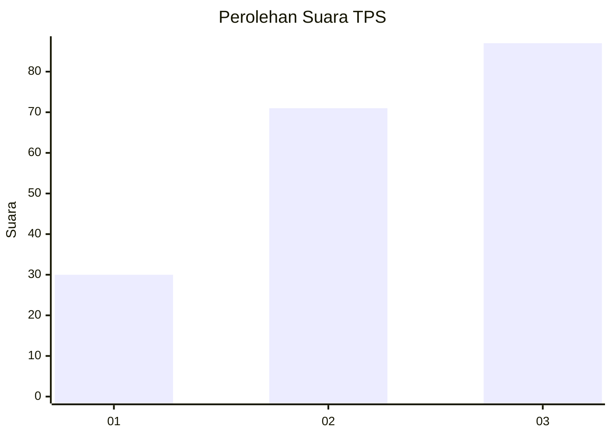
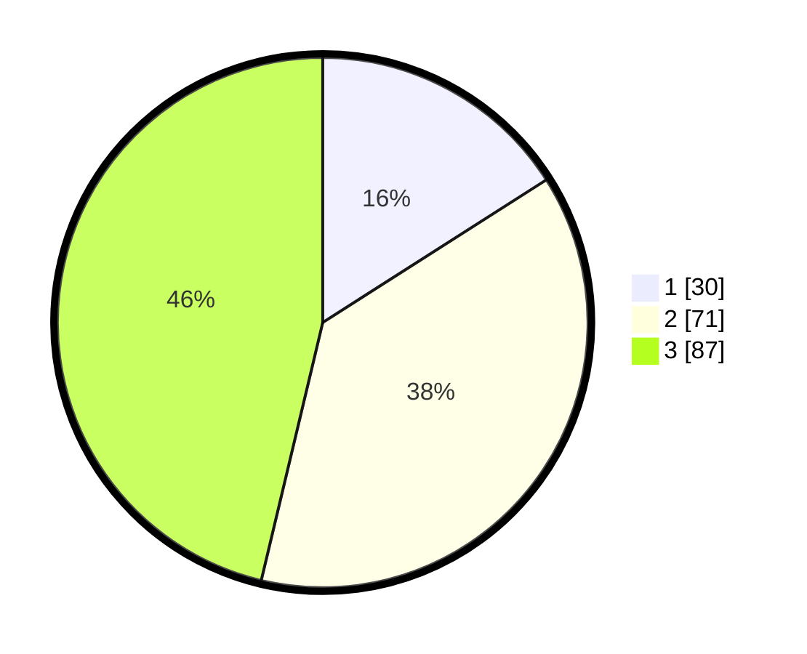

# Hasil

## Grafik

## Tabel

| No. | Nama Paslon    | Suara | Suara (raw) | Persentase |
|:--- |:-------------- | -----:| -----------:| ----------:|
| 1   | ANIES MUHAIMIN | 30    | [30][p-1]   | 15,96      |
| 2   | PRABOWO GIBRAN | 71    | [71][p-2]   | 37,77      |
| 3   | GANJAR MAHFUD  | 87    | [87][p-3]   | 46,28      |

[p-1]: https://github.com/gigit-pemilu/pemilu-2024-33-jawa-tengah/blob/main/pilpres/hitung-suara/sub/33-jawa-tengah/sub/02-banyumas/sub/08-tambak/sub/2010-kamulyan/sub/001-tps/sub/paslon-1.txt
[p-2]: https://github.com/gigit-pemilu/pemilu-2024-33-jawa-tengah/blob/main/pilpres/hitung-suara/sub/33-jawa-tengah/sub/02-banyumas/sub/08-tambak/sub/2010-kamulyan/sub/001-tps/sub/paslon-2.txt
[p-3]: https://github.com/gigit-pemilu/pemilu-2024-33-jawa-tengah/blob/main/pilpres/hitung-suara/sub/33-jawa-tengah/sub/02-banyumas/sub/08-tambak/sub/2010-kamulyan/sub/001-tps/sub/paslon-3.txt

## Foto C Plano

https://sirekap-obj-formc.kpu.go.id/0f59/pemilu/ppwp/33/02/08/20/10/3302082010001-20240214-231333--2a6a2add-67c5-45dc-89f1-b0ef75686b3c.jpg

https://sirekap-obj-formc.kpu.go.id/0f59/pemilu/ppwp/33/02/08/20/10/3302082010001-20240214-231927--393523af-c4fa-4bc5-855b-61ba9f7a530a.jpg

https://sirekap-obj-formc.kpu.go.id/0f59/pemilu/ppwp/33/02/08/20/10/3302082010001-20240214-232253--566f7a58-95b2-44bc-9eb9-abae3e1cf027.jpg

## Metadata

| Key        | Value               |
| ---------- | ------------------- |
| Time Stamp | 2024-02-16 23:00:00 |

