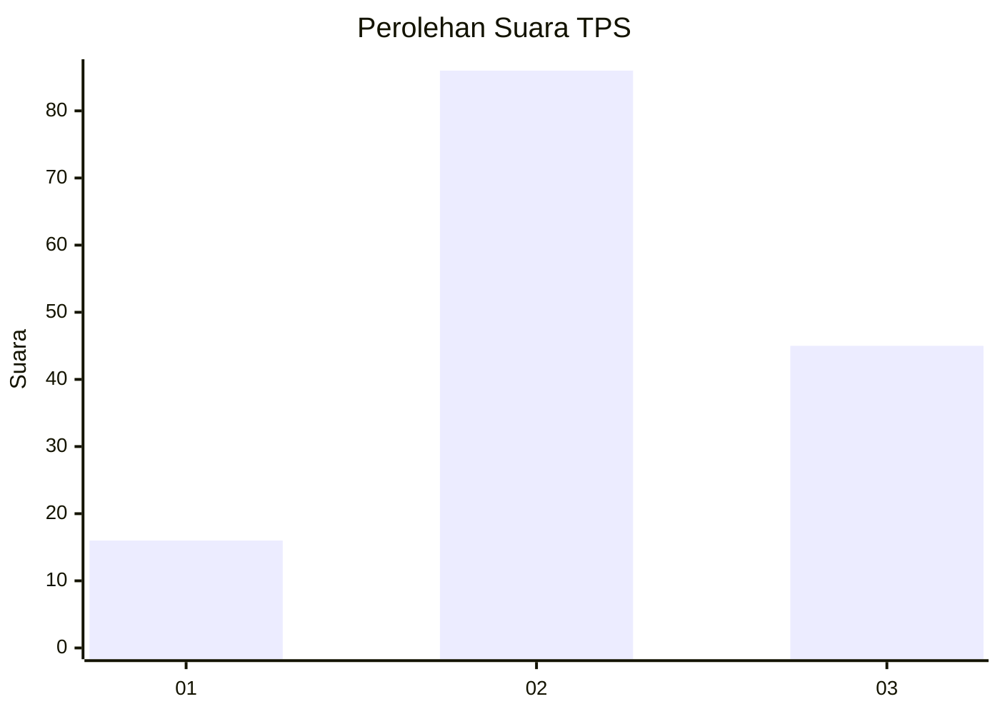
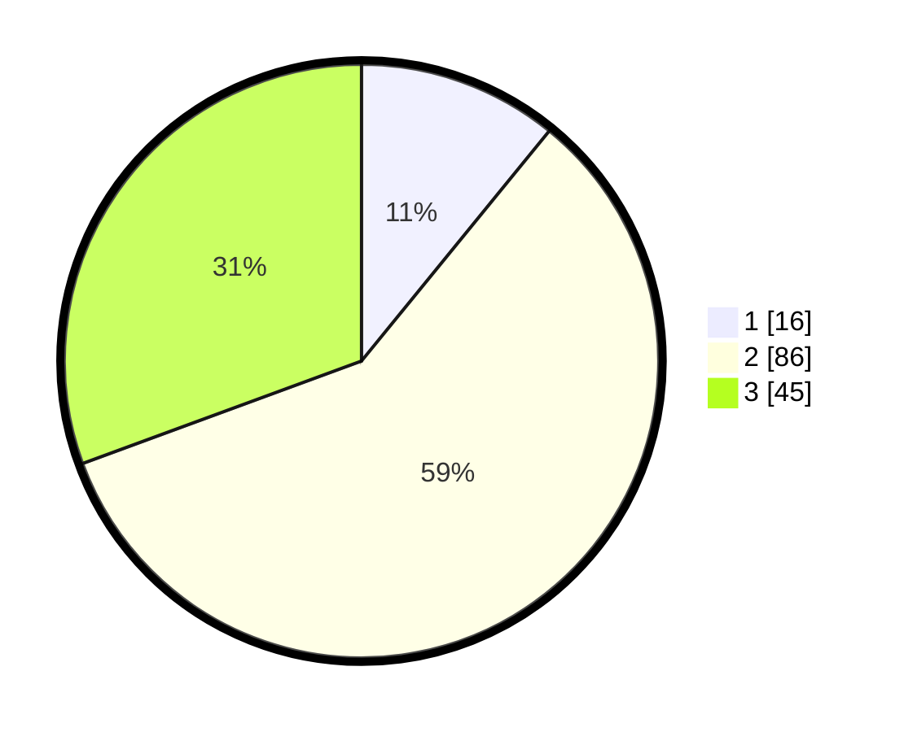

# Hasil

## Grafik

## Tabel

| No. | Nama Paslon    | Suara | Suara (raw) | Persentase |
|:--- |:-------------- | -----:| -----------:| ----------:|
| 1   | ANIES MUHAIMIN | 16    | [16][p-1]   | 10,88      |
| 2   | PRABOWO GIBRAN | 86    | [86][p-2]   | 58,50      |
| 3   | GANJAR MAHFUD  | 45    | [45][p-3]   | 30,61      |

[p-1]: https://github.com/gigit-pemilu/pemilu-2024/blob/main/pilpres/hitung-suara/sub/33-jawa-tengah/sub/02-banyumas/sub/08-tambak/sub/2011-purwodadi/sub/009-tps/sub/paslon-1.txt
[p-2]: https://github.com/gigit-pemilu/pemilu-2024/blob/main/pilpres/hitung-suara/sub/33-jawa-tengah/sub/02-banyumas/sub/08-tambak/sub/2011-purwodadi/sub/009-tps/sub/paslon-2.txt
[p-3]: https://github.com/gigit-pemilu/pemilu-2024/blob/main/pilpres/hitung-suara/sub/33-jawa-tengah/sub/02-banyumas/sub/08-tambak/sub/2011-purwodadi/sub/009-tps/sub/paslon-3.txt

## Foto C Plano

https://sirekap-obj-formc.kpu.go.id/051b/pemilu/ppwp/33/02/08/20/11/3302082011009-20240214-192355--02138234-6562-46e0-8277-7fa9c345bc40.jpg

https://sirekap-obj-formc.kpu.go.id/051b/pemilu/ppwp/33/02/08/20/11/3302082011009-20240214-213154--0229bfe9-532f-457d-81d6-a3e08abda7bf.jpg

https://sirekap-obj-formc.kpu.go.id/051b/pemilu/ppwp/33/02/08/20/11/3302082011009-20240214-213520--22c43c8d-c392-415e-aedf-596e217d1a73.jpg

## Metadata

| Key        | Value               |
| ---------- | ------------------- |
| Time Stamp | 2024-02-15 02:10:27 |

