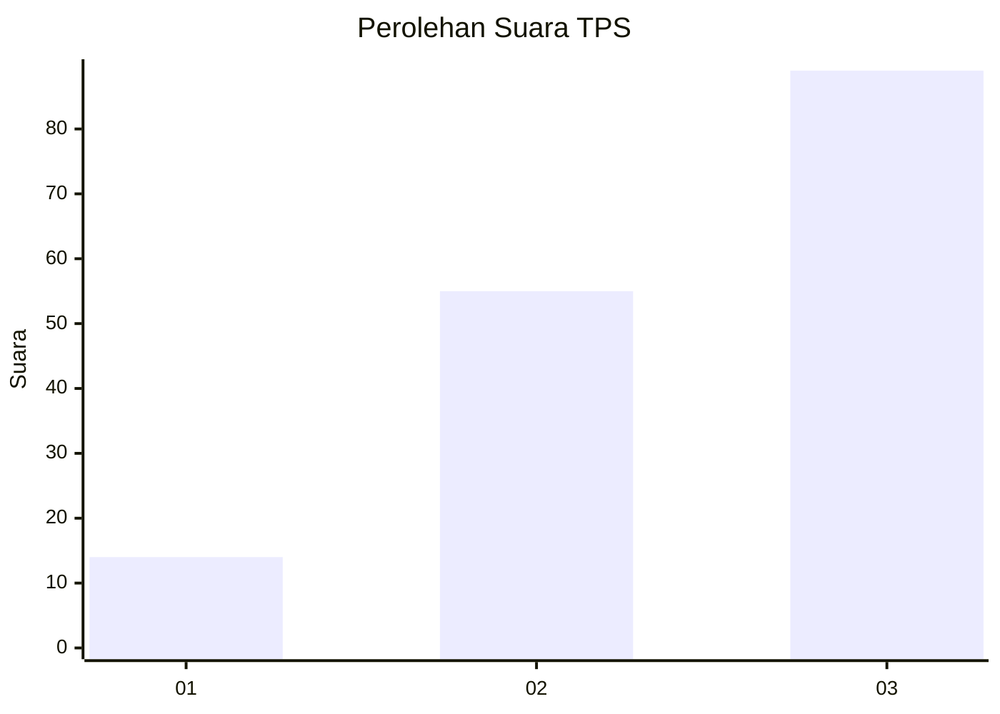
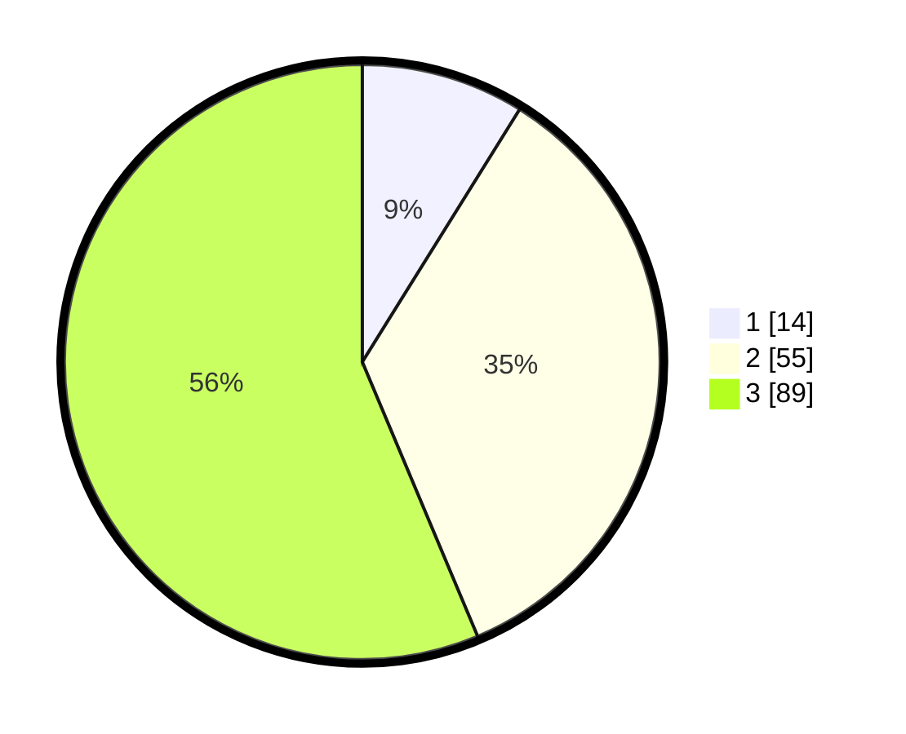

# Hasil

## Grafik

## Tabel

| No. | Nama Paslon    | Suara | Suara (raw) | Persentase |
|:--- |:-------------- | -----:| -----------:| ----------:|
| 1   | ANIES MUHAIMIN | 14    | [14][p-1]   | 8,86       |
| 2   | PRABOWO GIBRAN | 55    | [55][p-2]   | 34,81      |
| 3   | GANJAR MAHFUD  | 89    | [89][p-3]   | 56,33      |

[p-1]: https://github.com/gigit-pemilu/pemilu-2024-33-jawa-tengah/blob/main/pilpres/hitung-suara/sub/33-jawa-tengah/sub/02-banyumas/sub/08-tambak/sub/2012-watuagung/sub/013-tps/sub/paslon-1.txt
[p-2]: https://github.com/gigit-pemilu/pemilu-2024-33-jawa-tengah/blob/main/pilpres/hitung-suara/sub/33-jawa-tengah/sub/02-banyumas/sub/08-tambak/sub/2012-watuagung/sub/013-tps/sub/paslon-2.txt
[p-3]: https://github.com/gigit-pemilu/pemilu-2024-33-jawa-tengah/blob/main/pilpres/hitung-suara/sub/33-jawa-tengah/sub/02-banyumas/sub/08-tambak/sub/2012-watuagung/sub/013-tps/sub/paslon-3.txt

## Foto C Plano

https://sirekap-obj-formc.kpu.go.id/19f8/pemilu/ppwp/33/02/08/20/12/3302082012013-20240214-220715--24a5c4f8-6cf4-4814-aec3-1b69c4d079ae.jpg

https://sirekap-obj-formc.kpu.go.id/19f8/pemilu/ppwp/33/02/08/20/12/3302082012013-20240214-220929--350c772c-ae9f-4323-8808-2893f9edc919.jpg

https://sirekap-obj-formc.kpu.go.id/19f8/pemilu/ppwp/33/02/08/20/12/3302082012013-20240214-221233--e8a4819f-8fb3-4e38-83ce-3419dc9b5411.jpg

## Metadata

| Key        | Value               |
| ---------- | ------------------- |
| Time Stamp | 2024-02-16 23:30:00 |

