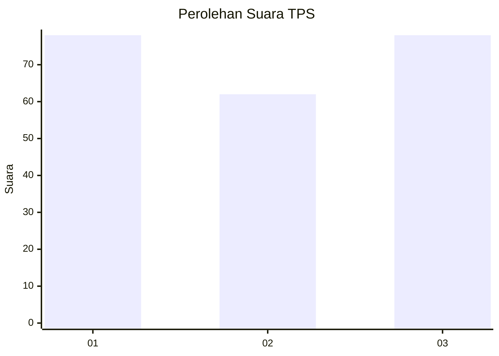
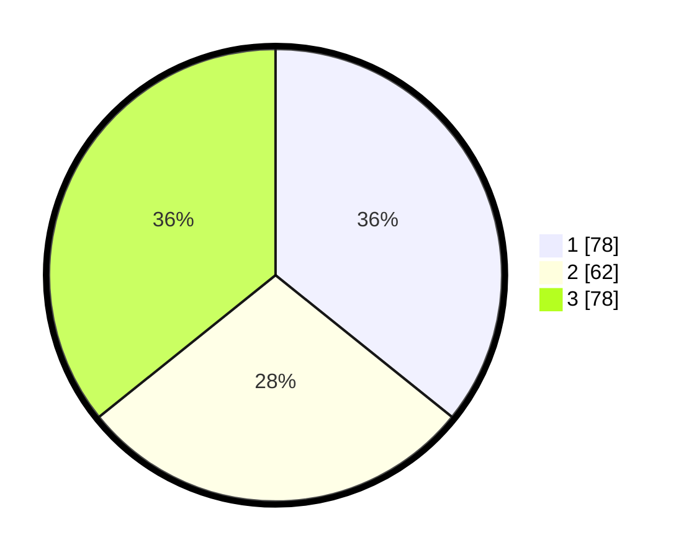

# Hasil

## Grafik

## Tabel

| No. | Nama Paslon    | Suara | Suara (raw) | Persentase |
|:--- |:-------------- | -----:| -----------:| ----------:|
| 1   | ANIES MUHAIMIN | 78    | [78][p-1]   | 35,78      |
| 2   | PRABOWO GIBRAN | 62    | [62][p-2]   | 28,44      |
| 3   | GANJAR MAHFUD  | 78    | [78][p-3]   | 35,78      |

[p-1]: https://github.com/gigit-pemilu/pemilu-2024/blob/main/pilpres/hitung-suara/sub/33-jawa-tengah/sub/02-banyumas/sub/08-tambak/sub/2012-watuagung/sub/016-tps/sub/paslon-1.txt
[p-2]: https://github.com/gigit-pemilu/pemilu-2024/blob/main/pilpres/hitung-suara/sub/33-jawa-tengah/sub/02-banyumas/sub/08-tambak/sub/2012-watuagung/sub/016-tps/sub/paslon-2.txt
[p-3]: https://github.com/gigit-pemilu/pemilu-2024/blob/main/pilpres/hitung-suara/sub/33-jawa-tengah/sub/02-banyumas/sub/08-tambak/sub/2012-watuagung/sub/016-tps/sub/paslon-3.txt

## Foto C Plano

https://sirekap-obj-formc.kpu.go.id/4aab/pemilu/ppwp/33/02/08/20/12/3302082012016-20240214-214100--13983c6a-f6a0-4d64-9e46-ba24d8fb4914.jpg

https://sirekap-obj-formc.kpu.go.id/4aab/pemilu/ppwp/33/02/08/20/12/3302082012016-20240215-081350--5aed41b4-52c2-4074-9f50-0d929e9dec11.jpg

https://sirekap-obj-formc.kpu.go.id/4aab/pemilu/ppwp/33/02/08/20/12/3302082012016-20240214-214122--8f91a14a-70a4-48f1-a1a8-6d1ae8779277.jpg

## Metadata

| Key        | Value               |
| ---------- | ------------------- |
| Time Stamp | 2024-02-15 15:00:29 |

