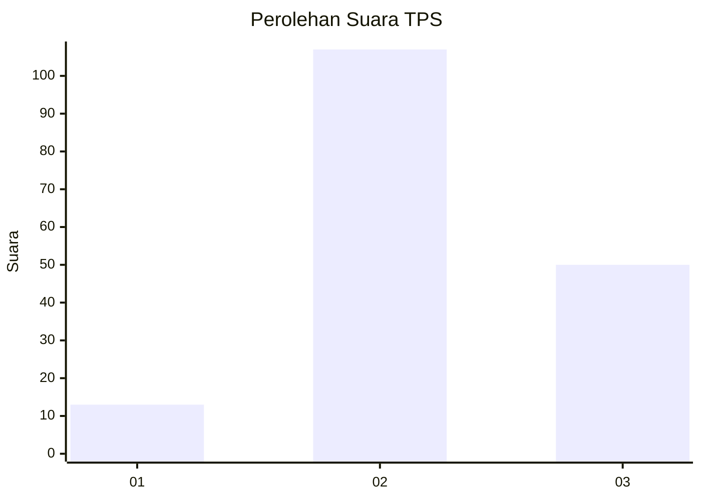
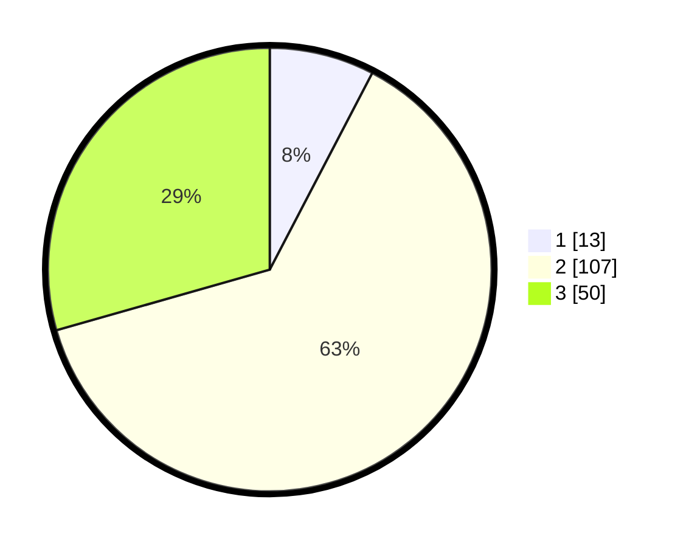

# Hasil

## Grafik

## Tabel

| No. | Nama Paslon    | Suara | Suara (raw) | Persentase |
|:--- |:-------------- | -----:| -----------:| ----------:|
| 1   | ANIES MUHAIMIN | 13    | [13][p-1]   | 7,65       |
| 2   | PRABOWO GIBRAN | 107   | [107][p-2]  | 62,94      |
| 3   | GANJAR MAHFUD  | 50    | [50][p-3]   | 29,41      |

[p-1]: https://github.com/gigit-pemilu/pemilu-2024/blob/main/pilpres/hitung-suara/sub/33-jawa-tengah/sub/02-banyumas/sub/09-somagede/sub/2001-tanggeran/sub/004-tps/sub/paslon-1.txt
[p-2]: https://github.com/gigit-pemilu/pemilu-2024/blob/main/pilpres/hitung-suara/sub/33-jawa-tengah/sub/02-banyumas/sub/09-somagede/sub/2001-tanggeran/sub/004-tps/sub/paslon-2.txt
[p-3]: https://github.com/gigit-pemilu/pemilu-2024/blob/main/pilpres/hitung-suara/sub/33-jawa-tengah/sub/02-banyumas/sub/09-somagede/sub/2001-tanggeran/sub/004-tps/sub/paslon-3.txt

## Foto C Plano

https://sirekap-obj-formc.kpu.go.id/1fed/pemilu/ppwp/33/02/09/20/01/3302092001004-20240214-222632--50b066a3-bf15-4b13-ab9d-db6963e2f025.jpg

https://sirekap-obj-formc.kpu.go.id/1fed/pemilu/ppwp/33/02/09/20/01/3302092001004-20240214-222751--411a053b-3bbd-4f39-98ed-f30596dfbeb2.jpg

https://sirekap-obj-formc.kpu.go.id/1fed/pemilu/ppwp/33/02/09/20/01/3302092001004-20240214-223238--710feb3e-89d9-4c2e-904a-8a82468897a4.jpg

## Metadata

| Key        | Value               |
| ---------- | ------------------- |
| Time Stamp | 2024-02-16 23:30:00 |

