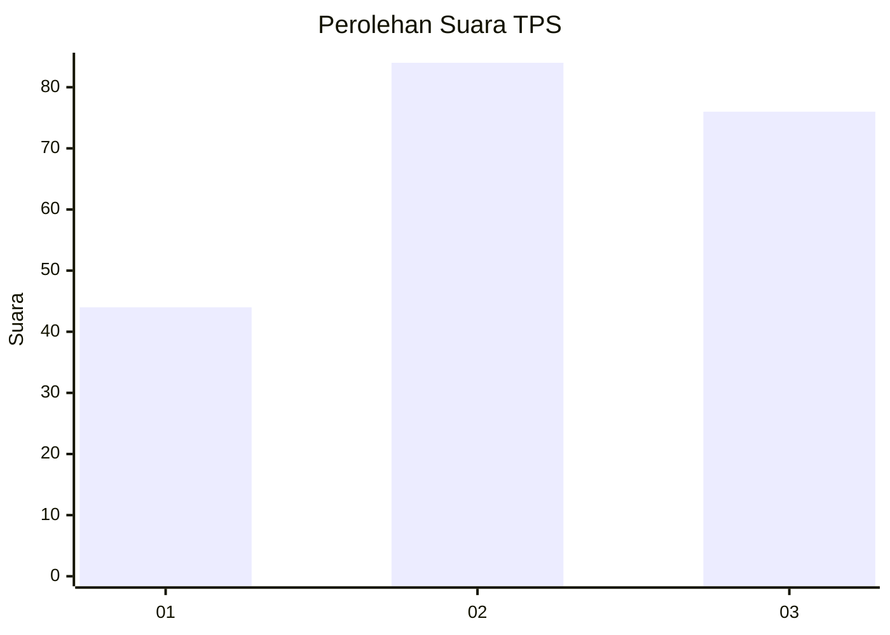
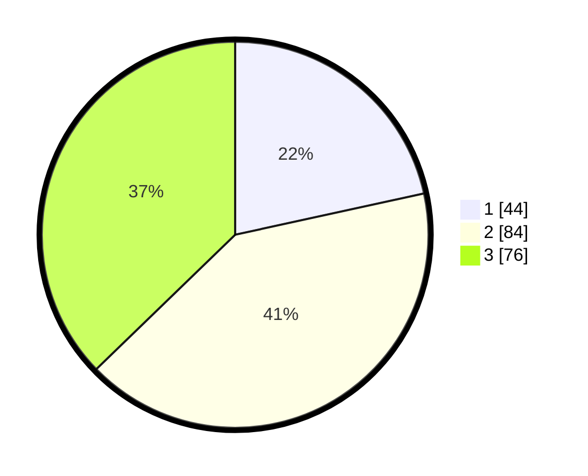

# Hasil

## Grafik

## Tabel

| No. | Nama Paslon    | Suara | Suara (raw) | Persentase |
|:--- |:-------------- | -----:| -----------:| ----------:|
| 1   | ANIES MUHAIMIN | 44    | [44][p-1]   | 21,57      |
| 2   | PRABOWO GIBRAN | 84    | [84][p-2]   | 41,18      |
| 3   | GANJAR MAHFUD  | 76    | [76][p-3]   | 37,25      |

[p-1]: https://github.com/gigit-pemilu/pemilu-2024-33-jawa-tengah/blob/main/pilpres/hitung-suara/sub/33-jawa-tengah/sub/02-banyumas/sub/09-somagede/sub/2003-somagede/sub/003-tps/sub/paslon-1.txt
[p-2]: https://github.com/gigit-pemilu/pemilu-2024-33-jawa-tengah/blob/main/pilpres/hitung-suara/sub/33-jawa-tengah/sub/02-banyumas/sub/09-somagede/sub/2003-somagede/sub/003-tps/sub/paslon-2.txt
[p-3]: https://github.com/gigit-pemilu/pemilu-2024-33-jawa-tengah/blob/main/pilpres/hitung-suara/sub/33-jawa-tengah/sub/02-banyumas/sub/09-somagede/sub/2003-somagede/sub/003-tps/sub/paslon-3.txt

## Foto C Plano

https://sirekap-obj-formc.kpu.go.id/78cb/pemilu/ppwp/33/02/09/20/03/3302092003003-20240214-231332--3cc763ce-8e92-43dd-8ac3-16830fcc7922.jpg

https://sirekap-obj-formc.kpu.go.id/78cb/pemilu/ppwp/33/02/09/20/03/3302092003003-20240214-231429--a2dba16e-5118-468c-993e-34028b8c38de.jpg

https://sirekap-obj-formc.kpu.go.id/78cb/pemilu/ppwp/33/02/09/20/03/3302092003003-20240214-231448--b055ccde-8e50-46c9-8b23-5b6a2f9827b2.jpg

## Metadata

| Key        | Value               |
| ---------- | ------------------- |
| Time Stamp | 2024-02-16 23:45:47 |

