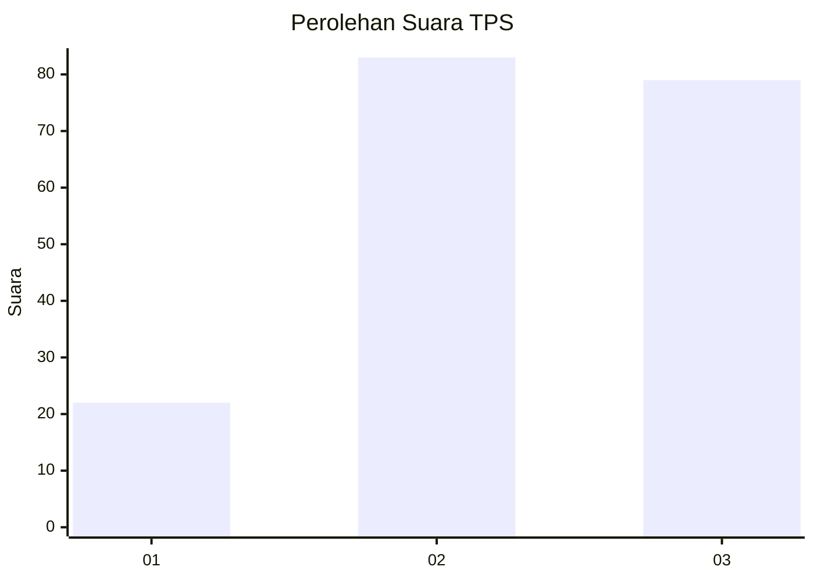
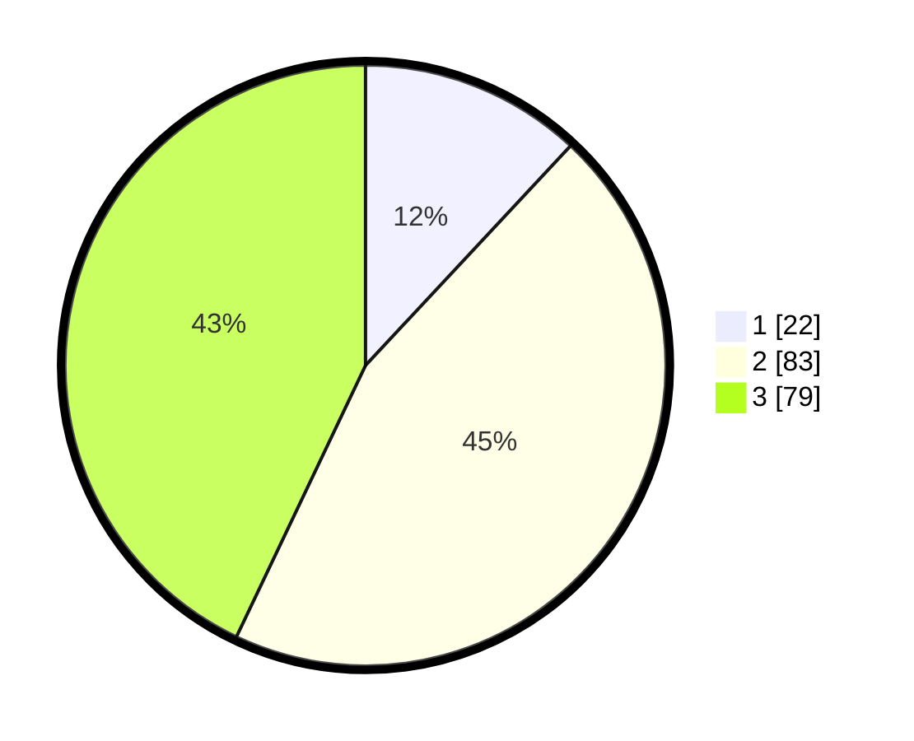

# Hasil

## Grafik

## Tabel

| No. | Nama Paslon    | Suara | Suara (raw) | Persentase |
|:--- |:-------------- | -----:| -----------:| ----------:|
| 1   | ANIES MUHAIMIN | 22    | [22][p-1]   | 11,96      |
| 2   | PRABOWO GIBRAN | 83    | [83][p-2]   | 45,11      |
| 3   | GANJAR MAHFUD  | 79    | [79][p-3]   | 42,93      |

[p-1]: https://github.com/gigit-pemilu/pemilu-2024-33-jawa-tengah/blob/main/pilpres/hitung-suara/sub/33-jawa-tengah/sub/02-banyumas/sub/09-somagede/sub/2005-kemawi/sub/002-tps/sub/paslon-1.txt
[p-2]: https://github.com/gigit-pemilu/pemilu-2024-33-jawa-tengah/blob/main/pilpres/hitung-suara/sub/33-jawa-tengah/sub/02-banyumas/sub/09-somagede/sub/2005-kemawi/sub/002-tps/sub/paslon-2.txt
[p-3]: https://github.com/gigit-pemilu/pemilu-2024-33-jawa-tengah/blob/main/pilpres/hitung-suara/sub/33-jawa-tengah/sub/02-banyumas/sub/09-somagede/sub/2005-kemawi/sub/002-tps/sub/paslon-3.txt

## Foto C Plano

https://sirekap-obj-formc.kpu.go.id/9229/pemilu/ppwp/33/02/09/20/05/3302092005002-20240215-004301--ebbb0040-86e4-4001-9c37-e7ba9d0b0a2e.jpg

https://sirekap-obj-formc.kpu.go.id/9229/pemilu/ppwp/33/02/09/20/05/3302092005002-20240215-004733--b07be338-7a56-40e6-b9ef-a3acdb23bdcc.jpg

https://sirekap-obj-formc.kpu.go.id/9229/pemilu/ppwp/33/02/09/20/05/3302092005002-20240215-004909--c01444ad-fb79-4bac-a73c-cb9b866363c0.jpg

## Metadata

| Key        | Value               |
| ---------- | ------------------- |
| Time Stamp | 2024-02-16 23:00:00 |

