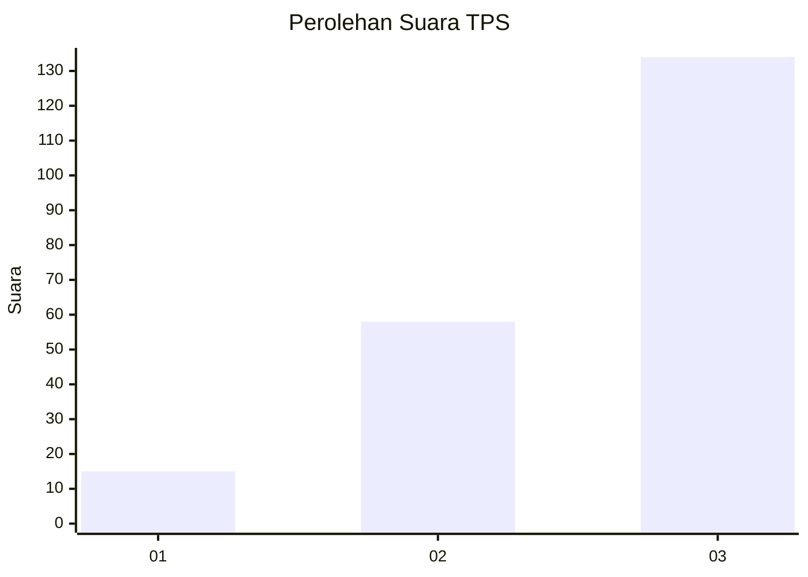
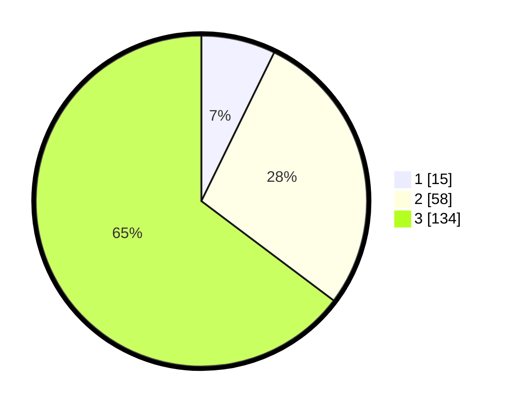

# Hasil

## Grafik

## Tabel

| No. | Nama Paslon    | Suara | Suara (raw) | Persentase |
|:--- |:-------------- | -----:| -----------:| ----------:|
| 1   | ANIES MUHAIMIN | 15    | [15][p-1]   | 7,25       |
| 2   | PRABOWO GIBRAN | 58    | [58][p-2]   | 28,02      |
| 3   | GANJAR MAHFUD  | 134   | [134][p-3]  | 64,73      |

[p-1]: https://github.com/gigit-pemilu/pemilu-2024-33-jawa-tengah/blob/main/pilpres/hitung-suara/sub/33-jawa-tengah/sub/02-banyumas/sub/09-somagede/sub/2005-kemawi/sub/004-tps/sub/paslon-1.txt
[p-2]: https://github.com/gigit-pemilu/pemilu-2024-33-jawa-tengah/blob/main/pilpres/hitung-suara/sub/33-jawa-tengah/sub/02-banyumas/sub/09-somagede/sub/2005-kemawi/sub/004-tps/sub/paslon-2.txt
[p-3]: https://github.com/gigit-pemilu/pemilu-2024-33-jawa-tengah/blob/main/pilpres/hitung-suara/sub/33-jawa-tengah/sub/02-banyumas/sub/09-somagede/sub/2005-kemawi/sub/004-tps/sub/paslon-3.txt

## Foto C Plano

https://sirekap-obj-formc.kpu.go.id/d33a/pemilu/ppwp/33/02/09/20/05/3302092005004-20240215-003826--2151b3bb-dd43-447e-a7ba-85e65dc132b1.jpg

https://sirekap-obj-formc.kpu.go.id/d33a/pemilu/ppwp/33/02/09/20/05/3302092005004-20240214-222445--7c310ecb-59c4-4a7d-9f4b-3d89a76e6de9.jpg

https://sirekap-obj-formc.kpu.go.id/d33a/pemilu/ppwp/33/02/09/20/05/3302092005004-20240215-004045--03e468e1-bebc-45dd-9011-a1b1f04f0e42.jpg

## Metadata

| Key        | Value               |
| ---------- | ------------------- |
| Time Stamp | 2024-02-16 23:00:00 |

