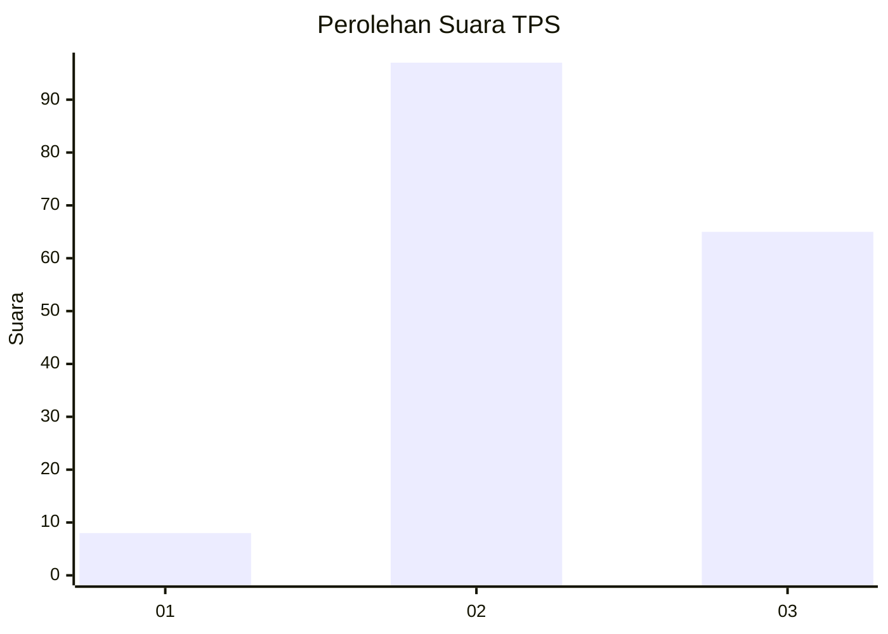
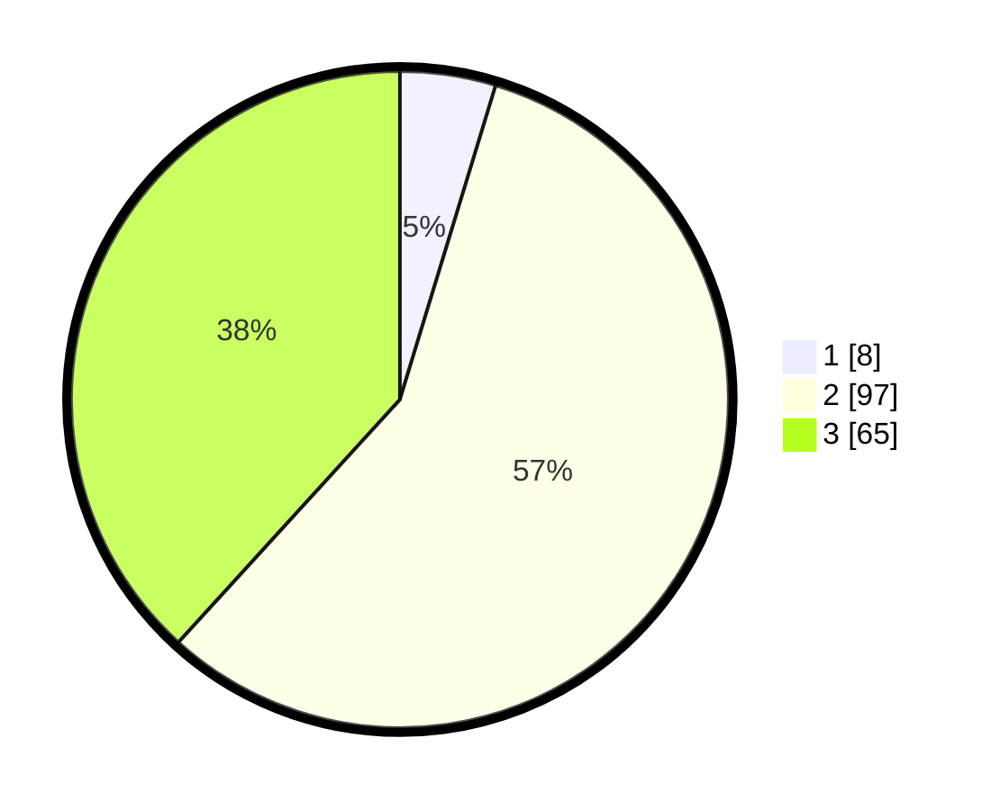

# Hasil

## Grafik

## Tabel

| No. | Nama Paslon    | Suara | Suara (raw) | Persentase |
|:--- |:-------------- | -----:| -----------:| ----------:|
| 1   | ANIES MUHAIMIN | 8     | [8][p-1]    | 4,71       |
| 2   | PRABOWO GIBRAN | 97    | [97][p-2]   | 57,06      |
| 3   | GANJAR MAHFUD  | 65    | [65][p-3]   | 38,24      |

[p-1]: https://github.com/gigit-pemilu/pemilu-2024/blob/main/pilpres/hitung-suara/sub/33-jawa-tengah/sub/02-banyumas/sub/09-somagede/sub/2006-piasa-kulon/sub/003-tps/sub/paslon-1.txt
[p-2]: https://github.com/gigit-pemilu/pemilu-2024/blob/main/pilpres/hitung-suara/sub/33-jawa-tengah/sub/02-banyumas/sub/09-somagede/sub/2006-piasa-kulon/sub/003-tps/sub/paslon-2.txt
[p-3]: https://github.com/gigit-pemilu/pemilu-2024/blob/main/pilpres/hitung-suara/sub/33-jawa-tengah/sub/02-banyumas/sub/09-somagede/sub/2006-piasa-kulon/sub/003-tps/sub/paslon-3.txt

## Foto C Plano

https://sirekap-obj-formc.kpu.go.id/911a/pemilu/ppwp/33/02/09/20/06/3302092006003-20240215-003146--6ec0bf00-fb46-4b43-b2eb-cec9093fe7d8.jpg

https://sirekap-obj-formc.kpu.go.id/911a/pemilu/ppwp/33/02/09/20/06/3302092006003-20240215-003654--271599f5-9459-4ce3-9ed7-be5ca1dd3522.jpg

https://sirekap-obj-formc.kpu.go.id/911a/pemilu/ppwp/33/02/09/20/06/3302092006003-20240215-003748--8b57d66a-9cbb-4c57-8361-f6977e0eebef.jpg

## Metadata

| Key        | Value               |
| ---------- | ------------------- |
| Time Stamp | 2024-02-16 21:01:00 |

