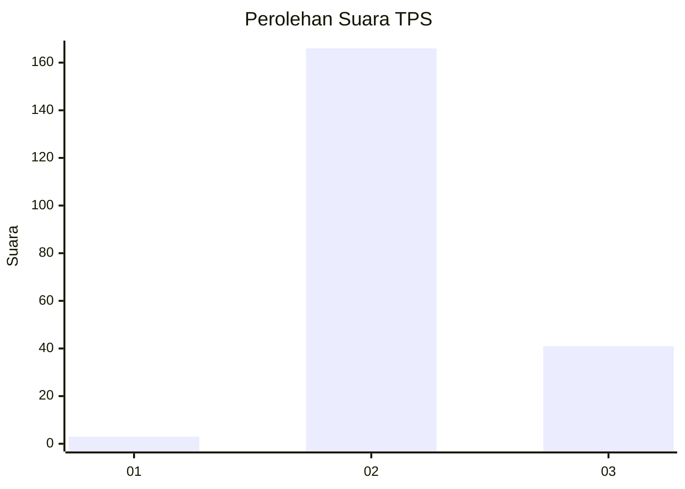

# Hasil

## Grafik

## Tabel

| No. | Nama Paslon    | Suara | Suara (raw) | Persentase |
|:--- |:-------------- | -----:| -----------:| ----------:|
| 1   | ANIES MUHAIMIN | 3     | [3][p-1]    | 1,43       |
| 2   | PRABOWO GIBRAN | 166   | [166][p-2]  | 79,05      |
| 3   | GANJAR MAHFUD  | 41    | [41][p-3]   | 19,52      |

[p-1]: https://github.com/gigit-pemilu/pemilu-2024-33-jawa-tengah/blob/main/pilpres/hitung-suara/sub/33-jawa-tengah/sub/02-banyumas/sub/10-kalibagor/sub/2001-srowot/sub/001-tps/sub/paslon-1.txt
[p-2]: https://github.com/gigit-pemilu/pemilu-2024-33-jawa-tengah/blob/main/pilpres/hitung-suara/sub/33-jawa-tengah/sub/02-banyumas/sub/10-kalibagor/sub/2001-srowot/sub/001-tps/sub/paslon-2.txt
[p-3]: https://github.com/gigit-pemilu/pemilu-2024-33-jawa-tengah/blob/main/pilpres/hitung-suara/sub/33-jawa-tengah/sub/02-banyumas/sub/10-kalibagor/sub/2001-srowot/sub/001-tps/sub/paslon-3.txt

## Foto C Plano

https://sirekap-obj-formc.kpu.go.id/64b7/pemilu/ppwp/33/02/10/20/01/3302102001001-20240214-194556--52c77c96-41ce-4868-875c-e3b36e002bbd.jpg

https://sirekap-obj-formc.kpu.go.id/64b7/pemilu/ppwp/33/02/10/20/01/3302102001001-20240215-005722--5b369aef-ffa3-42d0-b905-933ddd778879.jpg

https://sirekap-obj-formc.kpu.go.id/64b7/pemilu/ppwp/33/02/10/20/01/3302102001001-20240215-005939--914f55ec-06bd-45df-addd-ab5b4937c892.jpg

## Metadata

| Key        | Value               |
| ---------- | ------------------- |
| Time Stamp | 2024-02-16 21:01:00 |

