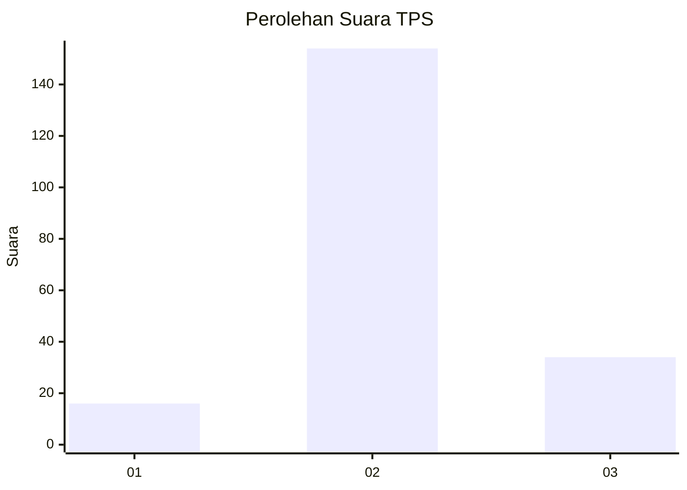
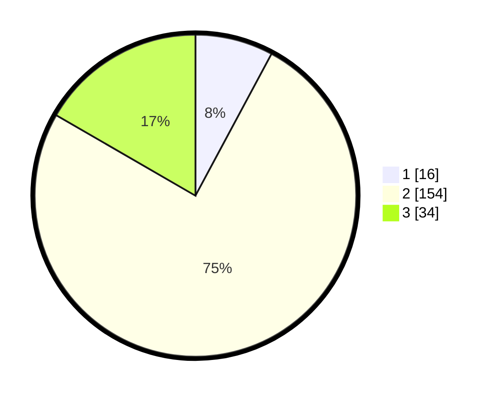

# Hasil

## Grafik

## Tabel

| No. | Nama Paslon    | Suara | Suara (raw) | Persentase |
|:--- |:-------------- | -----:| -----------:| ----------:|
| 1   | ANIES MUHAIMIN | 16    | [16][p-1]   | 7,84       |
| 2   | PRABOWO GIBRAN | 154   | [154][p-2]  | 75,49      |
| 3   | GANJAR MAHFUD  | 34    | [34][p-3]   | 16,67      |

[p-1]: https://github.com/gigit-pemilu/pemilu-2024/blob/main/pilpres/hitung-suara/sub/33-jawa-tengah/sub/02-banyumas/sub/10-kalibagor/sub/2001-srowot/sub/002-tps/sub/paslon-1.txt
[p-2]: https://github.com/gigit-pemilu/pemilu-2024/blob/main/pilpres/hitung-suara/sub/33-jawa-tengah/sub/02-banyumas/sub/10-kalibagor/sub/2001-srowot/sub/002-tps/sub/paslon-2.txt
[p-3]: https://github.com/gigit-pemilu/pemilu-2024/blob/main/pilpres/hitung-suara/sub/33-jawa-tengah/sub/02-banyumas/sub/10-kalibagor/sub/2001-srowot/sub/002-tps/sub/paslon-3.txt

## Foto C Plano

https://sirekap-obj-formc.kpu.go.id/ac8b/pemilu/ppwp/33/02/10/20/01/3302102001002-20240214-223616--13dda0f0-258a-47f1-9138-18b7adb9b74f.jpg

https://sirekap-obj-formc.kpu.go.id/ac8b/pemilu/ppwp/33/02/10/20/01/3302102001002-20240214-223751--28dffcfb-358f-4894-8d66-c536457ec1f0.jpg

https://sirekap-obj-formc.kpu.go.id/ac8b/pemilu/ppwp/33/02/10/20/01/3302102001002-20240214-223853--fa3bd6da-303c-4d65-9e23-e01fe826c979.jpg

## Metadata

| Key        | Value               |
| ---------- | ------------------- |
| Time Stamp | 2024-02-17 11:00:02 |

