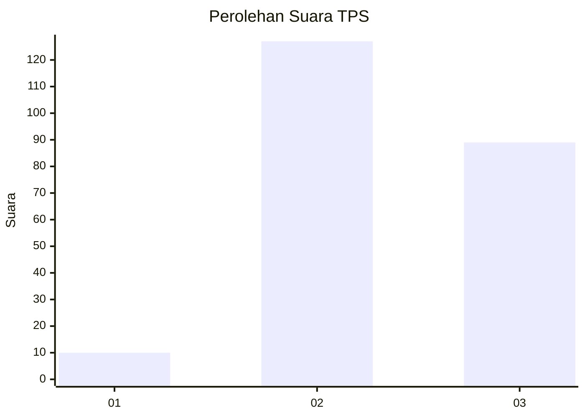
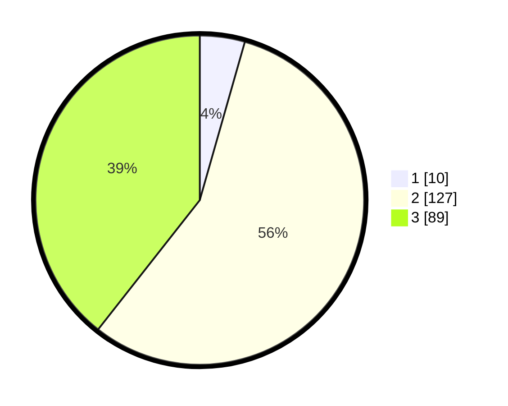

# Hasil

## Grafik

## Tabel

| No. | Nama Paslon    | Suara | Suara (raw) | Persentase |
|:--- |:-------------- | -----:| -----------:| ----------:|
| 1   | ANIES MUHAIMIN | 10    | [10][p-1]   | 4,42       |
| 2   | PRABOWO GIBRAN | 127   | [127][p-2]  | 56,19      |
| 3   | GANJAR MAHFUD  | 89    | [89][p-3]   | 39,38      |

[p-1]: https://github.com/gigit-pemilu/pemilu-2024/blob/main/pilpres/hitung-suara/sub/33-jawa-tengah/sub/02-banyumas/sub/10-kalibagor/sub/2001-srowot/sub/004-tps/sub/paslon-1.txt
[p-2]: https://github.com/gigit-pemilu/pemilu-2024/blob/main/pilpres/hitung-suara/sub/33-jawa-tengah/sub/02-banyumas/sub/10-kalibagor/sub/2001-srowot/sub/004-tps/sub/paslon-2.txt
[p-3]: https://github.com/gigit-pemilu/pemilu-2024/blob/main/pilpres/hitung-suara/sub/33-jawa-tengah/sub/02-banyumas/sub/10-kalibagor/sub/2001-srowot/sub/004-tps/sub/paslon-3.txt

## Foto C Plano

https://sirekap-obj-formc.kpu.go.id/9c65/pemilu/ppwp/33/02/10/20/01/3302102001004-20240215-003857--f623a3b0-6fe1-4aad-a3e1-3c5afbfc61d0.jpg

https://sirekap-obj-formc.kpu.go.id/9c65/pemilu/ppwp/33/02/10/20/01/3302102001004-20240215-004014--0bea338b-da7f-4db5-9adc-c577e9f67f98.jpg

https://sirekap-obj-formc.kpu.go.id/9c65/pemilu/ppwp/33/02/10/20/01/3302102001004-20240215-004153--7e0f0f2d-0a48-46f9-80b3-9142ffc2cb42.jpg

## Metadata

| Key        | Value               |
| ---------- | ------------------- |
| Time Stamp | 2024-02-17 11:30:03 |

