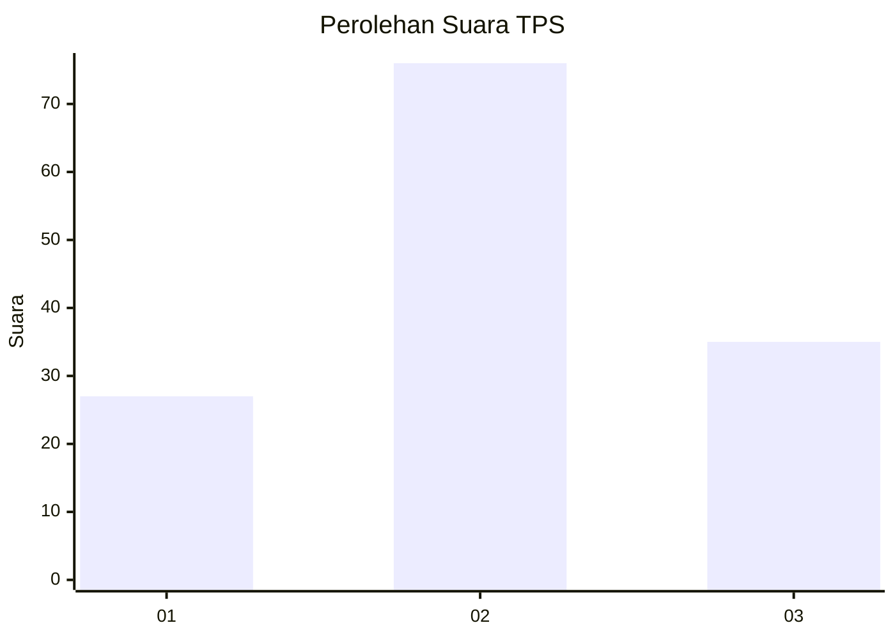
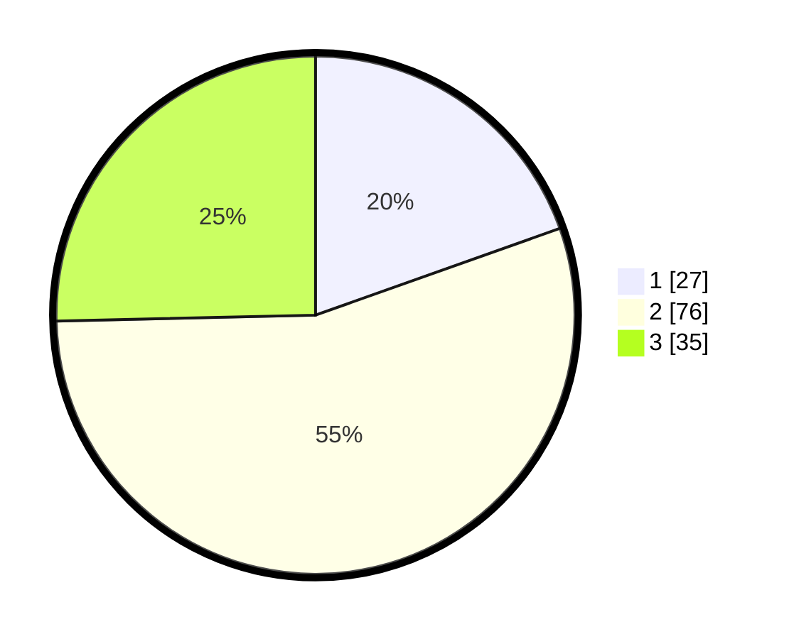

# Hasil

## Grafik

## Tabel

| No. | Nama Paslon    | Suara | Suara (raw) | Persentase |
|:--- |:-------------- | -----:| -----------:| ----------:|
| 1   | ANIES MUHAIMIN | 27    | [27][p-1]   | 19,57      |
| 2   | PRABOWO GIBRAN | 76    | [76][p-2]   | 55,07      |
| 3   | GANJAR MAHFUD  | 35    | [35][p-3]   | 25,36      |

[p-1]: https://github.com/gigit-pemilu/pemilu-2024-33-jawa-tengah/blob/main/pilpres/hitung-suara/sub/33-jawa-tengah/sub/02-banyumas/sub/10-kalibagor/sub/2007-kalibagor/sub/015-tps/sub/paslon-1.txt
[p-2]: https://github.com/gigit-pemilu/pemilu-2024-33-jawa-tengah/blob/main/pilpres/hitung-suara/sub/33-jawa-tengah/sub/02-banyumas/sub/10-kalibagor/sub/2007-kalibagor/sub/015-tps/sub/paslon-2.txt
[p-3]: https://github.com/gigit-pemilu/pemilu-2024-33-jawa-tengah/blob/main/pilpres/hitung-suara/sub/33-jawa-tengah/sub/02-banyumas/sub/10-kalibagor/sub/2007-kalibagor/sub/015-tps/sub/paslon-3.txt

## Foto C Plano

https://sirekap-obj-formc.kpu.go.id/6e2a/pemilu/ppwp/33/02/10/20/07/3302102007015-20240215-010903--b72893f8-4476-4dbc-87db-6ba4bc425f92.jpg

https://sirekap-obj-formc.kpu.go.id/6e2a/pemilu/ppwp/33/02/10/20/07/3302102007015-20240215-011038--c4ab437a-5ea7-4bfe-9bfd-68d884857eb5.jpg

https://sirekap-obj-formc.kpu.go.id/6e2a/pemilu/ppwp/33/02/10/20/07/3302102007015-20240215-011208--74d963d9-1b70-41b1-9dd4-b0bb16dc6fc3.jpg

## Metadata

| Key        | Value               |
| ---------- | ------------------- |
| Time Stamp | 2024-02-17 11:30:03 |

