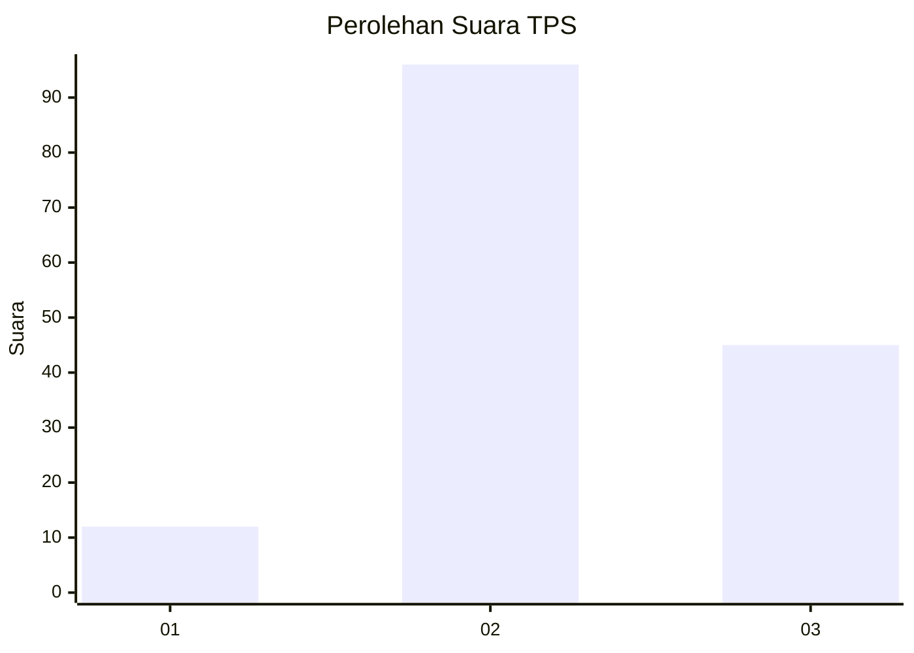
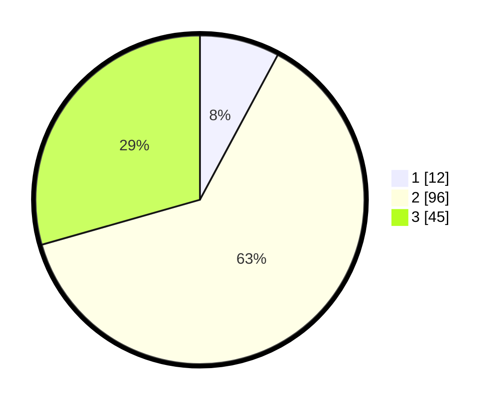

# Hasil

## Grafik

## Tabel

| No. | Nama Paslon    | Suara | Suara (raw) | Persentase |
|:--- |:-------------- | -----:| -----------:| ----------:|
| 1   | ANIES MUHAIMIN | 12    | [12][p-1]   | 7,84       |
| 2   | PRABOWO GIBRAN | 96    | [96][p-2]   | 62,75      |
| 3   | GANJAR MAHFUD  | 45    | [45][p-3]   | 29,41      |

[p-1]: https://github.com/gigit-pemilu/pemilu-2024-33-jawa-tengah/blob/main/pilpres/hitung-suara/sub/33-jawa-tengah/sub/02-banyumas/sub/10-kalibagor/sub/2010-kalicupak-kidul/sub/001-tps/sub/paslon-1.txt
[p-2]: https://github.com/gigit-pemilu/pemilu-2024-33-jawa-tengah/blob/main/pilpres/hitung-suara/sub/33-jawa-tengah/sub/02-banyumas/sub/10-kalibagor/sub/2010-kalicupak-kidul/sub/001-tps/sub/paslon-2.txt
[p-3]: https://github.com/gigit-pemilu/pemilu-2024-33-jawa-tengah/blob/main/pilpres/hitung-suara/sub/33-jawa-tengah/sub/02-banyumas/sub/10-kalibagor/sub/2010-kalicupak-kidul/sub/001-tps/sub/paslon-3.txt

## Foto C Plano

https://sirekap-obj-formc.kpu.go.id/2a9b/pemilu/ppwp/33/02/10/20/10/3302102010001-20240215-005349--537feeb2-6c6d-4a7b-bbfd-b3cfaf3d2ba5.jpg

https://sirekap-obj-formc.kpu.go.id/2a9b/pemilu/ppwp/33/02/10/20/10/3302102010001-20240215-005913--06787a4b-8583-4876-b514-1258032be96c.jpg

https://sirekap-obj-formc.kpu.go.id/2a9b/pemilu/ppwp/33/02/10/20/10/3302102010001-20240215-010212--9d954239-5e5a-41ac-b5ff-2518ba8db67b.jpg

## Metadata

| Key        | Value               |
| ---------- | ------------------- |
| Time Stamp | 2024-02-17 12:00:00 |

