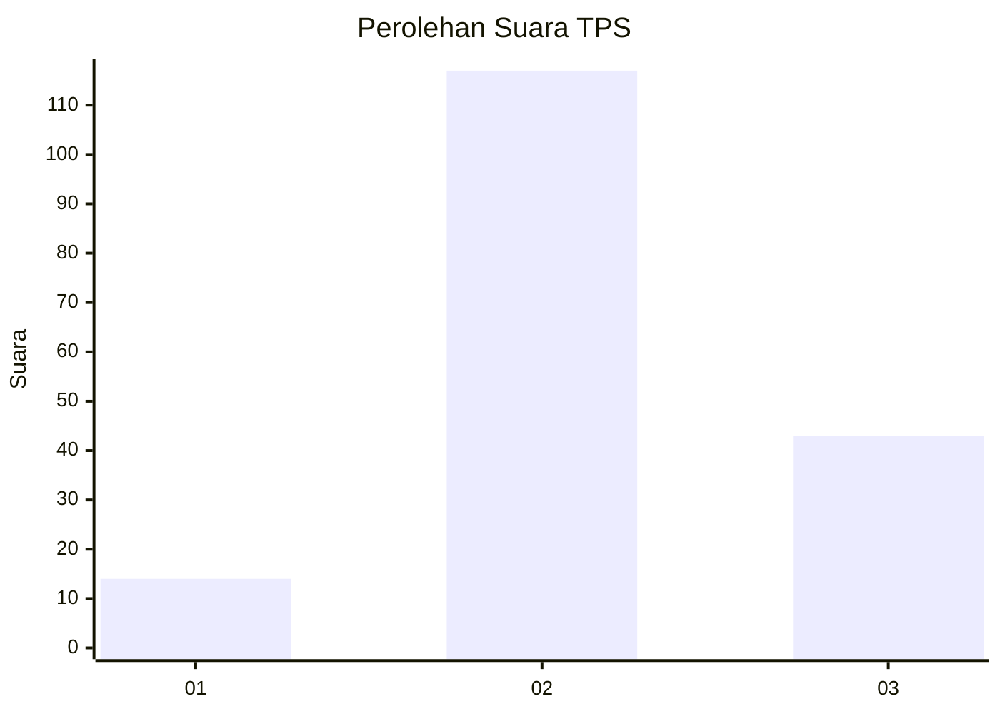
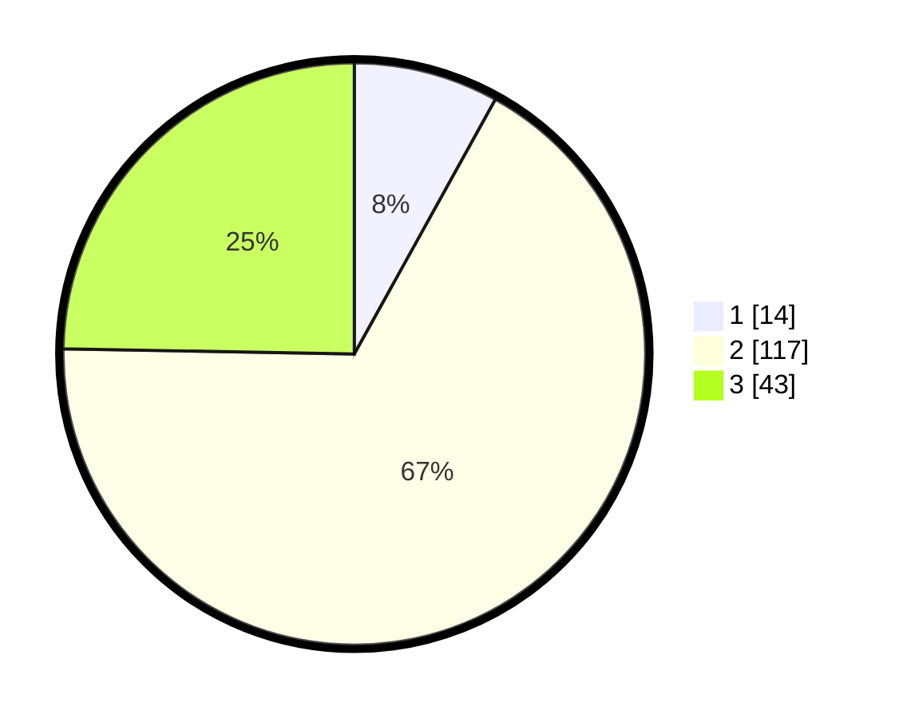

# Hasil

## Grafik

## Tabel

| No. | Nama Paslon    | Suara | Suara (raw) | Persentase |
|:--- |:-------------- | -----:| -----------:| ----------:|
| 1   | ANIES MUHAIMIN | 14    | [14][p-1]   | 8,05       |
| 2   | PRABOWO GIBRAN | 117   | [117][p-2]  | 67,24      |
| 3   | GANJAR MAHFUD  | 43    | [43][p-3]   | 24,71      |

[p-1]: https://github.com/gigit-pemilu/pemilu-2024/blob/main/pilpres/hitung-suara/sub/33-jawa-tengah/sub/02-banyumas/sub/11-banyumas/sub/2001-binangun/sub/001-tps/sub/paslon-1.txt
[p-2]: https://github.com/gigit-pemilu/pemilu-2024/blob/main/pilpres/hitung-suara/sub/33-jawa-tengah/sub/02-banyumas/sub/11-banyumas/sub/2001-binangun/sub/001-tps/sub/paslon-2.txt
[p-3]: https://github.com/gigit-pemilu/pemilu-2024/blob/main/pilpres/hitung-suara/sub/33-jawa-tengah/sub/02-banyumas/sub/11-banyumas/sub/2001-binangun/sub/001-tps/sub/paslon-3.txt

## Foto C Plano

https://sirekap-obj-formc.kpu.go.id/4c54/pemilu/ppwp/33/02/11/20/01/3302112001001-20240215-081104--dc238de2-4d5a-47d4-b57d-ded6301a4823.jpg

https://sirekap-obj-formc.kpu.go.id/4c54/pemilu/ppwp/33/02/11/20/01/3302112001001-20240214-221732--fad55624-0750-472a-b042-f16732b2d79e.jpg

https://sirekap-obj-formc.kpu.go.id/4c54/pemilu/ppwp/33/02/11/20/01/3302112001001-20240215-081343--4b1fb0dd-f412-4ad3-979e-7b3e0e267e1c.jpg

## Metadata

| Key        | Value               |
| ---------- | ------------------- |
| Time Stamp | 2024-02-16 21:01:00 |

