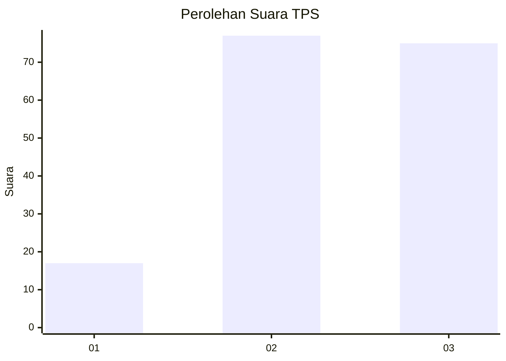
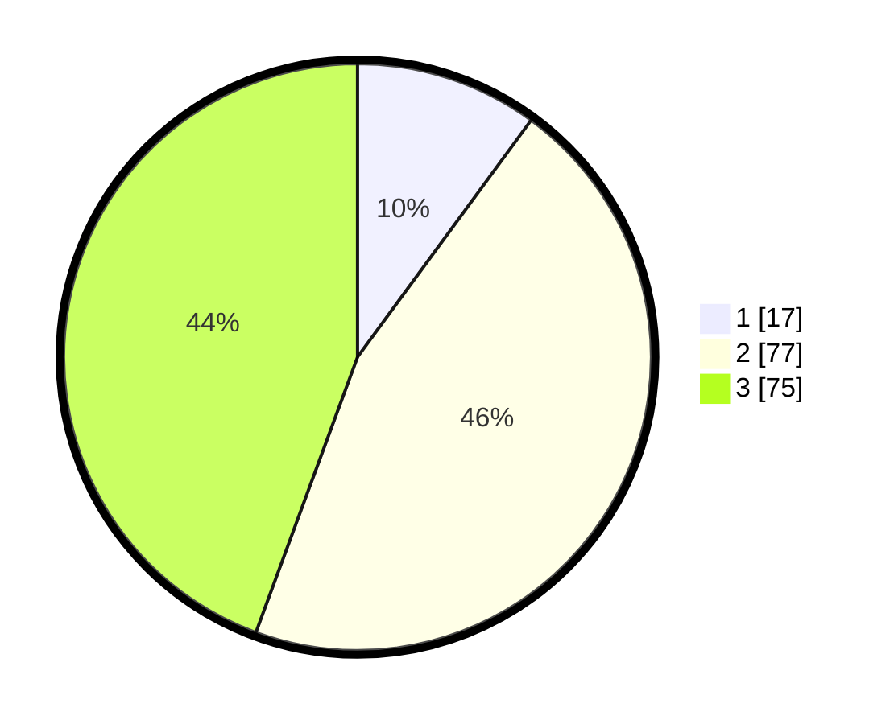

# Hasil

## Grafik

## Tabel

| No. | Nama Paslon    | Suara | Suara (raw) | Persentase |
|:--- |:-------------- | -----:| -----------:| ----------:|
| 1   | ANIES MUHAIMIN | 17    | [17][p-1]   | 10,06      |
| 2   | PRABOWO GIBRAN | 77    | [77][p-2]   | 45,56      |
| 3   | GANJAR MAHFUD  | 75    | [75][p-3]   | 44,38      |

[p-1]: https://github.com/gigit-pemilu/pemilu-2024/blob/main/pilpres/hitung-suara/sub/33-jawa-tengah/sub/02-banyumas/sub/11-banyumas/sub/2001-binangun/sub/007-tps/sub/paslon-1.txt
[p-2]: https://github.com/gigit-pemilu/pemilu-2024/blob/main/pilpres/hitung-suara/sub/33-jawa-tengah/sub/02-banyumas/sub/11-banyumas/sub/2001-binangun/sub/007-tps/sub/paslon-2.txt
[p-3]: https://github.com/gigit-pemilu/pemilu-2024/blob/main/pilpres/hitung-suara/sub/33-jawa-tengah/sub/02-banyumas/sub/11-banyumas/sub/2001-binangun/sub/007-tps/sub/paslon-3.txt

## Foto C Plano

https://sirekap-obj-formc.kpu.go.id/0f1c/pemilu/ppwp/33/02/11/20/01/3302112001007-20240215-021231--281705a8-55dd-4cff-87ce-56d6ecc71005.jpg

https://sirekap-obj-formc.kpu.go.id/0f1c/pemilu/ppwp/33/02/11/20/01/3302112001007-20240215-021326--ea47b24e-8687-465c-bb6d-17173bd739ba.jpg

https://sirekap-obj-formc.kpu.go.id/0f1c/pemilu/ppwp/33/02/11/20/01/3302112001007-20240215-021516--ebca9cb9-0427-4fd9-af2e-dc6cb06d7f14.jpg

## Metadata

| Key        | Value               |
| ---------- | ------------------- |
| Time Stamp | 2024-02-16 21:01:00 |

