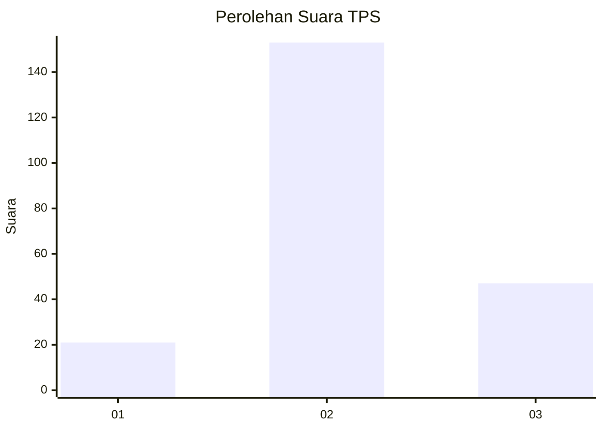
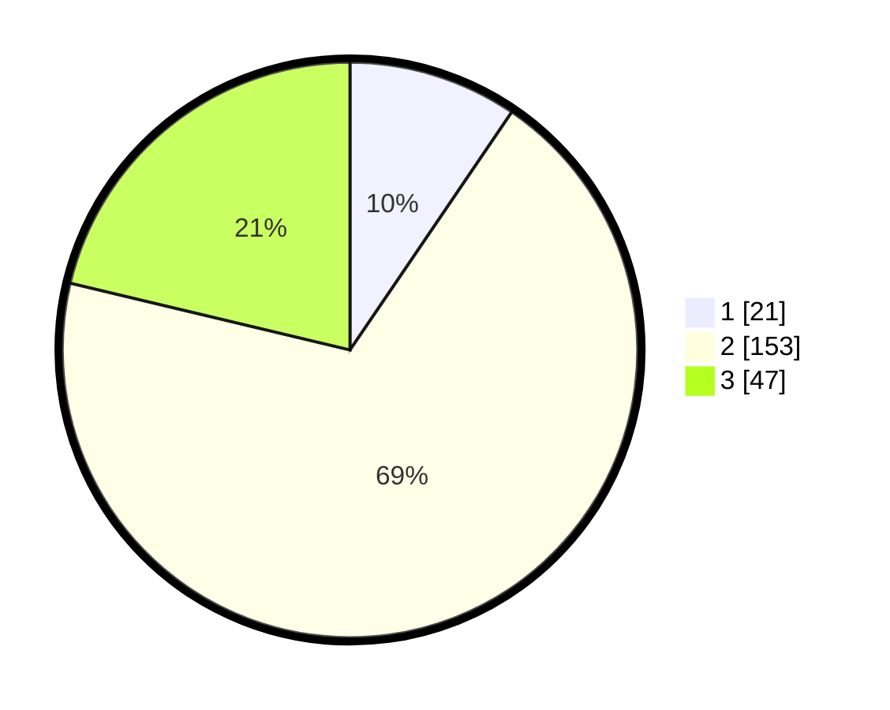

# Hasil

## Grafik

## Tabel

| No. | Nama Paslon    | Suara | Suara (raw) | Persentase |
|:--- |:-------------- | -----:| -----------:| ----------:|
| 1   | ANIES MUHAIMIN | 21    | [21][p-1]   | 9,50       |
| 2   | PRABOWO GIBRAN | 153   | [153][p-2]  | 69,23      |
| 3   | GANJAR MAHFUD  | 47    | [47][p-3]   | 21,27      |

[p-1]: https://github.com/gigit-pemilu/pemilu-2024/blob/main/pilpres/hitung-suara/sub/33-jawa-tengah/sub/02-banyumas/sub/11-banyumas/sub/2002-pasinggangan/sub/006-tps/sub/paslon-1.txt
[p-2]: https://github.com/gigit-pemilu/pemilu-2024/blob/main/pilpres/hitung-suara/sub/33-jawa-tengah/sub/02-banyumas/sub/11-banyumas/sub/2002-pasinggangan/sub/006-tps/sub/paslon-2.txt
[p-3]: https://github.com/gigit-pemilu/pemilu-2024/blob/main/pilpres/hitung-suara/sub/33-jawa-tengah/sub/02-banyumas/sub/11-banyumas/sub/2002-pasinggangan/sub/006-tps/sub/paslon-3.txt

## Foto C Plano

https://sirekap-obj-formc.kpu.go.id/ced5/pemilu/ppwp/33/02/11/20/02/3302112002006-20240219-090854--2adf83ad-a0cd-47b7-b147-7d96e9ffe4f7.jpg

https://sirekap-obj-formc.kpu.go.id/ced5/pemilu/ppwp/33/02/11/20/02/3302112002006-20240215-011716--2de4b0c0-6922-4a00-a5a4-e3f2dfd87074.jpg

https://sirekap-obj-formc.kpu.go.id/ced5/pemilu/ppwp/33/02/11/20/02/3302112002006-20240215-012030--157e2408-fe84-4695-bfb5-f68f1c80a395.jpg

## Metadata

| Key        | Value               |
| ---------- | ------------------- |
| Time Stamp | 2024-02-19 10:00:00 |

