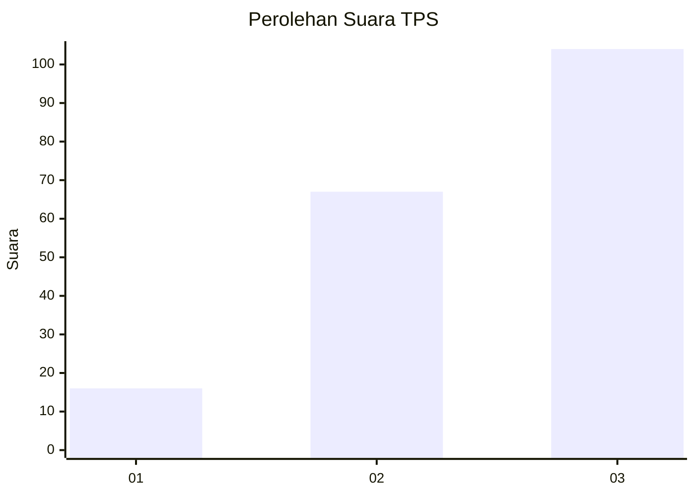
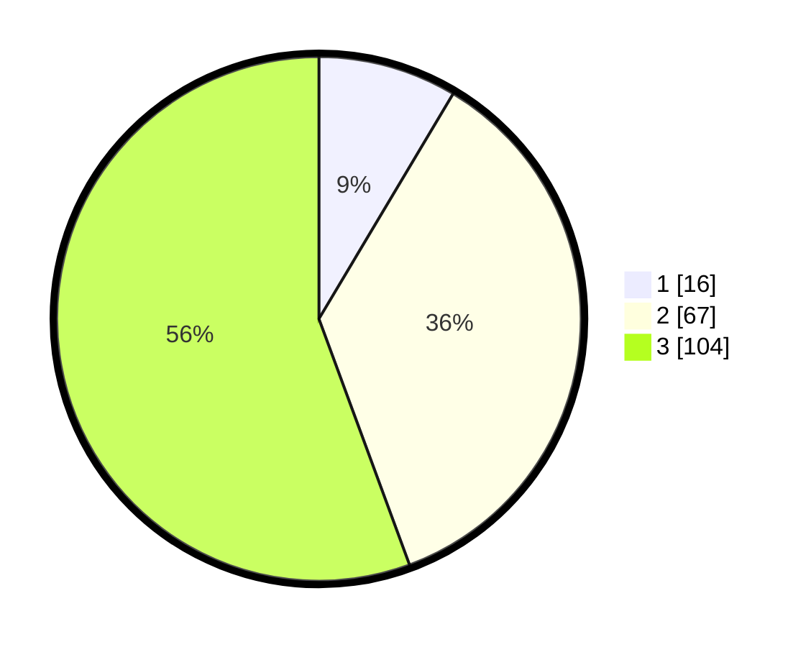

# Hasil

## Grafik

## Tabel

| No. | Nama Paslon    | Suara | Suara (raw) | Persentase |
|:--- |:-------------- | -----:| -----------:| ----------:|
| 1   | ANIES MUHAIMIN | 16    | [16][p-1]   | 8,56       |
| 2   | PRABOWO GIBRAN | 67    | [67][p-2]   | 35,83      |
| 3   | GANJAR MAHFUD  | 104   | [104][p-3]  | 55,61      |

[p-1]: https://github.com/gigit-pemilu/pemilu-2024-33-jawa-tengah/blob/main/pilpres/hitung-suara/sub/33-jawa-tengah/sub/02-banyumas/sub/11-banyumas/sub/2004-karangrau/sub/002-tps/sub/paslon-1.txt
[p-2]: https://github.com/gigit-pemilu/pemilu-2024-33-jawa-tengah/blob/main/pilpres/hitung-suara/sub/33-jawa-tengah/sub/02-banyumas/sub/11-banyumas/sub/2004-karangrau/sub/002-tps/sub/paslon-2.txt
[p-3]: https://github.com/gigit-pemilu/pemilu-2024-33-jawa-tengah/blob/main/pilpres/hitung-suara/sub/33-jawa-tengah/sub/02-banyumas/sub/11-banyumas/sub/2004-karangrau/sub/002-tps/sub/paslon-3.txt

## Foto C Plano

https://sirekap-obj-formc.kpu.go.id/5fdb/pemilu/ppwp/33/02/11/20/04/3302112004002-20240215-014805--1998ebd0-2dc1-47bb-9ab5-3b97547a6b3f.jpg

https://sirekap-obj-formc.kpu.go.id/5fdb/pemilu/ppwp/33/02/11/20/04/3302112004002-20240215-014942--5b0050eb-57c3-4d30-a55e-901a9cd7aaf6.jpg

https://sirekap-obj-formc.kpu.go.id/5fdb/pemilu/ppwp/33/02/11/20/04/3302112004002-20240215-015107--d39ee813-699f-4790-81aa-5ea9168b4fbb.jpg

## Metadata

| Key        | Value               |
| ---------- | ------------------- |
| Time Stamp | 2024-02-16 22:01:00 |

