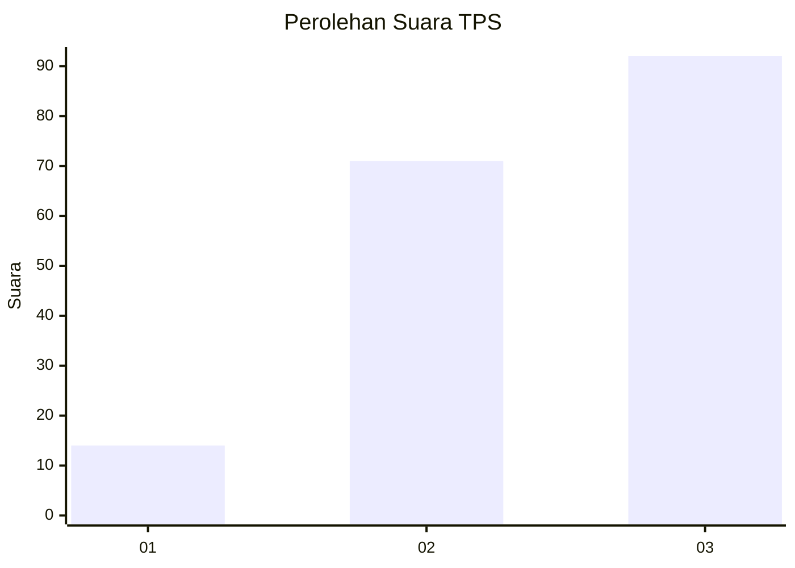
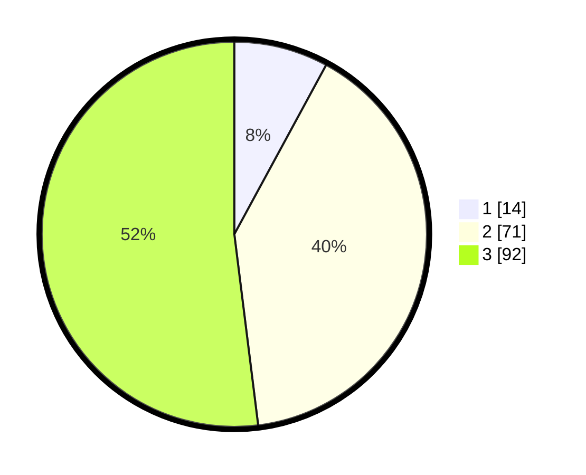

# Hasil

## Grafik

## Tabel

| No. | Nama Paslon    | Suara | Suara (raw) | Persentase |
|:--- |:-------------- | -----:| -----------:| ----------:|
| 1   | ANIES MUHAIMIN | 14    | [14][p-1]   | 7,91       |
| 2   | PRABOWO GIBRAN | 71    | [71][p-2]   | 40,11      |
| 3   | GANJAR MAHFUD  | 92    | [92][p-3]   | 51,98      |

[p-1]: https://github.com/gigit-pemilu/pemilu-2024-33-jawa-tengah/blob/main/pilpres/hitung-suara/sub/33-jawa-tengah/sub/02-banyumas/sub/11-banyumas/sub/2004-karangrau/sub/018-tps/sub/paslon-1.txt
[p-2]: https://github.com/gigit-pemilu/pemilu-2024-33-jawa-tengah/blob/main/pilpres/hitung-suara/sub/33-jawa-tengah/sub/02-banyumas/sub/11-banyumas/sub/2004-karangrau/sub/018-tps/sub/paslon-2.txt
[p-3]: https://github.com/gigit-pemilu/pemilu-2024-33-jawa-tengah/blob/main/pilpres/hitung-suara/sub/33-jawa-tengah/sub/02-banyumas/sub/11-banyumas/sub/2004-karangrau/sub/018-tps/sub/paslon-3.txt

## Foto C Plano

https://sirekap-obj-formc.kpu.go.id/a32e/pemilu/ppwp/33/02/11/20/04/3302112004018-20240214-214249--31285eb8-c1f7-48ee-a3f7-6d4b2dc60e28.jpg

https://sirekap-obj-formc.kpu.go.id/a32e/pemilu/ppwp/33/02/11/20/04/3302112004018-20240214-214320--16441cdf-dded-40ca-ab64-3719d91c4092.jpg

https://sirekap-obj-formc.kpu.go.id/a32e/pemilu/ppwp/33/02/11/20/04/3302112004018-20240214-214356--d9c06d39-e2b3-4431-887c-a03c0d4d14c3.jpg

## Metadata

| Key        | Value               |
| ---------- | ------------------- |
| Time Stamp | 2024-02-16 22:01:00 |

