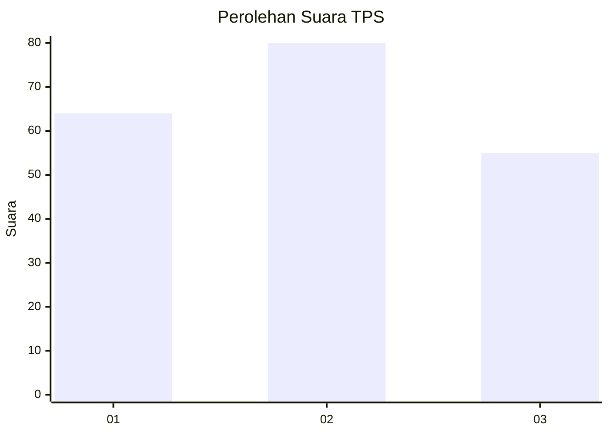
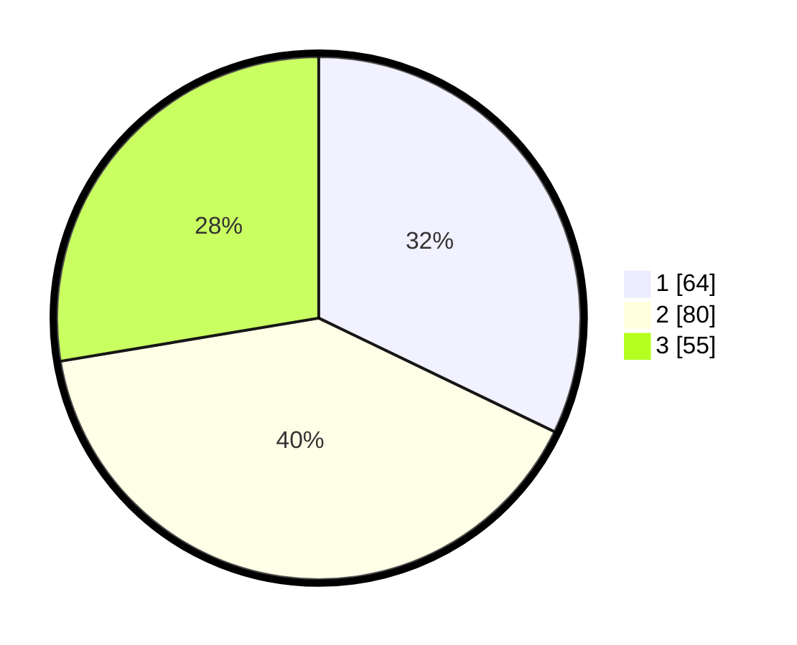

# Hasil

## Grafik

## Tabel

| No. | Nama Paslon    | Suara | Suara (raw) | Persentase |
|:--- |:-------------- | -----:| -----------:| ----------:|
| 1   | ANIES MUHAIMIN | 64    | [64][p-1]   | 32,16      |
| 2   | PRABOWO GIBRAN | 80    | [80][p-2]   | 40,20      |
| 3   | GANJAR MAHFUD  | 55    | [55][p-3]   | 27,64      |

[p-1]: https://github.com/gigit-pemilu/pemilu-2024/blob/main/pilpres/hitung-suara/sub/33-jawa-tengah/sub/02-banyumas/sub/11-banyumas/sub/2008-sudagaran/sub/005-tps/sub/paslon-1.txt
[p-2]: https://github.com/gigit-pemilu/pemilu-2024/blob/main/pilpres/hitung-suara/sub/33-jawa-tengah/sub/02-banyumas/sub/11-banyumas/sub/2008-sudagaran/sub/005-tps/sub/paslon-2.txt
[p-3]: https://github.com/gigit-pemilu/pemilu-2024/blob/main/pilpres/hitung-suara/sub/33-jawa-tengah/sub/02-banyumas/sub/11-banyumas/sub/2008-sudagaran/sub/005-tps/sub/paslon-3.txt

## Foto C Plano

https://sirekap-obj-formc.kpu.go.id/6cba/pemilu/ppwp/33/02/11/20/08/3302112008005-20240214-203818--0c7fe5a2-c1f4-49f2-8446-ed100e625acb.jpg

https://sirekap-obj-formc.kpu.go.id/6cba/pemilu/ppwp/33/02/11/20/08/3302112008005-20240214-203822--886ccdd9-0173-4d4d-942e-c5172e32d029.jpg

https://sirekap-obj-formc.kpu.go.id/6cba/pemilu/ppwp/33/02/11/20/08/3302112008005-20240214-203825--16f3dfc5-ea31-4271-8e20-f3b975dfe6d7.jpg

## Metadata

| Key        | Value               |
| ---------- | ------------------- |
| Time Stamp | 2024-02-16 22:01:00 |

