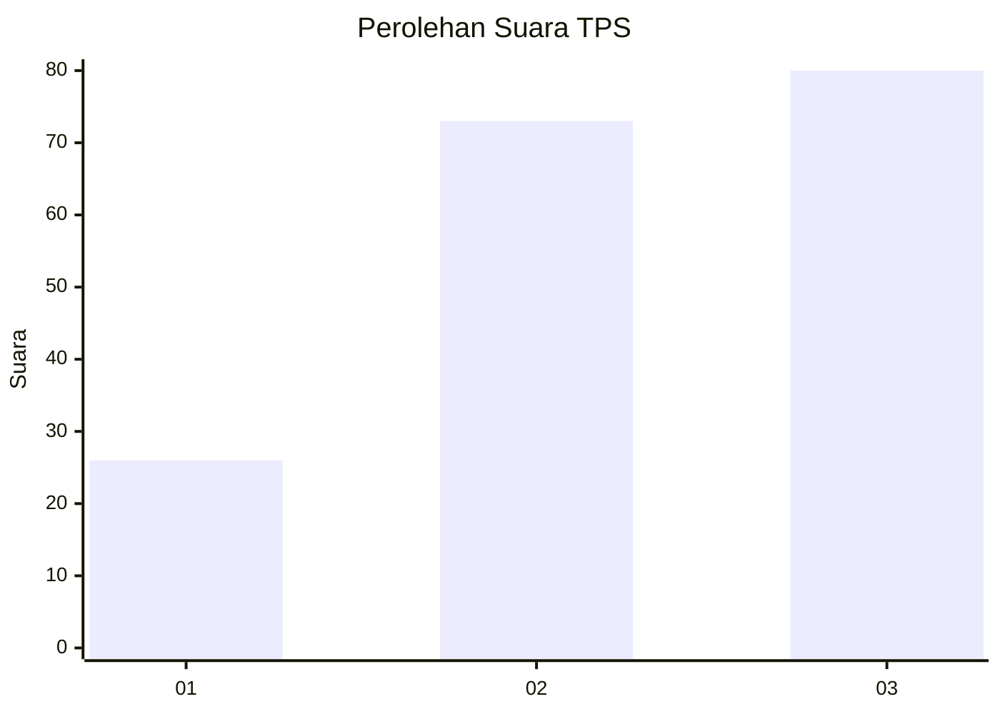
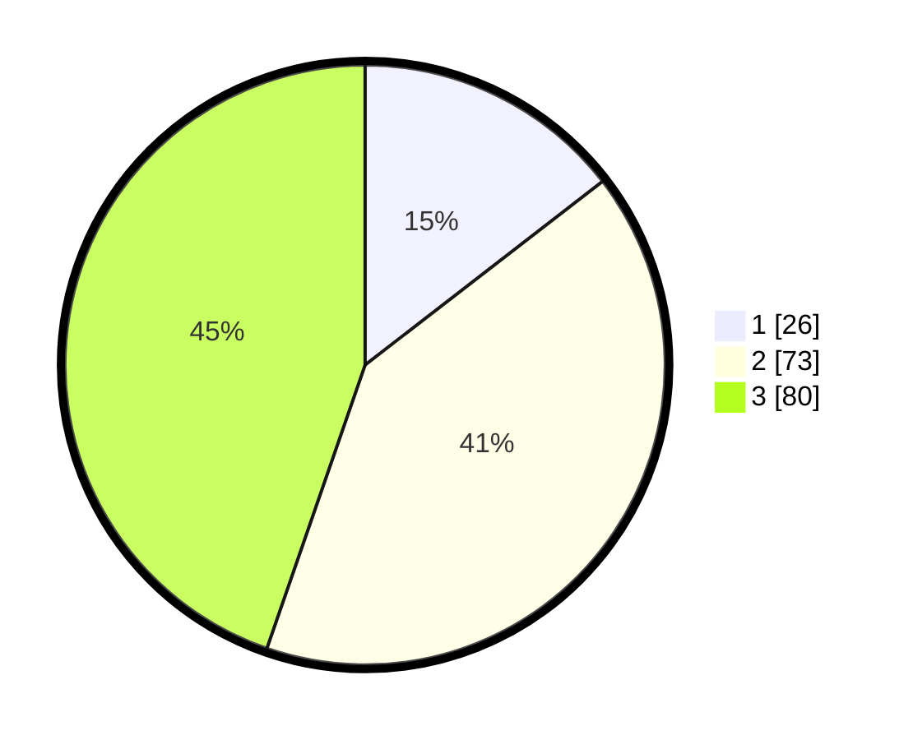

# Hasil

## Grafik

## Tabel

| No. | Nama Paslon    | Suara | Suara (raw) | Persentase |
|:--- |:-------------- | -----:| -----------:| ----------:|
| 1   | ANIES MUHAIMIN | 26    | [26][p-1]   | 14,53      |
| 2   | PRABOWO GIBRAN | 73    | [73][p-2]   | 40,78      |
| 3   | GANJAR MAHFUD  | 80    | [80][p-3]   | 44,69      |

[p-1]: https://github.com/gigit-pemilu/pemilu-2024/blob/main/pilpres/hitung-suara/sub/33-jawa-tengah/sub/02-banyumas/sub/11-banyumas/sub/2008-sudagaran/sub/011-tps/sub/paslon-1.txt
[p-2]: https://github.com/gigit-pemilu/pemilu-2024/blob/main/pilpres/hitung-suara/sub/33-jawa-tengah/sub/02-banyumas/sub/11-banyumas/sub/2008-sudagaran/sub/011-tps/sub/paslon-2.txt
[p-3]: https://github.com/gigit-pemilu/pemilu-2024/blob/main/pilpres/hitung-suara/sub/33-jawa-tengah/sub/02-banyumas/sub/11-banyumas/sub/2008-sudagaran/sub/011-tps/sub/paslon-3.txt

## Foto C Plano

https://sirekap-obj-formc.kpu.go.id/ff8b/pemilu/ppwp/33/02/11/20/08/3302112008011-20240215-051549--46f48a26-1c25-4fcb-9752-a21a9a235d00.jpg

https://sirekap-obj-formc.kpu.go.id/ff8b/pemilu/ppwp/33/02/11/20/08/3302112008011-20240214-155145--36a41d42-8987-4a97-851c-2d078b321913.jpg

https://sirekap-obj-formc.kpu.go.id/ff8b/pemilu/ppwp/33/02/11/20/08/3302112008011-20240214-155328--3f27c721-b9a2-462c-876f-78347cb02357.jpg

## Metadata

| Key        | Value               |
| ---------- | ------------------- |
| Time Stamp | 2024-02-16 21:01:00 |

