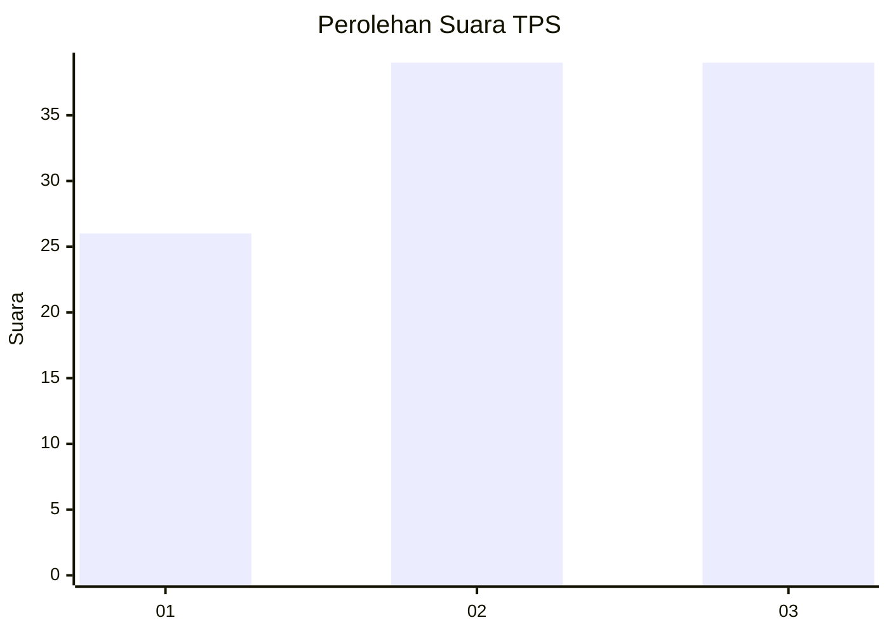
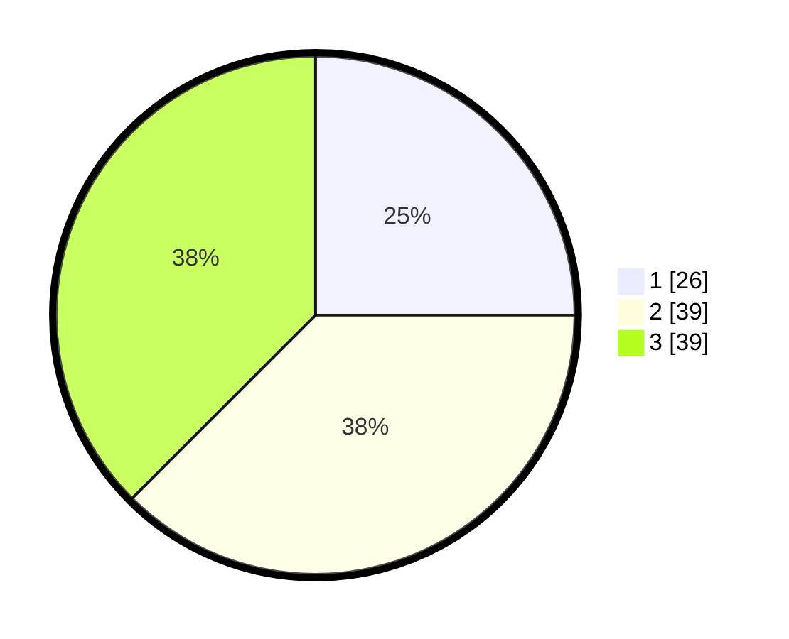

# Hasil

## Grafik

## Tabel

| No. | Nama Paslon    | Suara | Suara (raw) | Persentase |
|:--- |:-------------- | -----:| -----------:| ----------:|
| 1   | ANIES MUHAIMIN | 26    | [26][p-1]   | 25,00      |
| 2   | PRABOWO GIBRAN | 39    | [39][p-2]   | 37,50      |
| 3   | GANJAR MAHFUD  | 39    | [39][p-3]   | 37,50      |

[p-1]: https://github.com/gigit-pemilu/pemilu-2024/blob/main/pilpres/hitung-suara/sub/33-jawa-tengah/sub/02-banyumas/sub/11-banyumas/sub/2008-sudagaran/sub/901-tps/sub/paslon-1.txt
[p-2]: https://github.com/gigit-pemilu/pemilu-2024/blob/main/pilpres/hitung-suara/sub/33-jawa-tengah/sub/02-banyumas/sub/11-banyumas/sub/2008-sudagaran/sub/901-tps/sub/paslon-2.txt
[p-3]: https://github.com/gigit-pemilu/pemilu-2024/blob/main/pilpres/hitung-suara/sub/33-jawa-tengah/sub/02-banyumas/sub/11-banyumas/sub/2008-sudagaran/sub/901-tps/sub/paslon-3.txt

## Foto C Plano

https://sirekap-obj-formc.kpu.go.id/453d/pemilu/ppwp/33/02/11/20/08/3302112008901-20240214-192409--e65a646d-0d02-4a0b-a253-2a1747c2f105.jpg

https://sirekap-obj-formc.kpu.go.id/453d/pemilu/ppwp/33/02/11/20/08/3302112008901-20240214-194951--dae2ea12-07d4-4364-bcc2-e24d2a0aa721.jpg

https://sirekap-obj-formc.kpu.go.id/453d/pemilu/ppwp/33/02/11/20/08/3302112008901-20240214-200557--b2bd5e6b-cdb7-4648-9b90-c9495654afa5.jpg

## Metadata

| Key        | Value               |
| ---------- | ------------------- |
| Time Stamp | 2024-02-15 16:00:26 |

## DATA PEMILIH TETAP

Jumlah pemilih dalam DPT: **111**.
 * L: **56**.
 * P: **55**.

## DATA PENGGUNA HAK PILIH

Jumlah pengguna hak pilih dalam DPT: **85**.
 * L: **41**.
 * P: **44**.

Jumlah pengguna hak pilih dalam DPTb: **23**.
 * L: **11**.
 * P: **12**.

Jumlah pengguna hak pilih dalam DPK: **0**.
 * L: **0**.
 * P: **0**.

Jumlah pengguna hak pilih: **108**.
 * L: **52**.
 * P: **56**.

## JUMLAH SUARA SAH DAN TIDAK SAH

JUMLAH SELURUH SUARA SAH: **104**.

JUMLAH SUARA TIDAK SAH: **4**.

JUMLAH SELURUH SUARA SAH DAN SUARA TIDAK SAH: **108**.

