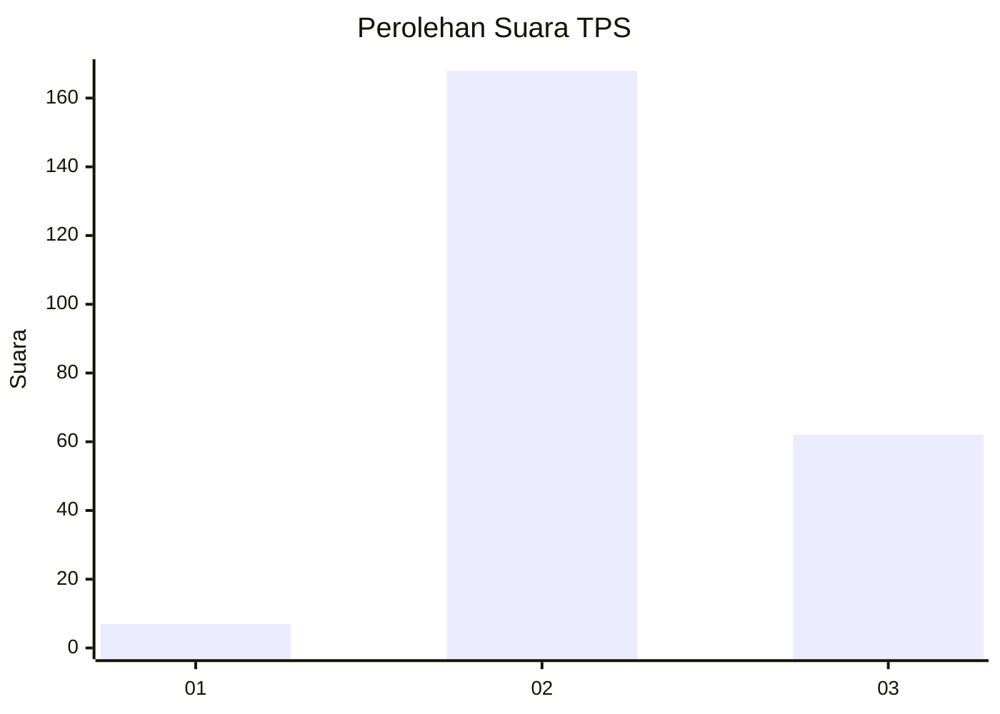
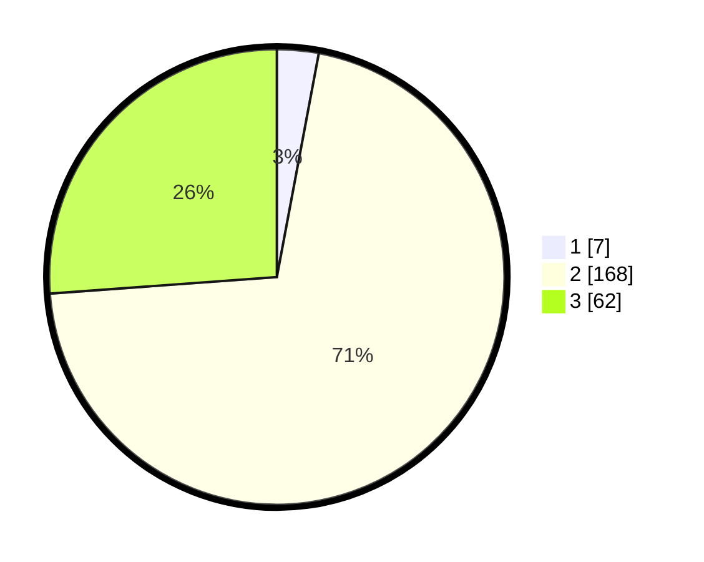

# Hasil

## Grafik

## Tabel

| No. | Nama Paslon    | Suara | Suara (raw) | Persentase |
|:--- |:-------------- | -----:| -----------:| ----------:|
| 1   | ANIES MUHAIMIN | 7     | [7][p-1]    | 2,95       |
| 2   | PRABOWO GIBRAN | 168   | [168][p-2]  | 70,89      |
| 3   | GANJAR MAHFUD  | 62    | [62][p-3]   | 26,16      |

[p-1]: https://github.com/gigit-pemilu/pemilu-2024-33-jawa-tengah/blob/main/pilpres/hitung-suara/sub/33-jawa-tengah/sub/02-banyumas/sub/12-patikraja/sub/2001-wlahar-kulon/sub/002-tps/sub/paslon-1.txt
[p-2]: https://github.com/gigit-pemilu/pemilu-2024-33-jawa-tengah/blob/main/pilpres/hitung-suara/sub/33-jawa-tengah/sub/02-banyumas/sub/12-patikraja/sub/2001-wlahar-kulon/sub/002-tps/sub/paslon-2.txt
[p-3]: https://github.com/gigit-pemilu/pemilu-2024-33-jawa-tengah/blob/main/pilpres/hitung-suara/sub/33-jawa-tengah/sub/02-banyumas/sub/12-patikraja/sub/2001-wlahar-kulon/sub/002-tps/sub/paslon-3.txt

## Foto C Plano

https://sirekap-obj-formc.kpu.go.id/f546/pemilu/ppwp/33/02/12/20/01/3302122001002-20240214-230822--bcf2630b-8f79-4202-9d09-228d893e87ed.jpg

https://sirekap-obj-formc.kpu.go.id/f546/pemilu/ppwp/33/02/12/20/01/3302122001002-20240214-231623--25a6c209-6df7-43dd-95bd-01a8178d0f4f.jpg

https://sirekap-obj-formc.kpu.go.id/f546/pemilu/ppwp/33/02/12/20/01/3302122001002-20240214-231719--826bd45c-c0a9-4861-a04c-97b0366f38bc.jpg

## Metadata

| Key        | Value               |
| ---------- | ------------------- |
| Time Stamp | 2024-02-16 23:30:00 |

