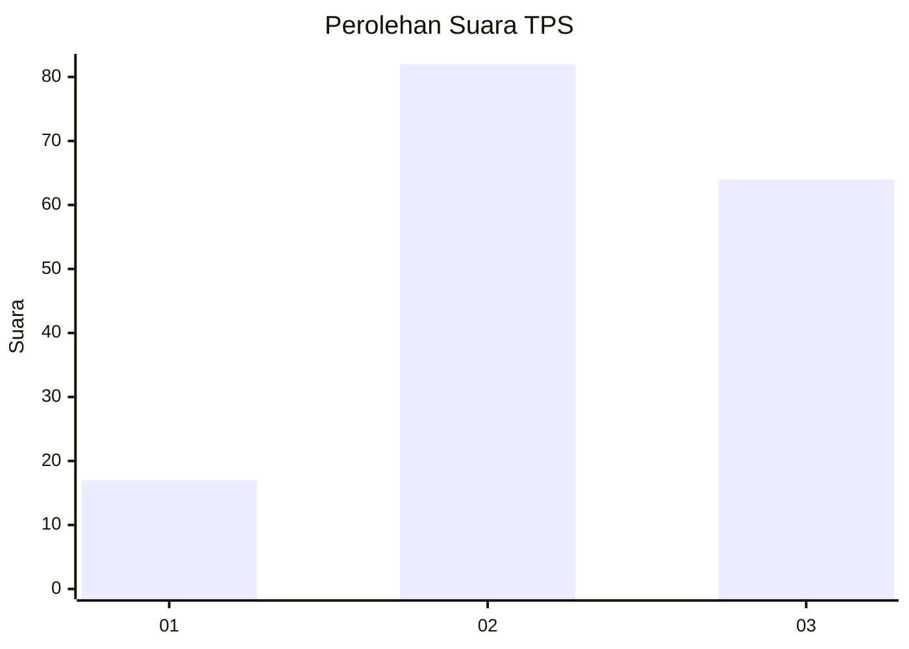
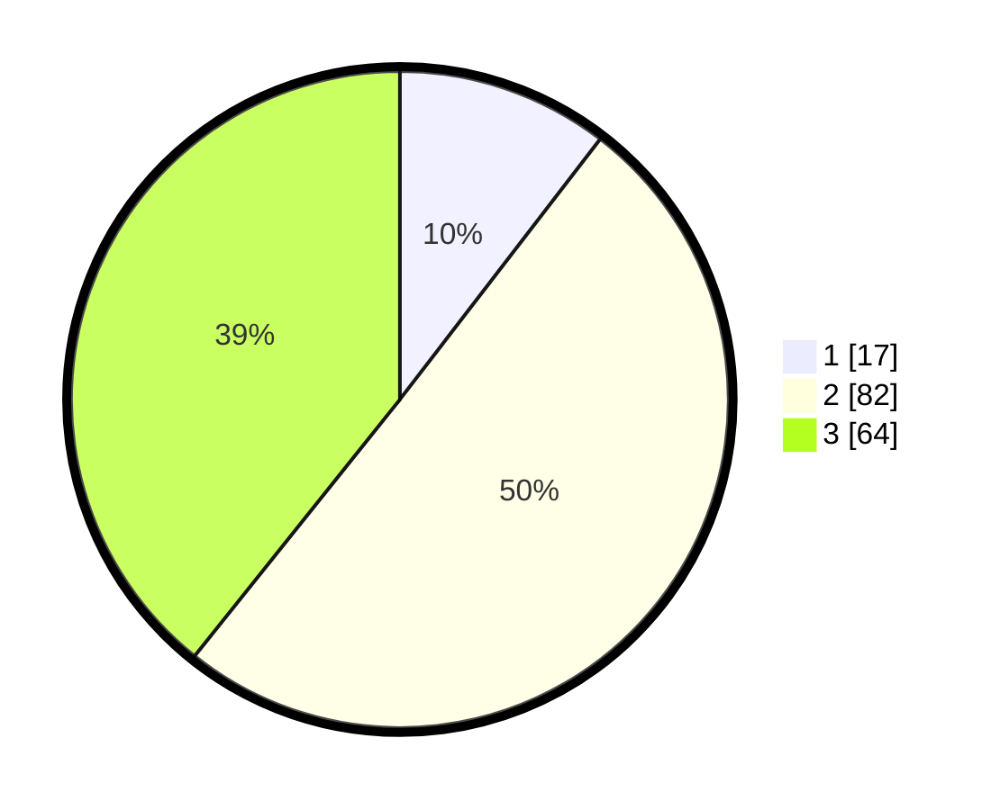

# Hasil

## Grafik

## Tabel

| No. | Nama Paslon    | Suara | Suara (raw) | Persentase |
|:--- |:-------------- | -----:| -----------:| ----------:|
| 1   | ANIES MUHAIMIN | 17    | [17][p-1]   | 10,43      |
| 2   | PRABOWO GIBRAN | 82    | [82][p-2]   | 50,31      |
| 3   | GANJAR MAHFUD  | 64    | [64][p-3]   | 39,26      |

[p-1]: https://github.com/gigit-pemilu/pemilu-2024/blob/main/pilpres/hitung-suara/sub/33-jawa-tengah/sub/02-banyumas/sub/12-patikraja/sub/2006-karangendep/sub/008-tps/sub/paslon-1.txt
[p-2]: https://github.com/gigit-pemilu/pemilu-2024/blob/main/pilpres/hitung-suara/sub/33-jawa-tengah/sub/02-banyumas/sub/12-patikraja/sub/2006-karangendep/sub/008-tps/sub/paslon-2.txt
[p-3]: https://github.com/gigit-pemilu/pemilu-2024/blob/main/pilpres/hitung-suara/sub/33-jawa-tengah/sub/02-banyumas/sub/12-patikraja/sub/2006-karangendep/sub/008-tps/sub/paslon-3.txt

## Foto C Plano

https://sirekap-obj-formc.kpu.go.id/1474/pemilu/ppwp/33/02/12/20/06/3302122006008-20240215-033419--20455e9a-5bb5-4454-a009-439ce1475adf.jpg

https://sirekap-obj-formc.kpu.go.id/1474/pemilu/ppwp/33/02/12/20/06/3302122006008-20240215-014432--d94d6a9a-88fb-4caa-821b-af345fa8c6f9.jpg

https://sirekap-obj-formc.kpu.go.id/1474/pemilu/ppwp/33/02/12/20/06/3302122006008-20240215-015137--2882f256-7be7-4c51-b43d-48be9e07f8b2.jpg

## Metadata

| Key        | Value               |
| ---------- | ------------------- |
| Time Stamp | 2024-02-16 23:30:00 |

