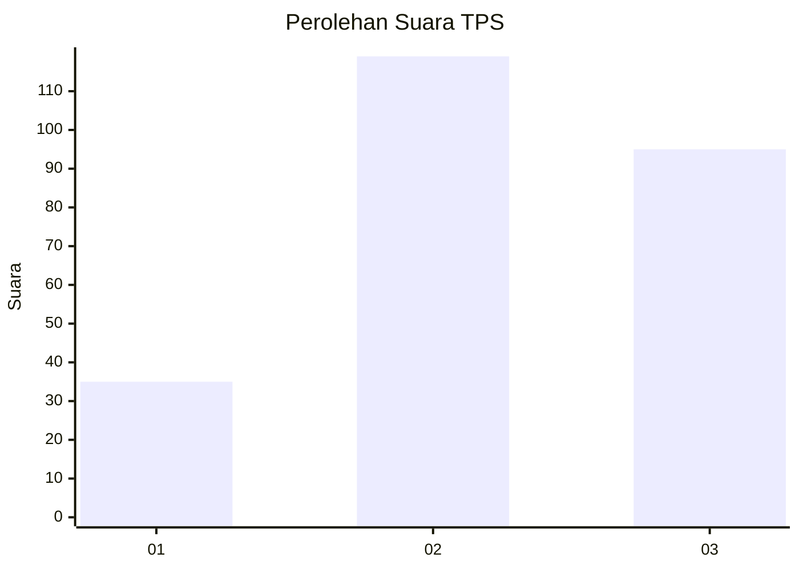
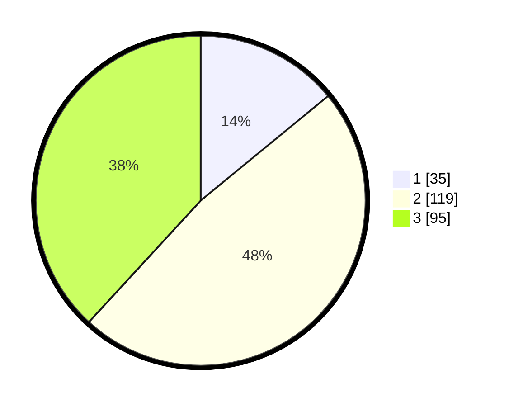

# Hasil

## Grafik

## Tabel

| No. | Nama Paslon    | Suara | Suara (raw) | Persentase |
|:--- |:-------------- | -----:| -----------:| ----------:|
| 1   | ANIES MUHAIMIN | 35    | [35][p-1]   | 14,06      |
| 2   | PRABOWO GIBRAN | 119   | [119][p-2]  | 47,79      |
| 3   | GANJAR MAHFUD  | 95    | [95][p-3]   | 38,15      |

[p-1]: https://github.com/gigit-pemilu/pemilu-2024-33-jawa-tengah/blob/main/pilpres/hitung-suara/sub/33-jawa-tengah/sub/02-banyumas/sub/12-patikraja/sub/2007-sawangan-wetan/sub/004-tps/sub/paslon-1.txt
[p-2]: https://github.com/gigit-pemilu/pemilu-2024-33-jawa-tengah/blob/main/pilpres/hitung-suara/sub/33-jawa-tengah/sub/02-banyumas/sub/12-patikraja/sub/2007-sawangan-wetan/sub/004-tps/sub/paslon-2.txt
[p-3]: https://github.com/gigit-pemilu/pemilu-2024-33-jawa-tengah/blob/main/pilpres/hitung-suara/sub/33-jawa-tengah/sub/02-banyumas/sub/12-patikraja/sub/2007-sawangan-wetan/sub/004-tps/sub/paslon-3.txt

## Foto C Plano

https://sirekap-obj-formc.kpu.go.id/b9de/pemilu/ppwp/33/02/12/20/07/3302122007004-20240215-093309--25aa777d-3ff7-414c-a5d9-36cd40b3c493.jpg

https://sirekap-obj-formc.kpu.go.id/b9de/pemilu/ppwp/33/02/12/20/07/3302122007004-20240215-093319--e3261fe3-6059-43e1-ab39-677a33538f06.jpg

https://sirekap-obj-formc.kpu.go.id/b9de/pemilu/ppwp/33/02/12/20/07/3302122007004-20240215-093336--91265aca-2a82-40aa-9ae6-e682e1dae950.jpg

## Metadata

| Key        | Value               |
| ---------- | ------------------- |
| Time Stamp | 2024-02-16 23:30:00 |

