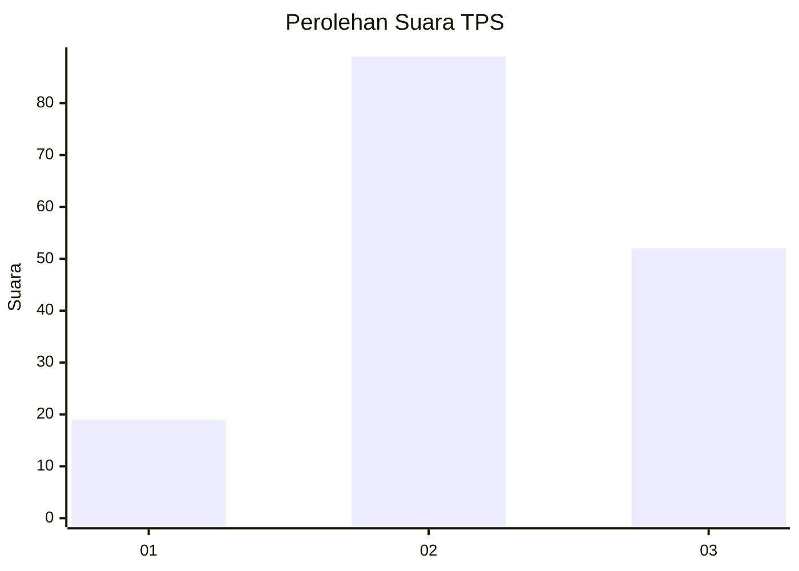
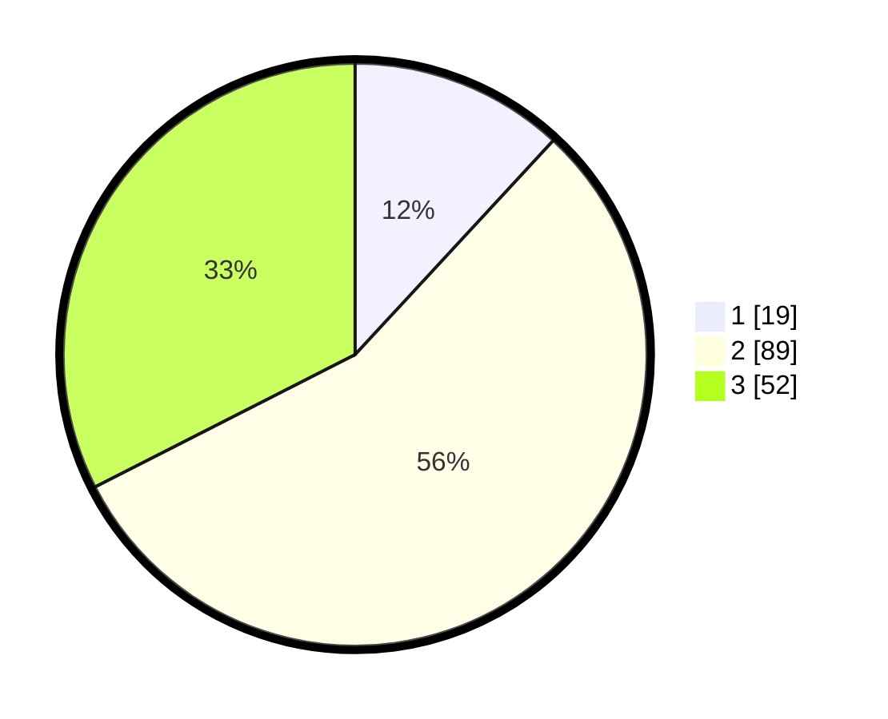

# Hasil

## Grafik

## Tabel

| No. | Nama Paslon    | Suara | Suara (raw) | Persentase |
|:--- |:-------------- | -----:| -----------:| ----------:|
| 1   | ANIES MUHAIMIN | 19    | [19][p-1]   | 11,88      |
| 2   | PRABOWO GIBRAN | 89    | [89][p-2]   | 55,63      |
| 3   | GANJAR MAHFUD  | 52    | [52][p-3]   | 32,50      |

[p-1]: https://github.com/gigit-pemilu/pemilu-2024-33-jawa-tengah/blob/main/pilpres/hitung-suara/sub/33-jawa-tengah/sub/02-banyumas/sub/12-patikraja/sub/2008-kedungwuluh-kidul/sub/005-tps/sub/paslon-1.txt
[p-2]: https://github.com/gigit-pemilu/pemilu-2024-33-jawa-tengah/blob/main/pilpres/hitung-suara/sub/33-jawa-tengah/sub/02-banyumas/sub/12-patikraja/sub/2008-kedungwuluh-kidul/sub/005-tps/sub/paslon-2.txt
[p-3]: https://github.com/gigit-pemilu/pemilu-2024-33-jawa-tengah/blob/main/pilpres/hitung-suara/sub/33-jawa-tengah/sub/02-banyumas/sub/12-patikraja/sub/2008-kedungwuluh-kidul/sub/005-tps/sub/paslon-3.txt

## Foto C Plano

https://sirekap-obj-formc.kpu.go.id/d3a2/pemilu/ppwp/33/02/12/20/08/3302122008005-20240214-141150--1087919b-8b56-4803-b29d-35527fc28502.jpg

https://sirekap-obj-formc.kpu.go.id/d3a2/pemilu/ppwp/33/02/12/20/08/3302122008005-20240214-141340--f9a4cf86-f658-482a-8e2c-cafedc337b22.jpg

https://sirekap-obj-formc.kpu.go.id/d3a2/pemilu/ppwp/33/02/12/20/08/3302122008005-20240214-141528--39847eda-505a-44ba-9ee6-457562d83f69.jpg

## Metadata

| Key        | Value               |
| ---------- | ------------------- |
| Time Stamp | 2024-02-16 23:30:00 |

