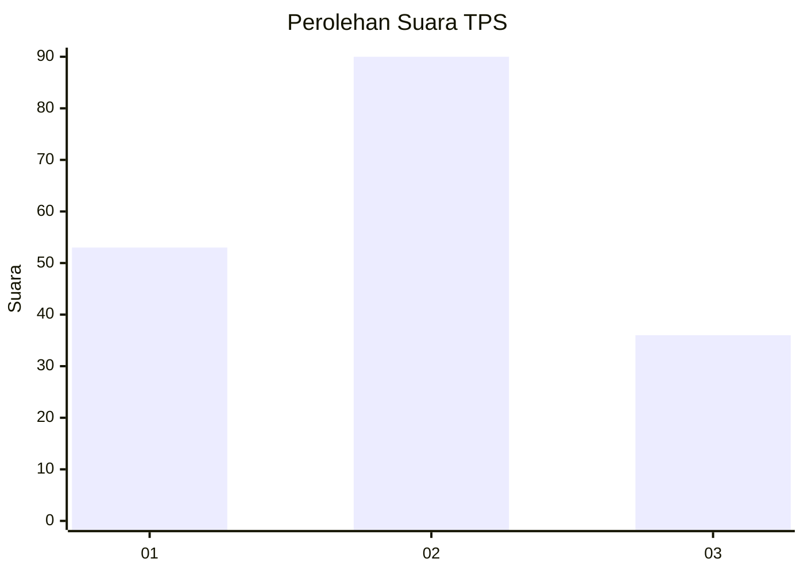
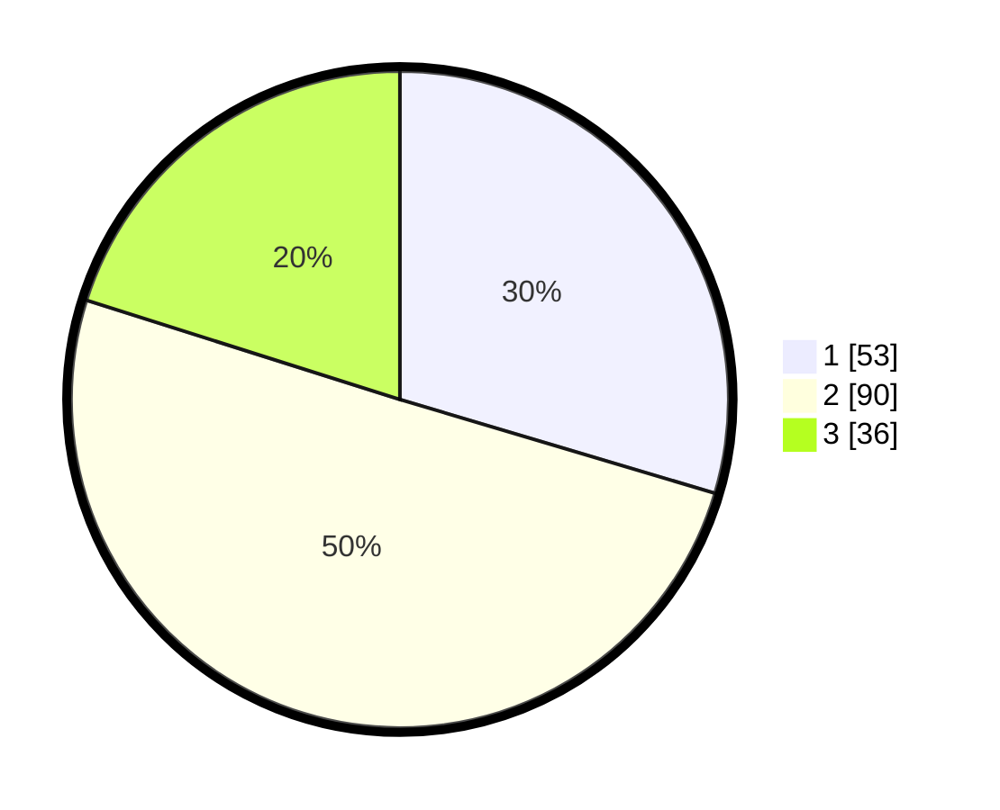

# Hasil

## Grafik

## Tabel

| No. | Nama Paslon    | Suara | Suara (raw) | Persentase |
|:--- |:-------------- | -----:| -----------:| ----------:|
| 1   | ANIES MUHAIMIN | 53    | [53][p-1]   | 29,61      |
| 2   | PRABOWO GIBRAN | 90    | [90][p-2]   | 50,28      |
| 3   | GANJAR MAHFUD  | 36    | [36][p-3]   | 20,11      |

[p-1]: https://github.com/gigit-pemilu/pemilu-2024/blob/main/pilpres/hitung-suara/sub/33-jawa-tengah/sub/02-banyumas/sub/12-patikraja/sub/2010-kedungwuluh-lor/sub/002-tps/sub/paslon-1.txt
[p-2]: https://github.com/gigit-pemilu/pemilu-2024/blob/main/pilpres/hitung-suara/sub/33-jawa-tengah/sub/02-banyumas/sub/12-patikraja/sub/2010-kedungwuluh-lor/sub/002-tps/sub/paslon-2.txt
[p-3]: https://github.com/gigit-pemilu/pemilu-2024/blob/main/pilpres/hitung-suara/sub/33-jawa-tengah/sub/02-banyumas/sub/12-patikraja/sub/2010-kedungwuluh-lor/sub/002-tps/sub/paslon-3.txt

## Foto C Plano

https://sirekap-obj-formc.kpu.go.id/94b7/pemilu/ppwp/33/02/12/20/10/3302122010002-20240215-001230--03f9b339-74db-4cb1-9110-282bf764a0d7.jpg

https://sirekap-obj-formc.kpu.go.id/94b7/pemilu/ppwp/33/02/12/20/10/3302122010002-20240214-224018--16d3bbe5-93e8-44d4-b710-fb8f0813f8ae.jpg

https://sirekap-obj-formc.kpu.go.id/94b7/pemilu/ppwp/33/02/12/20/10/3302122010002-20240214-224156--f7a2e3e0-3009-4d65-bd03-01c73b7f0dab.jpg

## Metadata

| Key        | Value               |
| ---------- | ------------------- |
| Time Stamp | 2024-02-16 21:01:00 |

