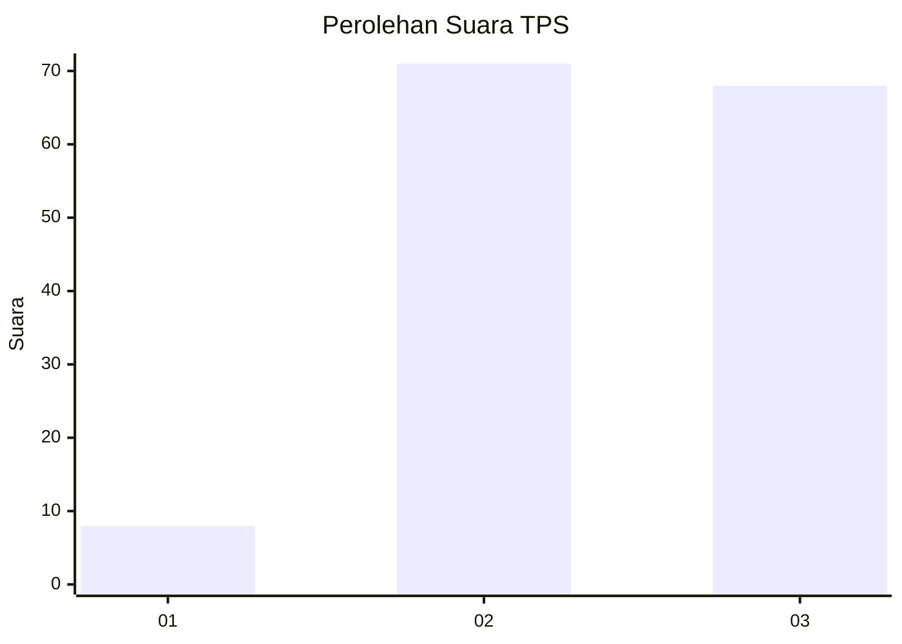
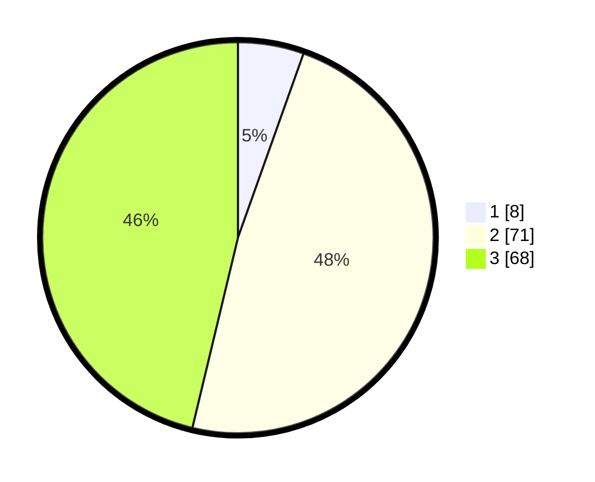

# Hasil

## Grafik

## Tabel

| No. | Nama Paslon    | Suara | Suara (raw) | Persentase |
|:--- |:-------------- | -----:| -----------:| ----------:|
| 1   | ANIES MUHAIMIN | 8     | [8][p-1]    | 5,44       |
| 2   | PRABOWO GIBRAN | 71    | [71][p-2]   | 48,30      |
| 3   | GANJAR MAHFUD  | 68    | [68][p-3]   | 46,26      |

[p-1]: https://github.com/gigit-pemilu/pemilu-2024/blob/main/pilpres/hitung-suara/sub/33-jawa-tengah/sub/02-banyumas/sub/12-patikraja/sub/2010-kedungwuluh-lor/sub/012-tps/sub/paslon-1.txt
[p-2]: https://github.com/gigit-pemilu/pemilu-2024/blob/main/pilpres/hitung-suara/sub/33-jawa-tengah/sub/02-banyumas/sub/12-patikraja/sub/2010-kedungwuluh-lor/sub/012-tps/sub/paslon-2.txt
[p-3]: https://github.com/gigit-pemilu/pemilu-2024/blob/main/pilpres/hitung-suara/sub/33-jawa-tengah/sub/02-banyumas/sub/12-patikraja/sub/2010-kedungwuluh-lor/sub/012-tps/sub/paslon-3.txt

## Foto C Plano

https://sirekap-obj-formc.kpu.go.id/35cd/pemilu/ppwp/33/02/12/20/10/3302122010012-20240215-024406--a9359355-859f-40b4-80d4-50dec90f94bb.jpg

https://sirekap-obj-formc.kpu.go.id/35cd/pemilu/ppwp/33/02/12/20/10/3302122010012-20240215-024434--eb1b0e3e-6a89-4877-af0f-b5b797c8281a.jpg

https://sirekap-obj-formc.kpu.go.id/35cd/pemilu/ppwp/33/02/12/20/10/3302122010012-20240215-024453--8e4647b6-dc43-4286-8623-5b786de217ff.jpg

## Metadata

| Key        | Value               |
| ---------- | ------------------- |
| Time Stamp | 2024-02-16 23:00:00 |

