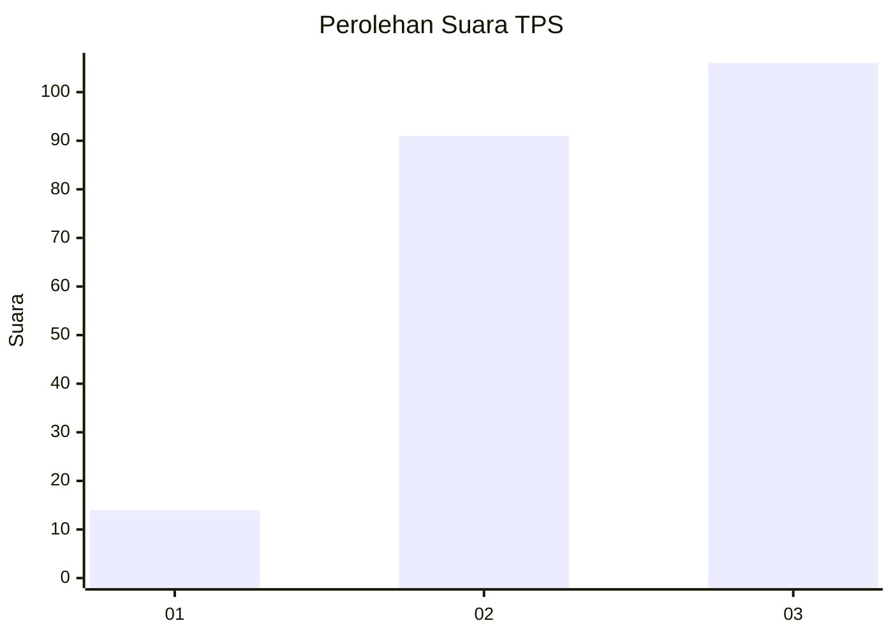
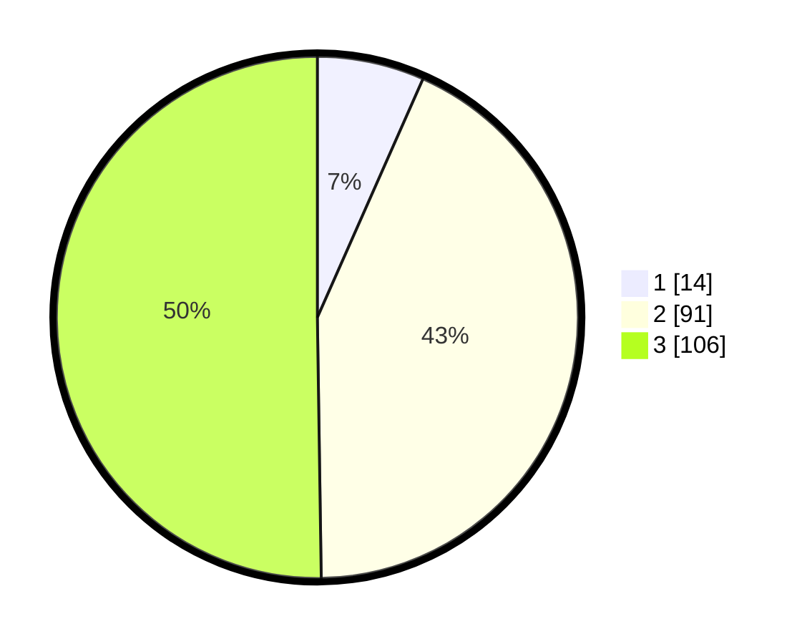

# Hasil

## Grafik

## Tabel

| No. | Nama Paslon    | Suara | Suara (raw) | Persentase |
|:--- |:-------------- | -----:| -----------:| ----------:|
| 1   | ANIES MUHAIMIN | 14    | [14][p-1]   | 6,64       |
| 2   | PRABOWO GIBRAN | 91    | [91][p-2]   | 43,13      |
| 3   | GANJAR MAHFUD  | 106   | [106][p-3]  | 50,24      |

[p-1]: https://github.com/gigit-pemilu/pemilu-2024/blob/main/pilpres/hitung-suara/sub/33-jawa-tengah/sub/02-banyumas/sub/12-patikraja/sub/2010-kedungwuluh-lor/sub/014-tps/sub/paslon-1.txt
[p-2]: https://github.com/gigit-pemilu/pemilu-2024/blob/main/pilpres/hitung-suara/sub/33-jawa-tengah/sub/02-banyumas/sub/12-patikraja/sub/2010-kedungwuluh-lor/sub/014-tps/sub/paslon-2.txt
[p-3]: https://github.com/gigit-pemilu/pemilu-2024/blob/main/pilpres/hitung-suara/sub/33-jawa-tengah/sub/02-banyumas/sub/12-patikraja/sub/2010-kedungwuluh-lor/sub/014-tps/sub/paslon-3.txt

## Foto C Plano

https://sirekap-obj-formc.kpu.go.id/1ba9/pemilu/ppwp/33/02/12/20/10/3302122010014-20240215-045759--1c5b581a-c7af-48b9-80ed-e35a756b9e2d.jpg

https://sirekap-obj-formc.kpu.go.id/1ba9/pemilu/ppwp/33/02/12/20/10/3302122010014-20240215-050025--9e585182-6b68-4bab-a142-ba70e7960be4.jpg

https://sirekap-obj-formc.kpu.go.id/1ba9/pemilu/ppwp/33/02/12/20/10/3302122010014-20240215-050253--313cbdba-c9b4-4027-af49-a3c052053b5f.jpg

## Metadata

| Key        | Value               |
| ---------- | ------------------- |
| Time Stamp | 2024-02-16 21:01:00 |

