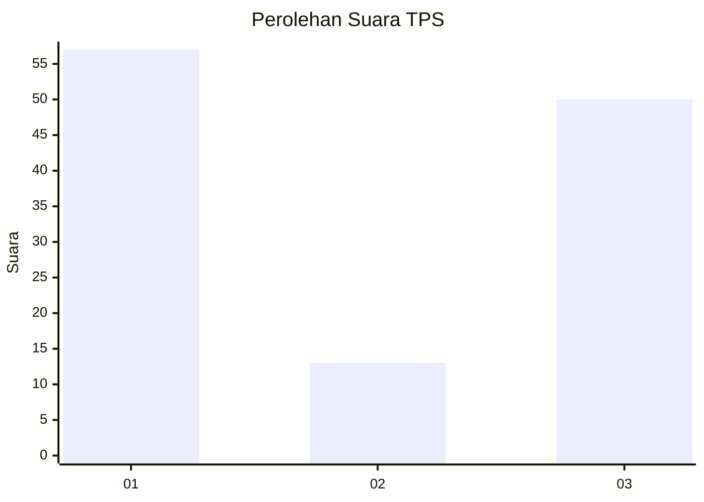
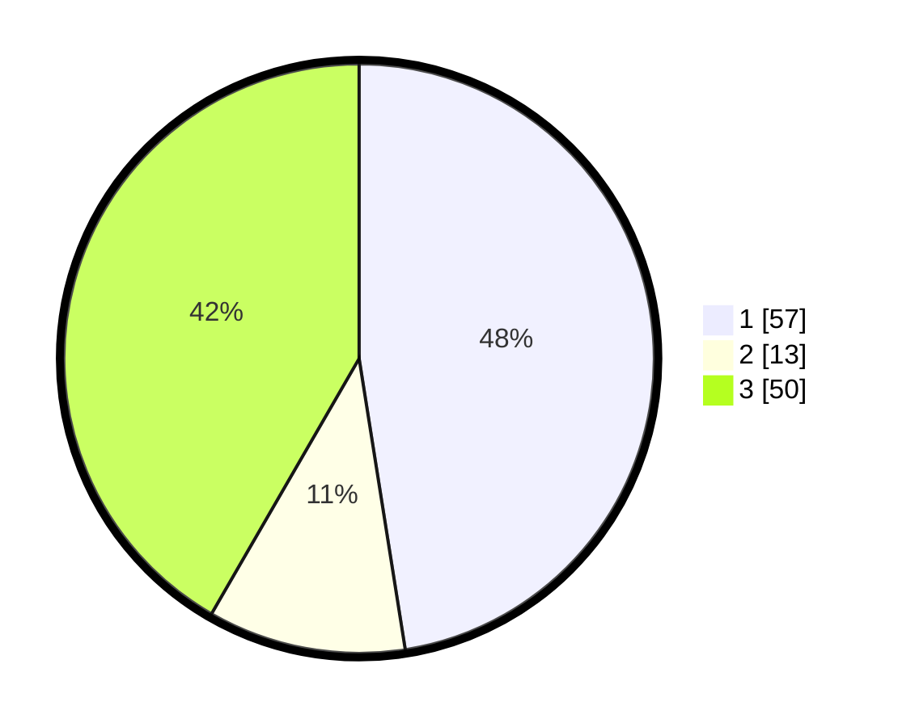

# Hasil

## Grafik

## Tabel

| No. | Nama Paslon    | Suara | Suara (raw) | Persentase |
|:--- |:-------------- | -----:| -----------:| ----------:|
| 1   | ANIES MUHAIMIN | 57    | [57][p-1]   | 47,50      |
| 2   | PRABOWO GIBRAN | 13    | [13][p-2]   | 10,83      |
| 3   | GANJAR MAHFUD  | 50    | [50][p-3]   | 41,67      |

[p-1]: https://github.com/gigit-pemilu/pemilu-2024-33-jawa-tengah/blob/main/pilpres/hitung-suara/sub/33-jawa-tengah/sub/02-banyumas/sub/12-patikraja/sub/2013-kedungwringin/sub/007-tps/sub/paslon-1.txt
[p-2]: https://github.com/gigit-pemilu/pemilu-2024-33-jawa-tengah/blob/main/pilpres/hitung-suara/sub/33-jawa-tengah/sub/02-banyumas/sub/12-patikraja/sub/2013-kedungwringin/sub/007-tps/sub/paslon-2.txt
[p-3]: https://github.com/gigit-pemilu/pemilu-2024-33-jawa-tengah/blob/main/pilpres/hitung-suara/sub/33-jawa-tengah/sub/02-banyumas/sub/12-patikraja/sub/2013-kedungwringin/sub/007-tps/sub/paslon-3.txt

## Foto C Plano

https://sirekap-obj-formc.kpu.go.id/7b04/pemilu/ppwp/33/02/12/20/13/3302122013007-20240214-202639--06f725ca-dd72-4cd3-bd45-130ea6087eb5.jpg

https://sirekap-obj-formc.kpu.go.id/7b04/pemilu/ppwp/33/02/12/20/13/3302122013007-20240214-222335--5af52cdc-40d1-49e4-b229-dbe21f7ab434.jpg

https://sirekap-obj-formc.kpu.go.id/7b04/pemilu/ppwp/33/02/12/20/13/3302122013007-20240214-203240--208b4323-645e-487b-825e-ba7f985ffad2.jpg

## Metadata

| Key        | Value               |
| ---------- | ------------------- |
| Time Stamp | 2024-02-15 12:00:28 |

