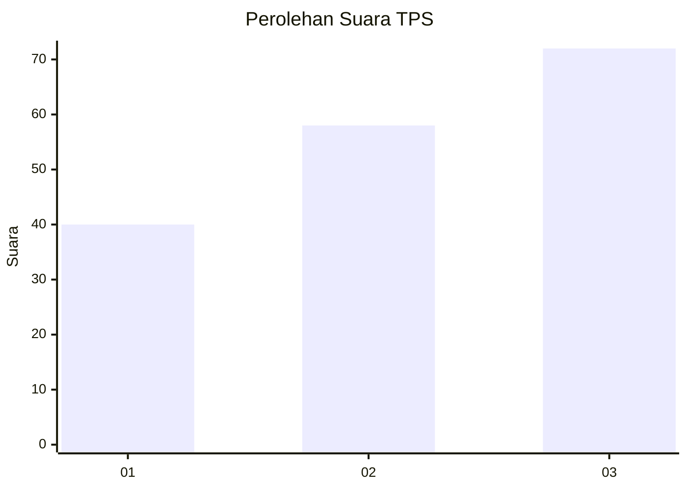
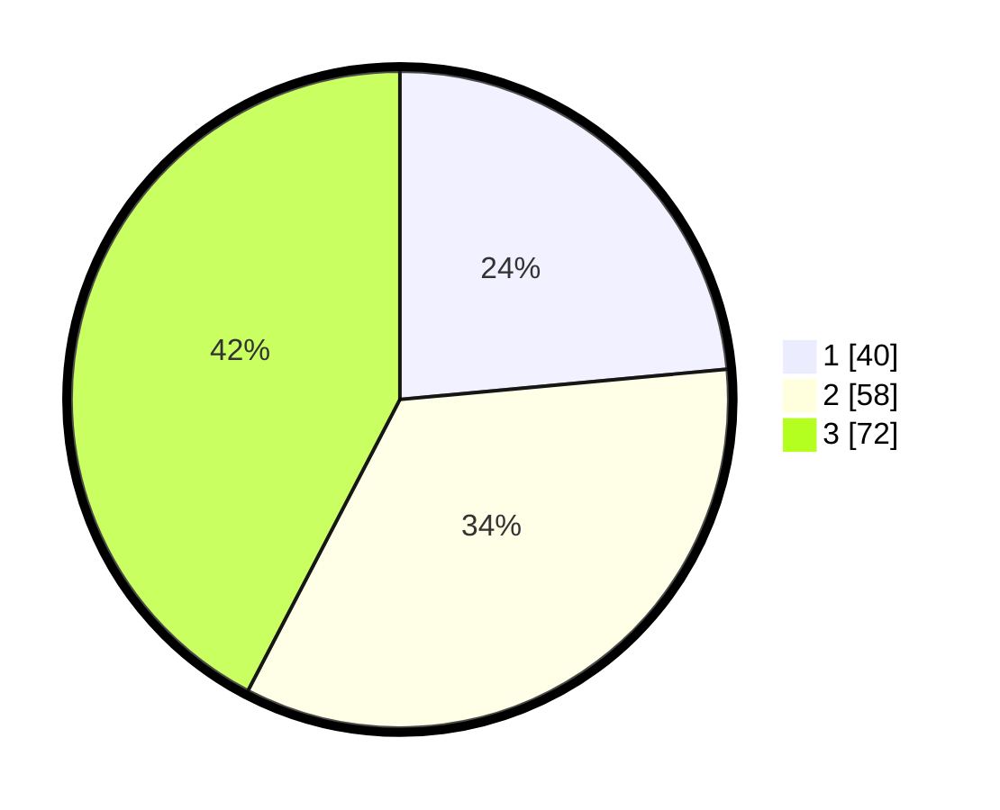

# Hasil

## Grafik

## Tabel

| No. | Nama Paslon    | Suara | Suara (raw) | Persentase |
|:--- |:-------------- | -----:| -----------:| ----------:|
| 1   | ANIES MUHAIMIN | 40    | [40][p-1]   | 23,53      |
| 2   | PRABOWO GIBRAN | 58    | [58][p-2]   | 34,12      |
| 3   | GANJAR MAHFUD  | 72    | [72][p-3]   | 42,35      |

[p-1]: https://github.com/gigit-pemilu/pemilu-2024-33-jawa-tengah/blob/main/pilpres/hitung-suara/sub/33-jawa-tengah/sub/02-banyumas/sub/13-purwojati/sub/2006-klapasawit/sub/001-tps/sub/paslon-1.txt
[p-2]: https://github.com/gigit-pemilu/pemilu-2024-33-jawa-tengah/blob/main/pilpres/hitung-suara/sub/33-jawa-tengah/sub/02-banyumas/sub/13-purwojati/sub/2006-klapasawit/sub/001-tps/sub/paslon-2.txt
[p-3]: https://github.com/gigit-pemilu/pemilu-2024-33-jawa-tengah/blob/main/pilpres/hitung-suara/sub/33-jawa-tengah/sub/02-banyumas/sub/13-purwojati/sub/2006-klapasawit/sub/001-tps/sub/paslon-3.txt

## Foto C Plano

https://sirekap-obj-formc.kpu.go.id/3aa8/pemilu/ppwp/33/02/13/20/06/3302132006001-20240215-011052--7aff0f90-11df-4e2a-9ed6-297ba1ad8777.jpg

https://sirekap-obj-formc.kpu.go.id/3aa8/pemilu/ppwp/33/02/13/20/06/3302132006001-20240215-010941--13949235-5169-4a2e-95d9-8c29427bfb3c.jpg

https://sirekap-obj-formc.kpu.go.id/3aa8/pemilu/ppwp/33/02/13/20/06/3302132006001-20240215-011917--3764bf0f-7007-4be5-acb9-1dfdbaef48ac.jpg

## Metadata

| Key        | Value               |
| ---------- | ------------------- |
| Time Stamp | 2024-02-16 23:00:00 |

