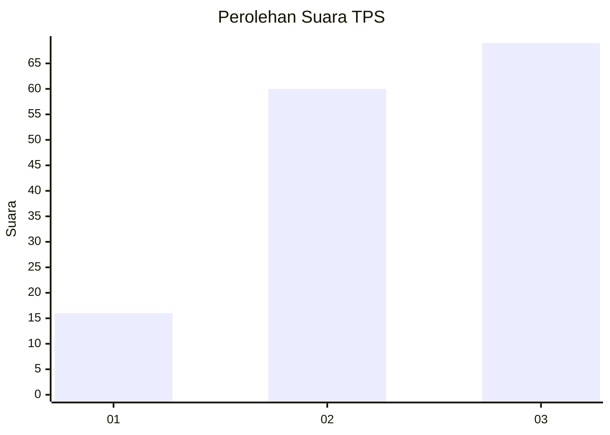
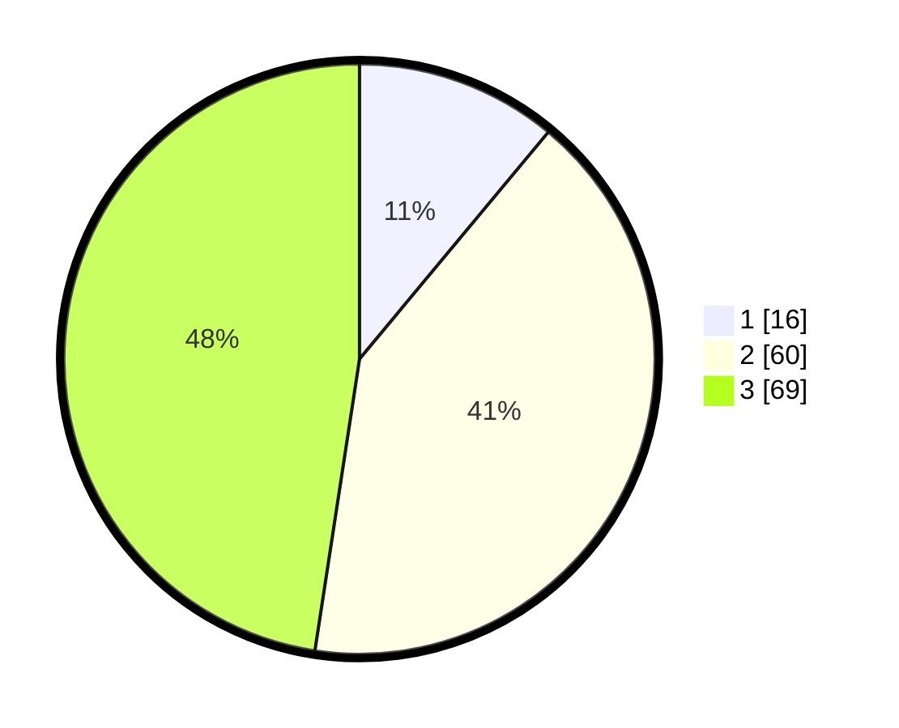

# Hasil

## Grafik

## Tabel

| No. | Nama Paslon    | Suara | Suara (raw) | Persentase |
|:--- |:-------------- | -----:| -----------:| ----------:|
| 1   | ANIES MUHAIMIN | 16    | [16][p-1]   | 11,03      |
| 2   | PRABOWO GIBRAN | 60    | [60][p-2]   | 41,38      |
| 3   | GANJAR MAHFUD  | 69    | [69][p-3]   | 47,59      |

[p-1]: https://github.com/gigit-pemilu/pemilu-2024/blob/main/pilpres/hitung-suara/sub/33-jawa-tengah/sub/02-banyumas/sub/13-purwojati/sub/2006-klapasawit/sub/006-tps/sub/paslon-1.txt
[p-2]: https://github.com/gigit-pemilu/pemilu-2024/blob/main/pilpres/hitung-suara/sub/33-jawa-tengah/sub/02-banyumas/sub/13-purwojati/sub/2006-klapasawit/sub/006-tps/sub/paslon-2.txt
[p-3]: https://github.com/gigit-pemilu/pemilu-2024/blob/main/pilpres/hitung-suara/sub/33-jawa-tengah/sub/02-banyumas/sub/13-purwojati/sub/2006-klapasawit/sub/006-tps/sub/paslon-3.txt

## Foto C Plano

https://sirekap-obj-formc.kpu.go.id/9247/pemilu/ppwp/33/02/13/20/06/3302132006006-20240215-022052--2d9e7a60-0c5d-4050-99d9-c11fbdbdff4e.jpg

https://sirekap-obj-formc.kpu.go.id/9247/pemilu/ppwp/33/02/13/20/06/3302132006006-20240215-022213--bc9af12b-511c-460e-95d3-2a005b167b2e.jpg

https://sirekap-obj-formc.kpu.go.id/9247/pemilu/ppwp/33/02/13/20/06/3302132006006-20240215-022427--9a1937b1-0e45-4e96-913b-4386a90d4a4e.jpg

## Metadata

| Key        | Value               |
| ---------- | ------------------- |
| Time Stamp | 2024-02-16 23:00:00 |

