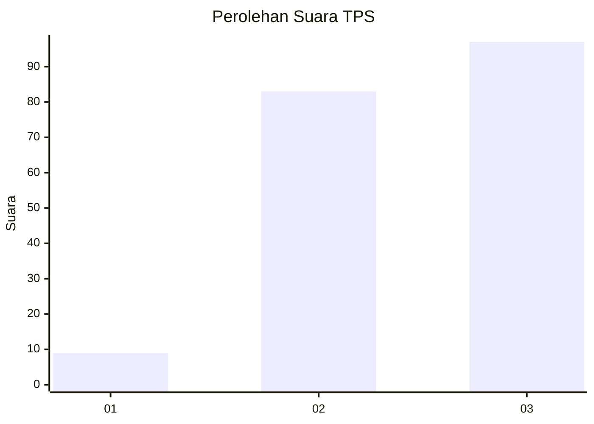
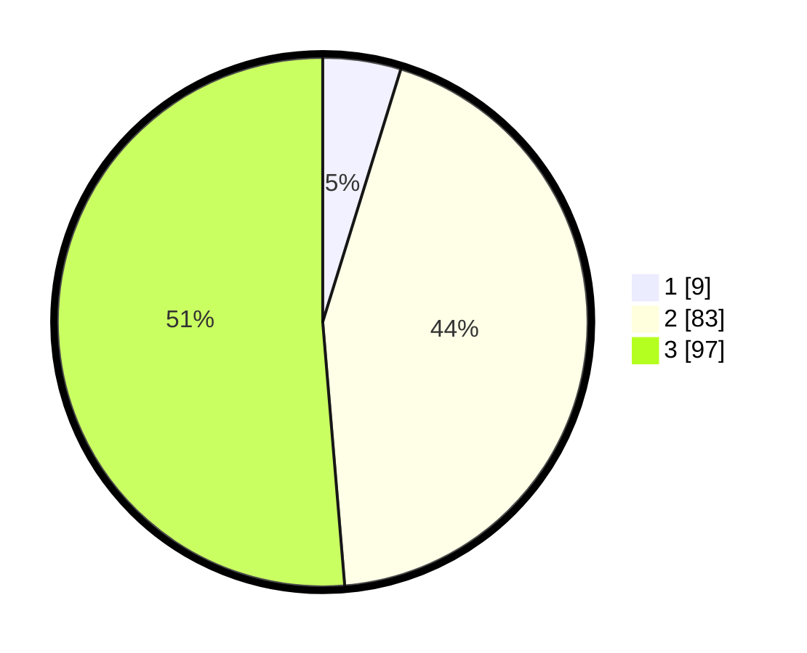

# Hasil

## Grafik

## Tabel

| No. | Nama Paslon    | Suara | Suara (raw) | Persentase |
|:--- |:-------------- | -----:| -----------:| ----------:|
| 1   | ANIES MUHAIMIN | 9     | [9][p-1]    | 4,76       |
| 2   | PRABOWO GIBRAN | 83    | [83][p-2]   | 43,92      |
| 3   | GANJAR MAHFUD  | 97    | [97][p-3]   | 51,32      |

[p-1]: https://github.com/gigit-pemilu/pemilu-2024-33-jawa-tengah/blob/main/pilpres/hitung-suara/sub/33-jawa-tengah/sub/02-banyumas/sub/13-purwojati/sub/2010-kalitapen/sub/010-tps/sub/paslon-1.txt
[p-2]: https://github.com/gigit-pemilu/pemilu-2024-33-jawa-tengah/blob/main/pilpres/hitung-suara/sub/33-jawa-tengah/sub/02-banyumas/sub/13-purwojati/sub/2010-kalitapen/sub/010-tps/sub/paslon-2.txt
[p-3]: https://github.com/gigit-pemilu/pemilu-2024-33-jawa-tengah/blob/main/pilpres/hitung-suara/sub/33-jawa-tengah/sub/02-banyumas/sub/13-purwojati/sub/2010-kalitapen/sub/010-tps/sub/paslon-3.txt

## Foto C Plano

https://sirekap-obj-formc.kpu.go.id/5260/pemilu/ppwp/33/02/13/20/10/3302132010010-20240214-234148--d7e4d841-1ac4-4181-a6bb-486a85addaef.jpg

https://sirekap-obj-formc.kpu.go.id/5260/pemilu/ppwp/33/02/13/20/10/3302132010010-20240214-234324--62db10d4-b175-4f2e-9a5b-ee8e8124b7d4.jpg

https://sirekap-obj-formc.kpu.go.id/5260/pemilu/ppwp/33/02/13/20/10/3302132010010-20240214-234543--0925f143-d116-4ab4-8f85-7fae1d6a97d3.jpg

## Metadata

| Key        | Value               |
| ---------- | ------------------- |
| Time Stamp | 2024-02-16 23:00:00 |

