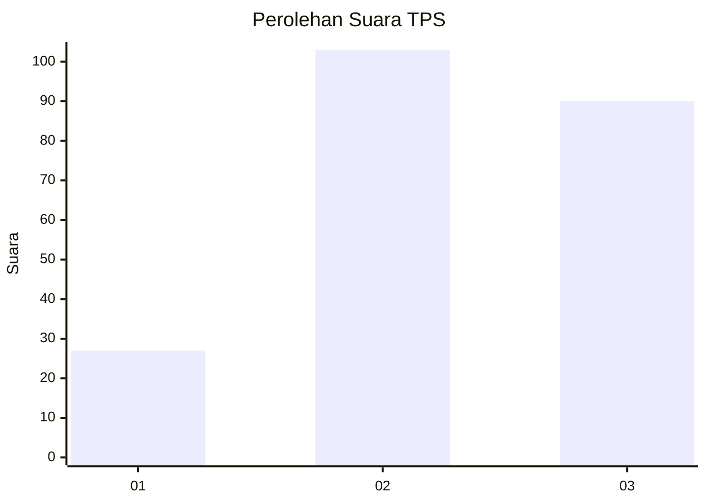
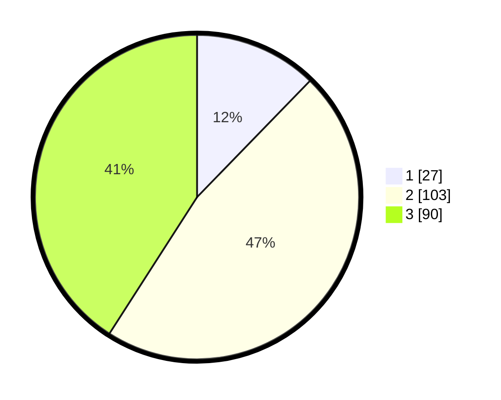

# Hasil

## Grafik

## Tabel

| No. | Nama Paslon    | Suara | Suara (raw) | Persentase |
|:--- |:-------------- | -----:| -----------:| ----------:|
| 1   | ANIES MUHAIMIN | 27    | [27][p-1]   | 12,27      |
| 2   | PRABOWO GIBRAN | 103   | [103][p-2]  | 46,82      |
| 3   | GANJAR MAHFUD  | 90    | [90][p-3]   | 40,91      |

[p-1]: https://github.com/gigit-pemilu/pemilu-2024-33-jawa-tengah/blob/main/pilpres/hitung-suara/sub/33-jawa-tengah/sub/02-banyumas/sub/14-ajibarang/sub/2001-darmakradenan/sub/003-tps/sub/paslon-1.txt
[p-2]: https://github.com/gigit-pemilu/pemilu-2024-33-jawa-tengah/blob/main/pilpres/hitung-suara/sub/33-jawa-tengah/sub/02-banyumas/sub/14-ajibarang/sub/2001-darmakradenan/sub/003-tps/sub/paslon-2.txt
[p-3]: https://github.com/gigit-pemilu/pemilu-2024-33-jawa-tengah/blob/main/pilpres/hitung-suara/sub/33-jawa-tengah/sub/02-banyumas/sub/14-ajibarang/sub/2001-darmakradenan/sub/003-tps/sub/paslon-3.txt

## Foto C Plano

https://sirekap-obj-formc.kpu.go.id/7f8f/pemilu/ppwp/33/02/14/20/01/3302142001003-20240217-120811--32286e25-376a-4c70-9f39-9a378b76e7e3.jpg

https://sirekap-obj-formc.kpu.go.id/7f8f/pemilu/ppwp/33/02/14/20/01/3302142001003-20240217-121643--6084687e-7ad7-4681-ad41-50d00ce999f3.jpg

https://sirekap-obj-formc.kpu.go.id/7f8f/pemilu/ppwp/33/02/14/20/01/3302142001003-20240217-121521--1ef6d58d-2f8b-414a-ae56-d37fdb9ac441.jpg

## Metadata

| Key        | Value               |
| ---------- | ------------------- |
| Time Stamp | 2024-02-24 22:31:28 |

