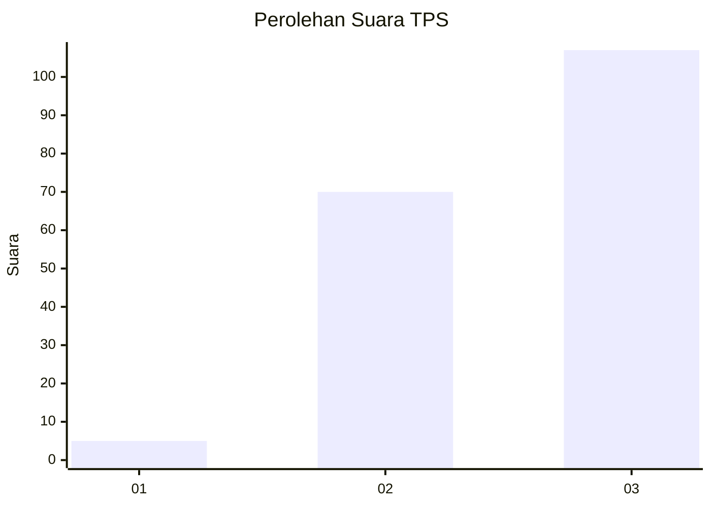
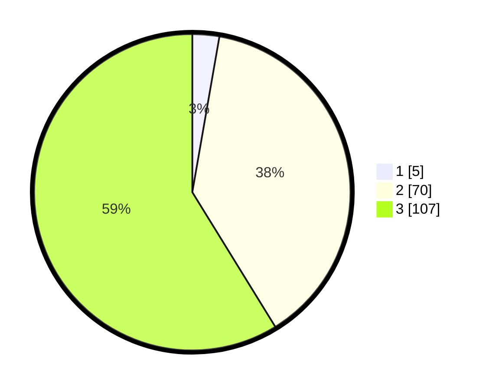

# Hasil

## Grafik

## Tabel

| No. | Nama Paslon    | Suara | Suara (raw) | Persentase |
|:--- |:-------------- | -----:| -----------:| ----------:|
| 1   | ANIES MUHAIMIN | 5     | [5][p-1]    | 2,75       |
| 2   | PRABOWO GIBRAN | 70    | [70][p-2]   | 38,46      |
| 3   | GANJAR MAHFUD  | 107   | [107][p-3]  | 58,79      |

[p-1]: https://github.com/gigit-pemilu/pemilu-2024/blob/main/pilpres/hitung-suara/sub/33-jawa-tengah/sub/02-banyumas/sub/14-ajibarang/sub/2001-darmakradenan/sub/012-tps/sub/paslon-1.txt
[p-2]: https://github.com/gigit-pemilu/pemilu-2024/blob/main/pilpres/hitung-suara/sub/33-jawa-tengah/sub/02-banyumas/sub/14-ajibarang/sub/2001-darmakradenan/sub/012-tps/sub/paslon-2.txt
[p-3]: https://github.com/gigit-pemilu/pemilu-2024/blob/main/pilpres/hitung-suara/sub/33-jawa-tengah/sub/02-banyumas/sub/14-ajibarang/sub/2001-darmakradenan/sub/012-tps/sub/paslon-3.txt

## Foto C Plano

https://sirekap-obj-formc.kpu.go.id/45c7/pemilu/ppwp/33/02/14/20/01/3302142001012-20240217-132433--fe6aaf30-6861-4d6e-92d8-105438ed773f.jpg

https://sirekap-obj-formc.kpu.go.id/45c7/pemilu/ppwp/33/02/14/20/01/3302142001012-20240217-132641--57fafa47-ff1f-4437-844b-dde255d475d9.jpg

https://sirekap-obj-formc.kpu.go.id/45c7/pemilu/ppwp/33/02/14/20/01/3302142001012-20240217-132725--fcf9b6b9-8a17-4486-b9a2-276467bf252a.jpg

## Metadata

| Key        | Value               |
| ---------- | ------------------- |
| Time Stamp | 2024-02-24 22:31:28 |

