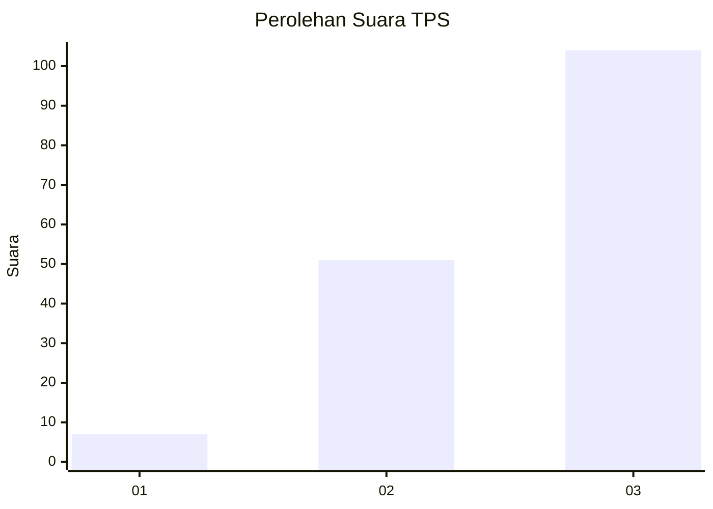
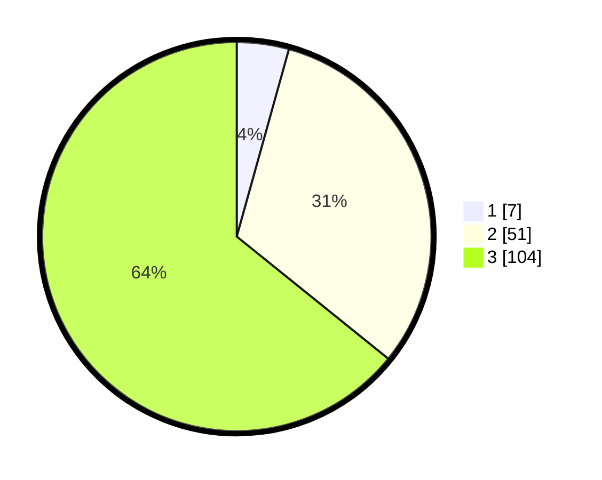

# Hasil

## Grafik

## Tabel

| No. | Nama Paslon    | Suara | Suara (raw) | Persentase |
|:--- |:-------------- | -----:| -----------:| ----------:|
| 1   | ANIES MUHAIMIN | 7     | [7][p-1]    | 4,32       |
| 2   | PRABOWO GIBRAN | 51    | [51][p-2]   | 31,48      |
| 3   | GANJAR MAHFUD  | 104   | [104][p-3]  | 64,20      |

[p-1]: https://github.com/gigit-pemilu/pemilu-2024/blob/main/pilpres/hitung-suara/sub/33-jawa-tengah/sub/02-banyumas/sub/14-ajibarang/sub/2001-darmakradenan/sub/013-tps/sub/paslon-1.txt
[p-2]: https://github.com/gigit-pemilu/pemilu-2024/blob/main/pilpres/hitung-suara/sub/33-jawa-tengah/sub/02-banyumas/sub/14-ajibarang/sub/2001-darmakradenan/sub/013-tps/sub/paslon-2.txt
[p-3]: https://github.com/gigit-pemilu/pemilu-2024/blob/main/pilpres/hitung-suara/sub/33-jawa-tengah/sub/02-banyumas/sub/14-ajibarang/sub/2001-darmakradenan/sub/013-tps/sub/paslon-3.txt

## Foto C Plano

https://sirekap-obj-formc.kpu.go.id/dab4/pemilu/ppwp/33/02/14/20/01/3302142001013-20240217-133246--8cd0b6aa-8a2c-41b7-969d-fc4c836cdd7a.jpg

https://sirekap-obj-formc.kpu.go.id/dab4/pemilu/ppwp/33/02/14/20/01/3302142001013-20240217-133323--312422c2-a1b2-420f-81f3-fc1b9543564e.jpg

https://sirekap-obj-formc.kpu.go.id/dab4/pemilu/ppwp/33/02/14/20/01/3302142001013-20240217-133413--9e553bbf-1605-4be1-b898-4c972a79796d.jpg

## Metadata

| Key        | Value               |
| ---------- | ------------------- |
| Time Stamp | 2024-02-27 21:00:04 |

