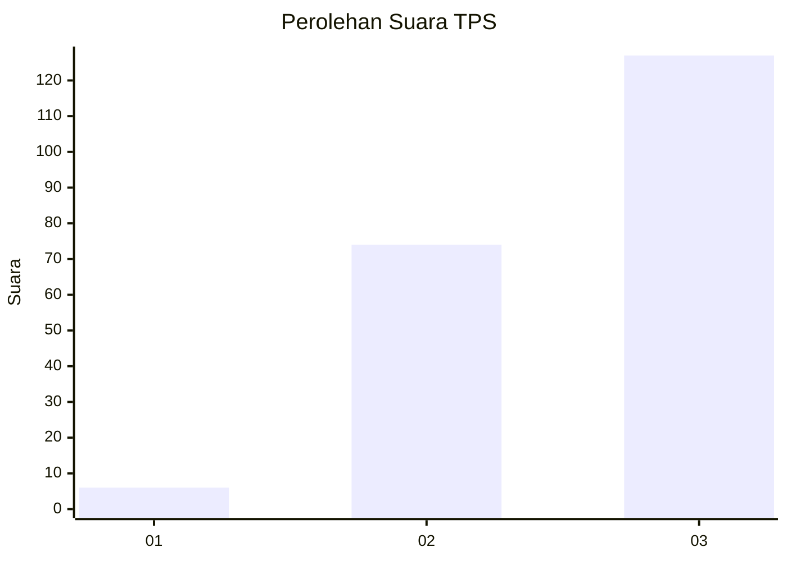
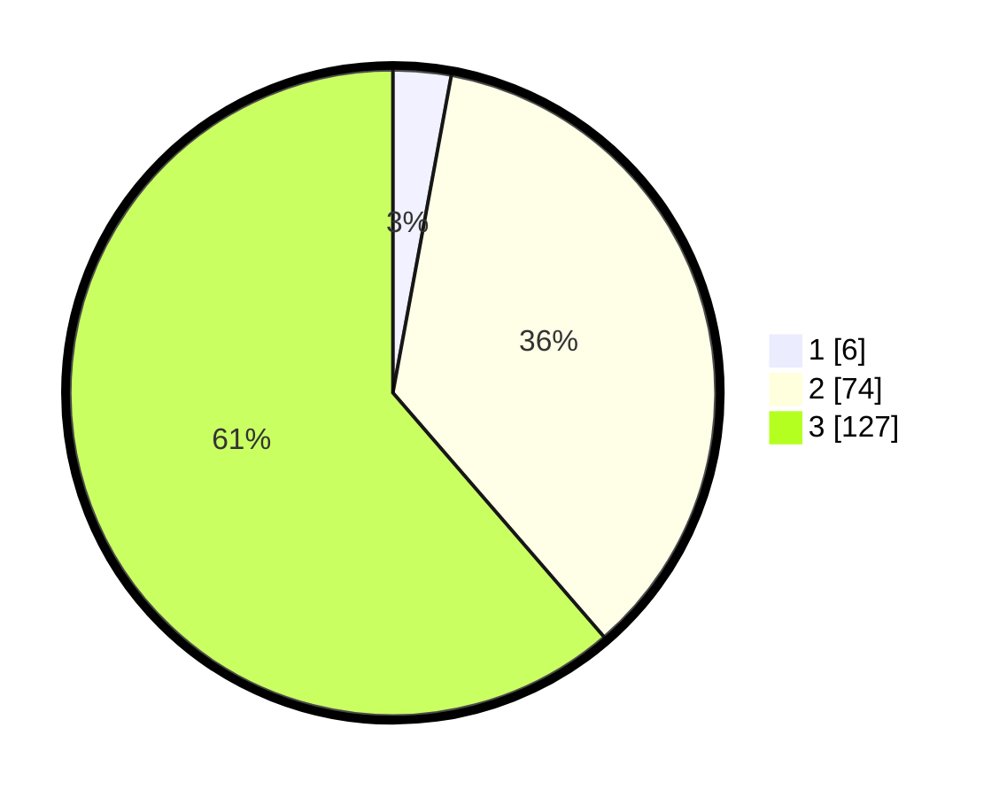

# Hasil

## Grafik

## Tabel

| No. | Nama Paslon    | Suara | Suara (raw) | Persentase |
|:--- |:-------------- | -----:| -----------:| ----------:|
| 1   | ANIES MUHAIMIN | 6     | [6][p-1]    | 2,90       |
| 2   | PRABOWO GIBRAN | 74    | [74][p-2]   | 35,75      |
| 3   | GANJAR MAHFUD  | 127   | [127][p-3]  | 61,35      |

[p-1]: https://github.com/gigit-pemilu/pemilu-2024/blob/main/pilpres/hitung-suara/sub/33-jawa-tengah/sub/02-banyumas/sub/14-ajibarang/sub/2001-darmakradenan/sub/015-tps/sub/paslon-1.txt
[p-2]: https://github.com/gigit-pemilu/pemilu-2024/blob/main/pilpres/hitung-suara/sub/33-jawa-tengah/sub/02-banyumas/sub/14-ajibarang/sub/2001-darmakradenan/sub/015-tps/sub/paslon-2.txt
[p-3]: https://github.com/gigit-pemilu/pemilu-2024/blob/main/pilpres/hitung-suara/sub/33-jawa-tengah/sub/02-banyumas/sub/14-ajibarang/sub/2001-darmakradenan/sub/015-tps/sub/paslon-3.txt

## Foto C Plano

https://sirekap-obj-formc.kpu.go.id/8b85/pemilu/ppwp/33/02/14/20/01/3302142001015-20240214-185939--c6b62534-aa6b-4dd5-adad-f1c12fe285b3.jpg

https://sirekap-obj-formc.kpu.go.id/8b85/pemilu/ppwp/33/02/14/20/01/3302142001015-20240214-190110--9b44389e-7e1f-414a-a910-d80771f70aeb.jpg

https://sirekap-obj-formc.kpu.go.id/8b85/pemilu/ppwp/33/02/14/20/01/3302142001015-20240214-191530--4ceba766-606e-4793-9955-bf749c3453e9.jpg

## Metadata

| Key        | Value               |
| ---------- | ------------------- |
| Time Stamp | 2024-02-14 21:46:01 |

