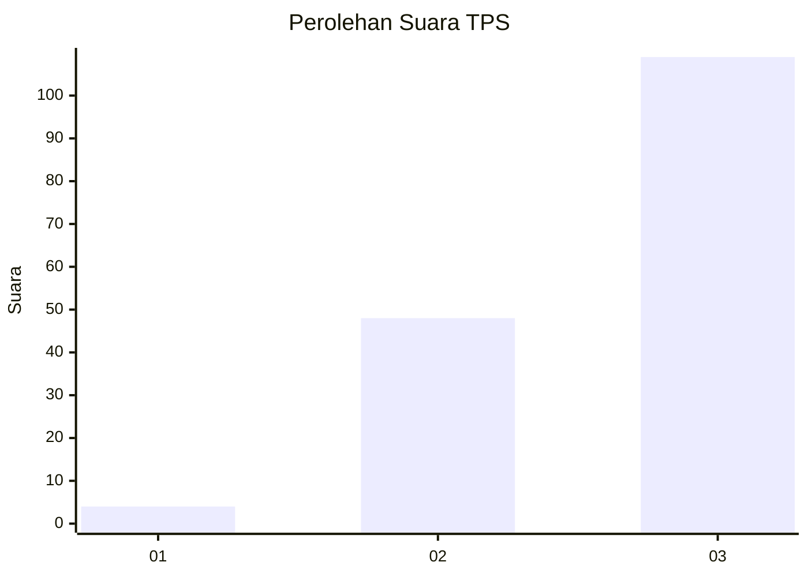
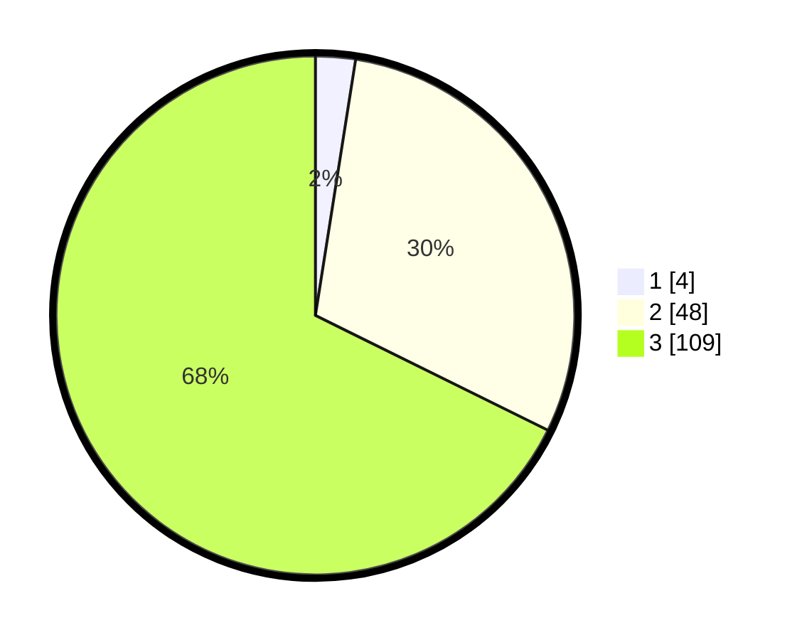

# Hasil

## Grafik

## Tabel

| No. | Nama Paslon    | Suara | Suara (raw) | Persentase |
|:--- |:-------------- | -----:| -----------:| ----------:|
| 1   | ANIES MUHAIMIN | 4     | [4][p-1]    | 2,48       |
| 2   | PRABOWO GIBRAN | 48    | [48][p-2]   | 29,81      |
| 3   | GANJAR MAHFUD  | 109   | [109][p-3]  | 67,70      |

[p-1]: https://github.com/gigit-pemilu/pemilu-2024/blob/main/pilpres/hitung-suara/sub/33-jawa-tengah/sub/02-banyumas/sub/14-ajibarang/sub/2001-darmakradenan/sub/018-tps/sub/paslon-1.txt
[p-2]: https://github.com/gigit-pemilu/pemilu-2024/blob/main/pilpres/hitung-suara/sub/33-jawa-tengah/sub/02-banyumas/sub/14-ajibarang/sub/2001-darmakradenan/sub/018-tps/sub/paslon-2.txt
[p-3]: https://github.com/gigit-pemilu/pemilu-2024/blob/main/pilpres/hitung-suara/sub/33-jawa-tengah/sub/02-banyumas/sub/14-ajibarang/sub/2001-darmakradenan/sub/018-tps/sub/paslon-3.txt

## Foto C Plano

https://sirekap-obj-formc.kpu.go.id/3332/pemilu/ppwp/33/02/14/20/01/3302142001018-20240215-111259--f35fe98f-5126-41ca-b7fb-5276ee052ad8.jpg

https://sirekap-obj-formc.kpu.go.id/3332/pemilu/ppwp/33/02/14/20/01/3302142001018-20240215-111415--76063194-a181-4266-a255-d50f4253c3ea.jpg

https://sirekap-obj-formc.kpu.go.id/3332/pemilu/ppwp/33/02/14/20/01/3302142001018-20240215-111825--89e3483f-269e-42e9-b811-92daca9d27d8.jpg

## Metadata

| Key        | Value               |
| ---------- | ------------------- |
| Time Stamp | 2024-02-25 20:00:00 |

