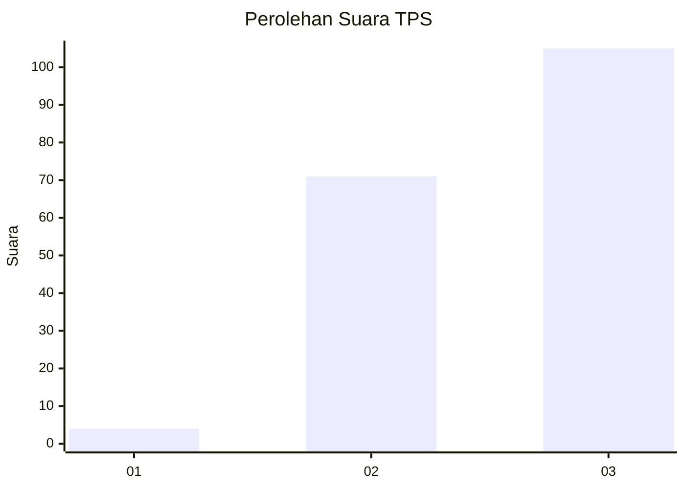
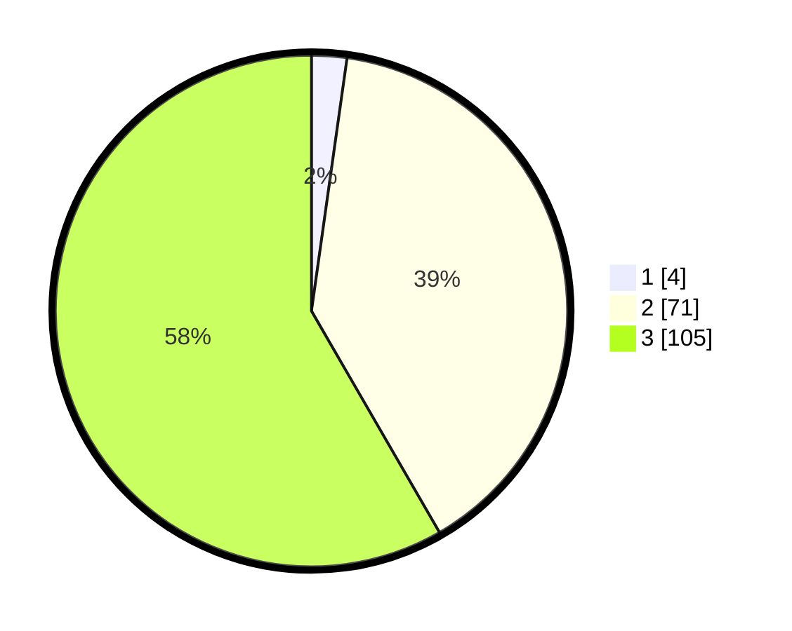

# Hasil

## Grafik

## Tabel

| No. | Nama Paslon    | Suara | Suara (raw) | Persentase |
|:--- |:-------------- | -----:| -----------:| ----------:|
| 1   | ANIES MUHAIMIN | 4     | [4][p-1]    | 2,22       |
| 2   | PRABOWO GIBRAN | 71    | [71][p-2]   | 39,44      |
| 3   | GANJAR MAHFUD  | 105   | [105][p-3]  | 58,33      |

[p-1]: https://github.com/gigit-pemilu/pemilu-2024-33-jawa-tengah/blob/main/pilpres/hitung-suara/sub/33-jawa-tengah/sub/02-banyumas/sub/14-ajibarang/sub/2001-darmakradenan/sub/019-tps/sub/paslon-1.txt
[p-2]: https://github.com/gigit-pemilu/pemilu-2024-33-jawa-tengah/blob/main/pilpres/hitung-suara/sub/33-jawa-tengah/sub/02-banyumas/sub/14-ajibarang/sub/2001-darmakradenan/sub/019-tps/sub/paslon-2.txt
[p-3]: https://github.com/gigit-pemilu/pemilu-2024-33-jawa-tengah/blob/main/pilpres/hitung-suara/sub/33-jawa-tengah/sub/02-banyumas/sub/14-ajibarang/sub/2001-darmakradenan/sub/019-tps/sub/paslon-3.txt

## Foto C Plano

https://sirekap-obj-formc.kpu.go.id/5003/pemilu/ppwp/33/02/14/20/01/3302142001019-20240214-202847--a485c472-e4bb-44a1-86a0-785b096b965d.jpg

https://sirekap-obj-formc.kpu.go.id/5003/pemilu/ppwp/33/02/14/20/01/3302142001019-20240214-203322--580b3d0e-c164-4553-ba5d-43fe0e25d8c7.jpg

https://sirekap-obj-formc.kpu.go.id/5003/pemilu/ppwp/33/02/14/20/01/3302142001019-20240214-203137--6ff5a648-60c4-4d97-8555-299abbedac75.jpg

## Metadata

| Key        | Value               |
| ---------- | ------------------- |
| Time Stamp | 2024-02-25 16:00:00 |

