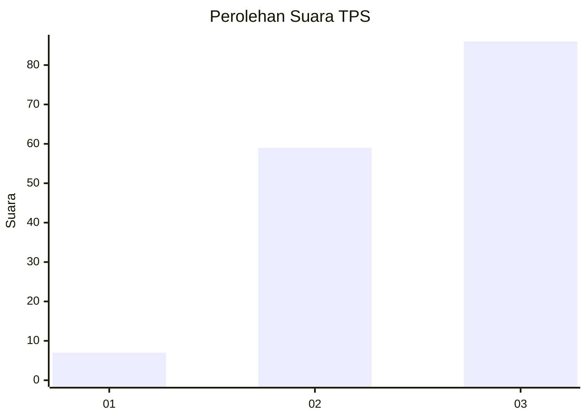
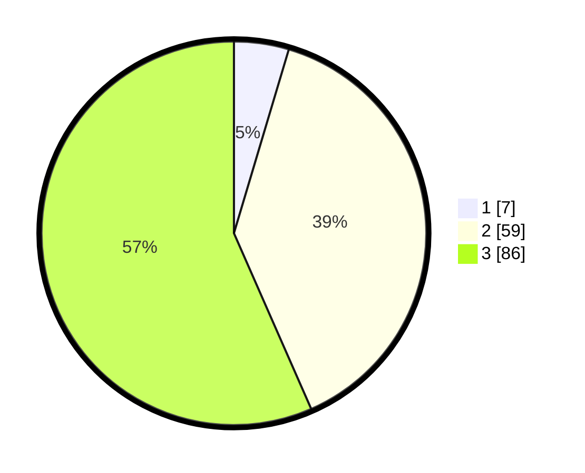

# Hasil

## Grafik

## Tabel

| No. | Nama Paslon    | Suara | Suara (raw) | Persentase |
|:--- |:-------------- | -----:| -----------:| ----------:|
| 1   | ANIES MUHAIMIN | 7     | [7][p-1]    | 4,61       |
| 2   | PRABOWO GIBRAN | 59    | [59][p-2]   | 38,82      |
| 3   | GANJAR MAHFUD  | 86    | [86][p-3]   | 56,58      |

[p-1]: https://github.com/gigit-pemilu/pemilu-2024-33-jawa-tengah/blob/main/pilpres/hitung-suara/sub/33-jawa-tengah/sub/02-banyumas/sub/14-ajibarang/sub/2001-darmakradenan/sub/020-tps/sub/paslon-1.txt
[p-2]: https://github.com/gigit-pemilu/pemilu-2024-33-jawa-tengah/blob/main/pilpres/hitung-suara/sub/33-jawa-tengah/sub/02-banyumas/sub/14-ajibarang/sub/2001-darmakradenan/sub/020-tps/sub/paslon-2.txt
[p-3]: https://github.com/gigit-pemilu/pemilu-2024-33-jawa-tengah/blob/main/pilpres/hitung-suara/sub/33-jawa-tengah/sub/02-banyumas/sub/14-ajibarang/sub/2001-darmakradenan/sub/020-tps/sub/paslon-3.txt

## Foto C Plano

https://sirekap-obj-formc.kpu.go.id/d51e/pemilu/ppwp/33/02/14/20/01/3302142001020-20240217-134857--ef17f67d-e669-46ee-92a0-28995da58b86.jpg

https://sirekap-obj-formc.kpu.go.id/d51e/pemilu/ppwp/33/02/14/20/01/3302142001020-20240217-134949--e0b6e20e-92e9-45ff-abca-35737dff5aef.jpg

https://sirekap-obj-formc.kpu.go.id/d51e/pemilu/ppwp/33/02/14/20/01/3302142001020-20240217-135027--c139d557-ee3a-4f03-99be-eb3100dfd10b.jpg

## Metadata

| Key        | Value               |
| ---------- | ------------------- |
| Time Stamp | 2024-02-24 22:31:28 |

