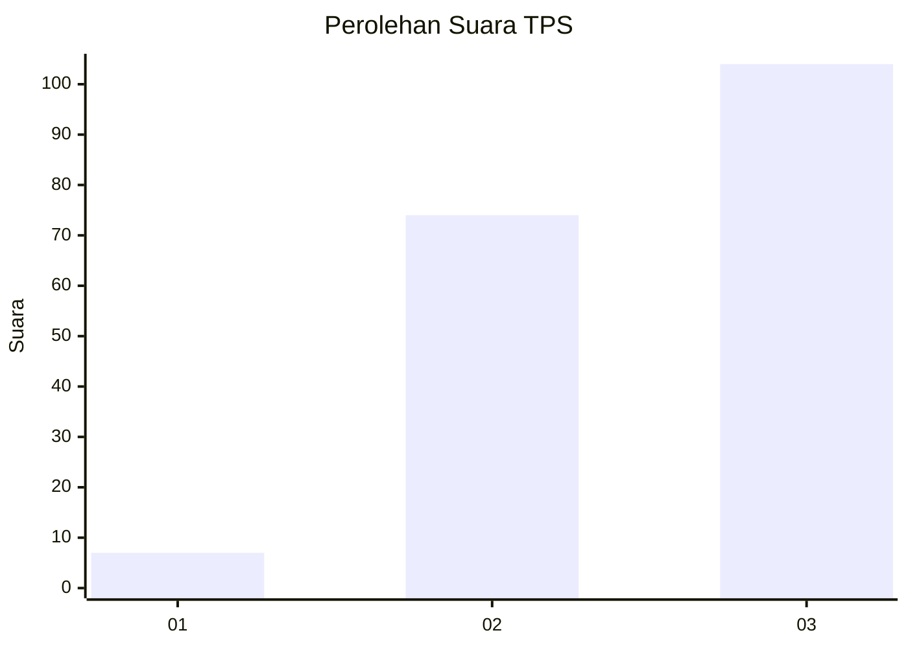
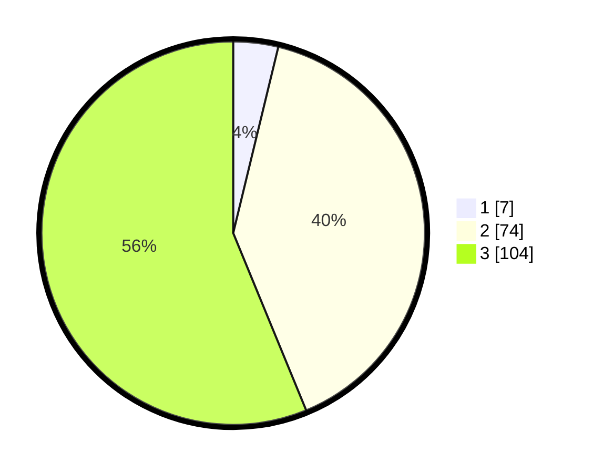

# Hasil

## Grafik

## Tabel

| No. | Nama Paslon    | Suara | Suara (raw) | Persentase |
|:--- |:-------------- | -----:| -----------:| ----------:|
| 1   | ANIES MUHAIMIN | 7     | [7][p-1]    | 3,78       |
| 2   | PRABOWO GIBRAN | 74    | [74][p-2]   | 40,00      |
| 3   | GANJAR MAHFUD  | 104   | [104][p-3]  | 56,22      |

[p-1]: https://github.com/gigit-pemilu/pemilu-2024/blob/main/pilpres/hitung-suara/sub/33-jawa-tengah/sub/02-banyumas/sub/14-ajibarang/sub/2001-darmakradenan/sub/027-tps/sub/paslon-1.txt
[p-2]: https://github.com/gigit-pemilu/pemilu-2024/blob/main/pilpres/hitung-suara/sub/33-jawa-tengah/sub/02-banyumas/sub/14-ajibarang/sub/2001-darmakradenan/sub/027-tps/sub/paslon-2.txt
[p-3]: https://github.com/gigit-pemilu/pemilu-2024/blob/main/pilpres/hitung-suara/sub/33-jawa-tengah/sub/02-banyumas/sub/14-ajibarang/sub/2001-darmakradenan/sub/027-tps/sub/paslon-3.txt

## Foto C Plano

https://sirekap-obj-formc.kpu.go.id/e636/pemilu/ppwp/33/02/14/20/01/3302142001027-20240215-000723--9aa93ec1-5705-4565-a5a8-dc1501cc4c48.jpg

https://sirekap-obj-formc.kpu.go.id/e636/pemilu/ppwp/33/02/14/20/01/3302142001027-20240215-022512--a61686c2-a3d7-424f-9ec1-f6934f444c9f.jpg

https://sirekap-obj-formc.kpu.go.id/e636/pemilu/ppwp/33/02/14/20/01/3302142001027-20240215-023316--92698613-5fa0-4e29-b269-d188a49dfb9f.jpg

## Metadata

| Key        | Value               |
| ---------- | ------------------- |
| Time Stamp | 2024-02-24 22:31:28 |

