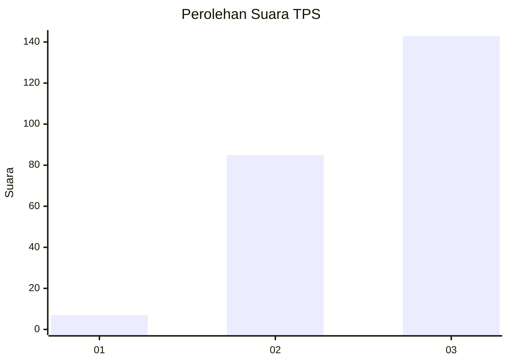
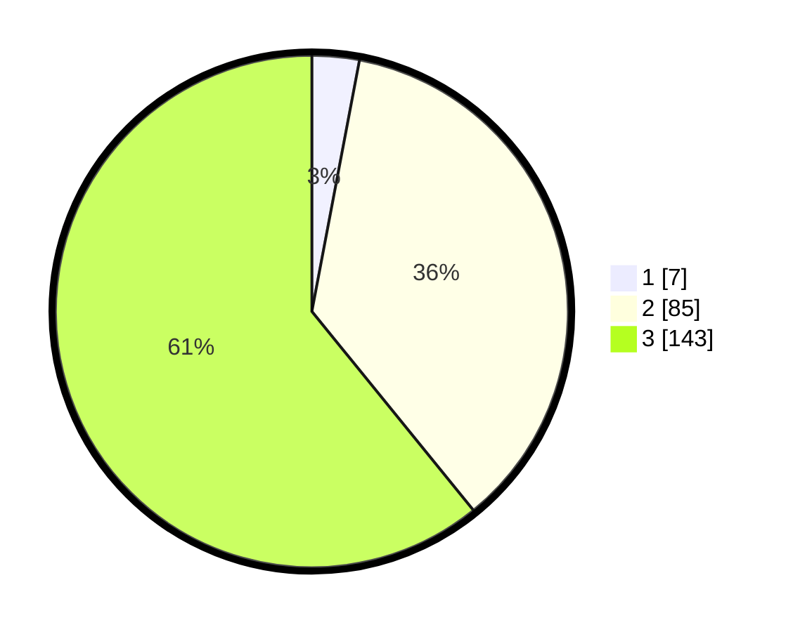

# Hasil

## Grafik

## Tabel

| No. | Nama Paslon    | Suara | Suara (raw) | Persentase |
|:--- |:-------------- | -----:| -----------:| ----------:|
| 1   | ANIES MUHAIMIN | 7     | [7][p-1]    | 2,98       |
| 2   | PRABOWO GIBRAN | 85    | [85][p-2]   | 36,17      |
| 3   | GANJAR MAHFUD  | 143   | [143][p-3]  | 60,85      |

[p-1]: https://github.com/gigit-pemilu/pemilu-2024/blob/main/pilpres/hitung-suara/sub/33-jawa-tengah/sub/02-banyumas/sub/14-ajibarang/sub/2002-tipar-kidul/sub/017-tps/sub/paslon-1.txt
[p-2]: https://github.com/gigit-pemilu/pemilu-2024/blob/main/pilpres/hitung-suara/sub/33-jawa-tengah/sub/02-banyumas/sub/14-ajibarang/sub/2002-tipar-kidul/sub/017-tps/sub/paslon-2.txt
[p-3]: https://github.com/gigit-pemilu/pemilu-2024/blob/main/pilpres/hitung-suara/sub/33-jawa-tengah/sub/02-banyumas/sub/14-ajibarang/sub/2002-tipar-kidul/sub/017-tps/sub/paslon-3.txt

## Foto C Plano

https://sirekap-obj-formc.kpu.go.id/5912/pemilu/ppwp/33/02/14/20/02/3302142002017-20240214-221728--a66710ab-0b51-45ae-99ed-b51a094baf26.jpg

https://sirekap-obj-formc.kpu.go.id/5912/pemilu/ppwp/33/02/14/20/02/3302142002017-20240214-222204--0f0155c1-11b3-419c-b6d4-ce39ae35654a.jpg

https://sirekap-obj-formc.kpu.go.id/5912/pemilu/ppwp/33/02/14/20/02/3302142002017-20240214-222101--aba8e320-fca8-4163-b18a-3db75cce1146.jpg

## Metadata

| Key        | Value               |
| ---------- | ------------------- |
| Time Stamp | 2024-02-16 23:45:47 |

