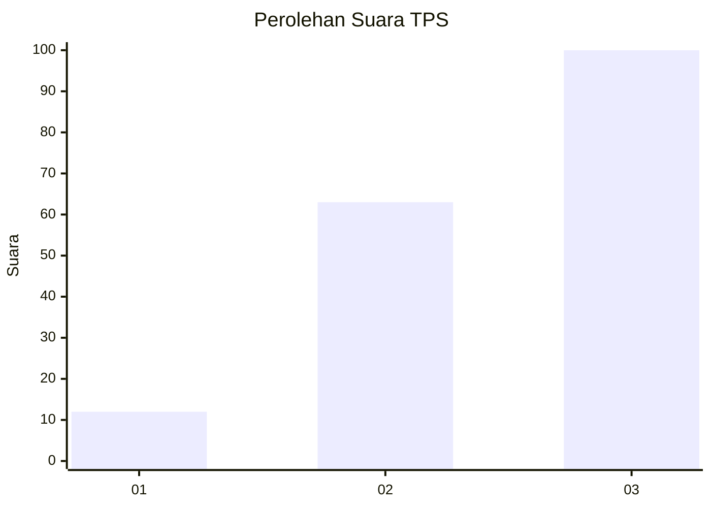
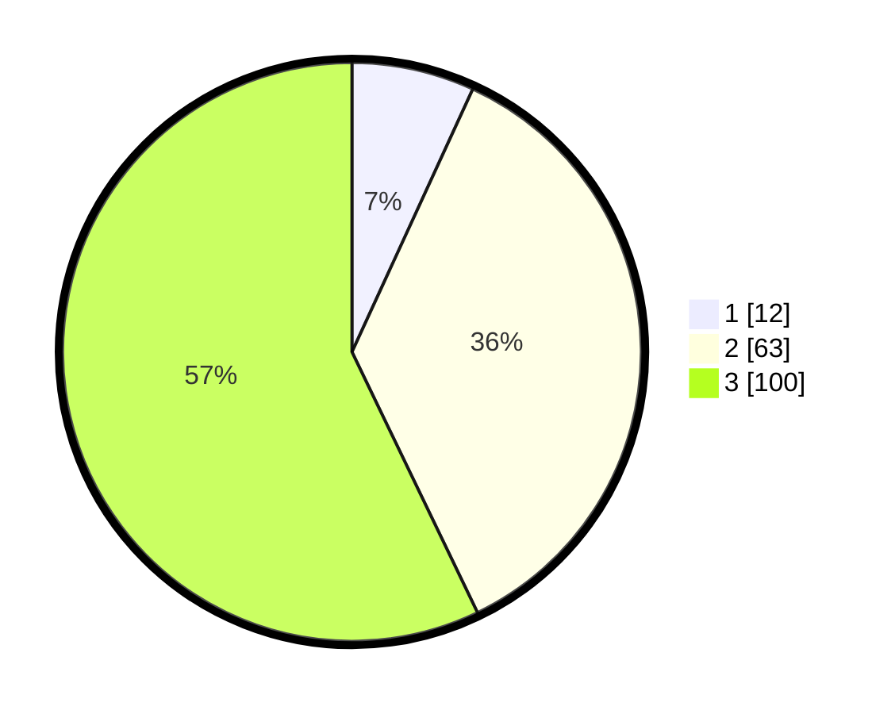

# Hasil

## Grafik

## Tabel

| No. | Nama Paslon    | Suara | Suara (raw) | Persentase |
|:--- |:-------------- | -----:| -----------:| ----------:|
| 1   | ANIES MUHAIMIN | 12    | [12][p-1]   | 6,86       |
| 2   | PRABOWO GIBRAN | 63    | [63][p-2]   | 36,00      |
| 3   | GANJAR MAHFUD  | 100   | [100][p-3]  | 57,14      |

[p-1]: https://github.com/gigit-pemilu/pemilu-2024/blob/main/pilpres/hitung-suara/sub/33-jawa-tengah/sub/02-banyumas/sub/14-ajibarang/sub/2003-sawangan/sub/002-tps/sub/paslon-1.txt
[p-2]: https://github.com/gigit-pemilu/pemilu-2024/blob/main/pilpres/hitung-suara/sub/33-jawa-tengah/sub/02-banyumas/sub/14-ajibarang/sub/2003-sawangan/sub/002-tps/sub/paslon-2.txt
[p-3]: https://github.com/gigit-pemilu/pemilu-2024/blob/main/pilpres/hitung-suara/sub/33-jawa-tengah/sub/02-banyumas/sub/14-ajibarang/sub/2003-sawangan/sub/002-tps/sub/paslon-3.txt

## Foto C Plano

https://sirekap-obj-formc.kpu.go.id/e409/pemilu/ppwp/33/02/14/20/03/3302142003002-20240214-222401--b4df46df-1efe-41d1-8075-fec285ef9779.jpg

https://sirekap-obj-formc.kpu.go.id/e409/pemilu/ppwp/33/02/14/20/03/3302142003002-20240214-224224--be89a0f5-4b2c-4cb7-8d35-e9d2cfe26f68.jpg

https://sirekap-obj-formc.kpu.go.id/e409/pemilu/ppwp/33/02/14/20/03/3302142003002-20240214-224400--c7604089-8951-4ab7-af99-537dc9cf3032.jpg

## Metadata

| Key        | Value               |
| ---------- | ------------------- |
| Time Stamp | 2024-02-25 11:00:00 |

