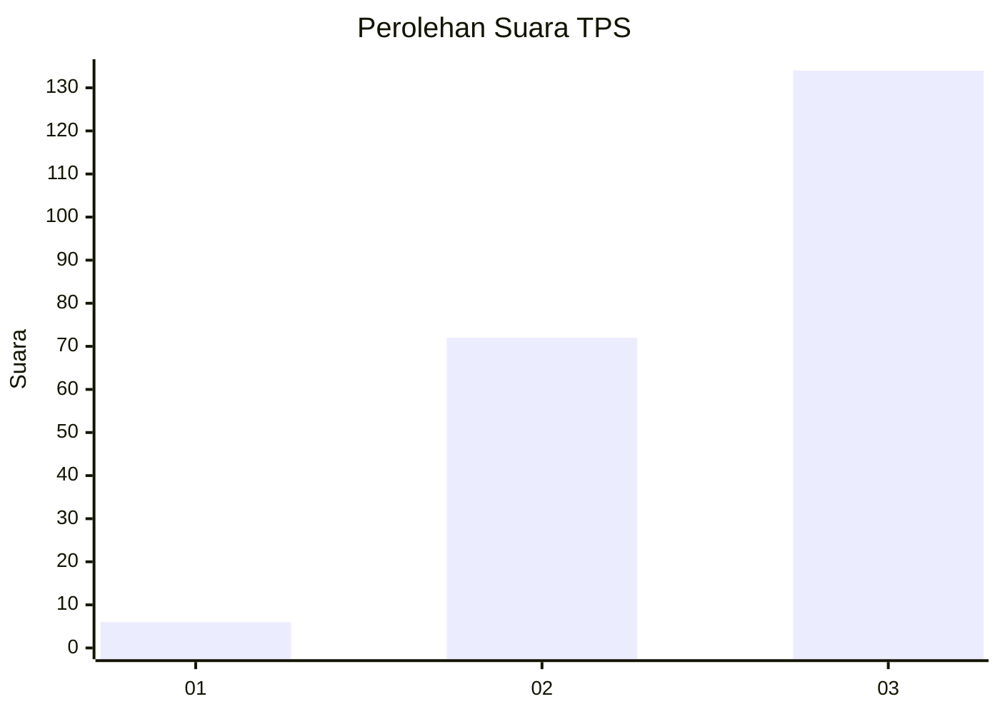
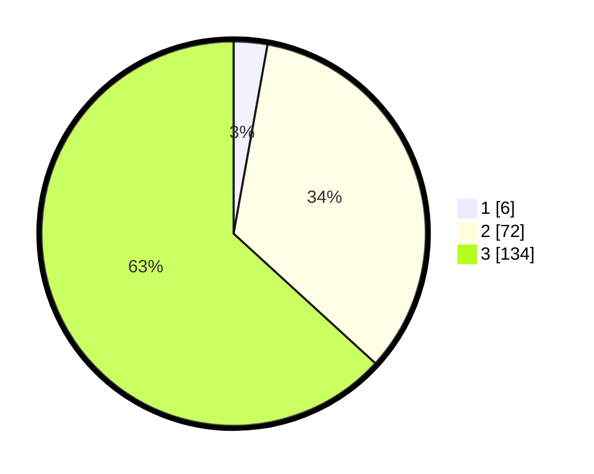

# Hasil

## Grafik

## Tabel

| No. | Nama Paslon    | Suara | Suara (raw) | Persentase |
|:--- |:-------------- | -----:| -----------:| ----------:|
| 1   | ANIES MUHAIMIN | 6     | [6][p-1]    | 2,83       |
| 2   | PRABOWO GIBRAN | 72    | [72][p-2]   | 33,96      |
| 3   | GANJAR MAHFUD  | 134   | [134][p-3]  | 63,21      |

[p-1]: https://github.com/gigit-pemilu/pemilu-2024/blob/main/pilpres/hitung-suara/sub/33-jawa-tengah/sub/02-banyumas/sub/14-ajibarang/sub/2003-sawangan/sub/004-tps/sub/paslon-1.txt
[p-2]: https://github.com/gigit-pemilu/pemilu-2024/blob/main/pilpres/hitung-suara/sub/33-jawa-tengah/sub/02-banyumas/sub/14-ajibarang/sub/2003-sawangan/sub/004-tps/sub/paslon-2.txt
[p-3]: https://github.com/gigit-pemilu/pemilu-2024/blob/main/pilpres/hitung-suara/sub/33-jawa-tengah/sub/02-banyumas/sub/14-ajibarang/sub/2003-sawangan/sub/004-tps/sub/paslon-3.txt

## Foto C Plano

https://sirekap-obj-formc.kpu.go.id/f347/pemilu/ppwp/33/02/14/20/03/3302142003004-20240215-023804--7c7a017a-0a0d-440a-a006-0edf8ccd846a.jpg

https://sirekap-obj-formc.kpu.go.id/f347/pemilu/ppwp/33/02/14/20/03/3302142003004-20240215-020729--7993e14d-219a-49f9-8bb2-0bdf4086c887.jpg

https://sirekap-obj-formc.kpu.go.id/f347/pemilu/ppwp/33/02/14/20/03/3302142003004-20240215-015956--c49bb08c-df67-40bd-b4b9-44b17048f81b.jpg

## Metadata

| Key        | Value               |
| ---------- | ------------------- |
| Time Stamp | 2024-02-24 22:31:28 |

