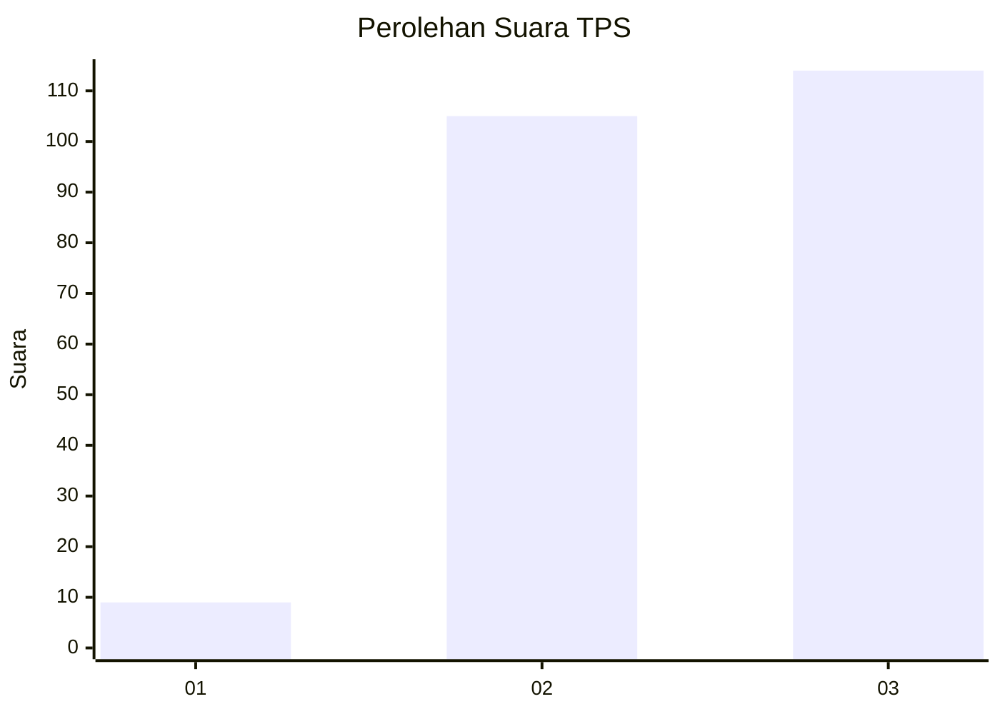
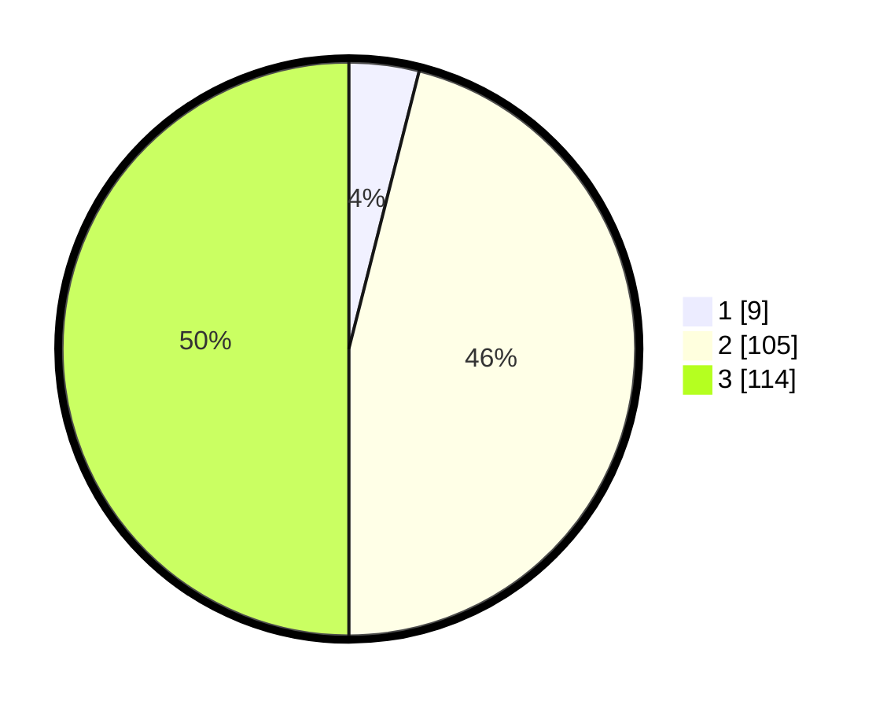

# Hasil

## Grafik

## Tabel

| No. | Nama Paslon    | Suara | Suara (raw) | Persentase |
|:--- |:-------------- | -----:| -----------:| ----------:|
| 1   | ANIES MUHAIMIN | 9     | [9][p-1]    | 3,95       |
| 2   | PRABOWO GIBRAN | 105   | [105][p-2]  | 46,05      |
| 3   | GANJAR MAHFUD  | 114   | [114][p-3]  | 50,00      |

[p-1]: https://github.com/gigit-pemilu/pemilu-2024/blob/main/pilpres/hitung-suara/sub/33-jawa-tengah/sub/02-banyumas/sub/14-ajibarang/sub/2003-sawangan/sub/012-tps/sub/paslon-1.txt
[p-2]: https://github.com/gigit-pemilu/pemilu-2024/blob/main/pilpres/hitung-suara/sub/33-jawa-tengah/sub/02-banyumas/sub/14-ajibarang/sub/2003-sawangan/sub/012-tps/sub/paslon-2.txt
[p-3]: https://github.com/gigit-pemilu/pemilu-2024/blob/main/pilpres/hitung-suara/sub/33-jawa-tengah/sub/02-banyumas/sub/14-ajibarang/sub/2003-sawangan/sub/012-tps/sub/paslon-3.txt

## Foto C Plano

https://sirekap-obj-formc.kpu.go.id/0e2b/pemilu/ppwp/33/02/14/20/03/3302142003012-20240215-035927--5eb06e72-a894-4694-b60a-c6d43f448da2.jpg

https://sirekap-obj-formc.kpu.go.id/0e2b/pemilu/ppwp/33/02/14/20/03/3302142003012-20240215-040437--1a5751b1-e59c-4221-8ae6-92f6e4307db3.jpg

https://sirekap-obj-formc.kpu.go.id/0e2b/pemilu/ppwp/33/02/14/20/03/3302142003012-20240215-040230--b3c1d887-88d0-4230-8549-b6f390ec27b0.jpg

## Metadata

| Key        | Value               |
| ---------- | ------------------- |
| Time Stamp | 2024-02-24 22:31:28 |

