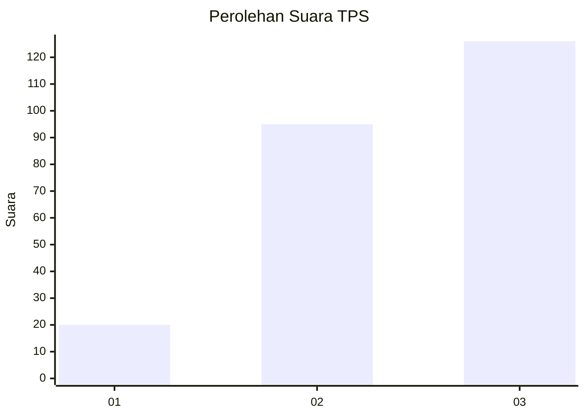
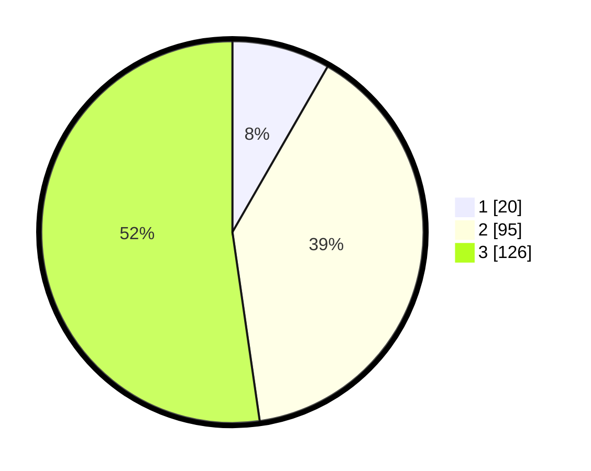

# Hasil

## Grafik

## Tabel

| No. | Nama Paslon    | Suara | Suara (raw) | Persentase |
|:--- |:-------------- | -----:| -----------:| ----------:|
| 1   | ANIES MUHAIMIN | 20    | [20][p-1]   | 8,30       |
| 2   | PRABOWO GIBRAN | 95    | [95][p-2]   | 39,42      |
| 3   | GANJAR MAHFUD  | 126   | [126][p-3]  | 52,28      |

[p-1]: https://github.com/gigit-pemilu/pemilu-2024/blob/main/pilpres/hitung-suara/sub/33-jawa-tengah/sub/02-banyumas/sub/14-ajibarang/sub/2003-sawangan/sub/013-tps/sub/paslon-1.txt
[p-2]: https://github.com/gigit-pemilu/pemilu-2024/blob/main/pilpres/hitung-suara/sub/33-jawa-tengah/sub/02-banyumas/sub/14-ajibarang/sub/2003-sawangan/sub/013-tps/sub/paslon-2.txt
[p-3]: https://github.com/gigit-pemilu/pemilu-2024/blob/main/pilpres/hitung-suara/sub/33-jawa-tengah/sub/02-banyumas/sub/14-ajibarang/sub/2003-sawangan/sub/013-tps/sub/paslon-3.txt

## Foto C Plano

https://sirekap-obj-formc.kpu.go.id/69d1/pemilu/ppwp/33/02/14/20/03/3302142003013-20240214-221844--d40a29d5-854b-4b48-b76f-b1187fe2aecb.jpg

https://sirekap-obj-formc.kpu.go.id/69d1/pemilu/ppwp/33/02/14/20/03/3302142003013-20240214-221924--114e4f2e-f82f-4bc1-8edf-2acc954cc14b.jpg

https://sirekap-obj-formc.kpu.go.id/69d1/pemilu/ppwp/33/02/14/20/03/3302142003013-20240214-222019--de1287b0-f8ce-48b4-9d69-f8276dce5ec3.jpg

## Metadata

| Key        | Value               |
| ---------- | ------------------- |
| Time Stamp | 2024-02-15 12:00:28 |

