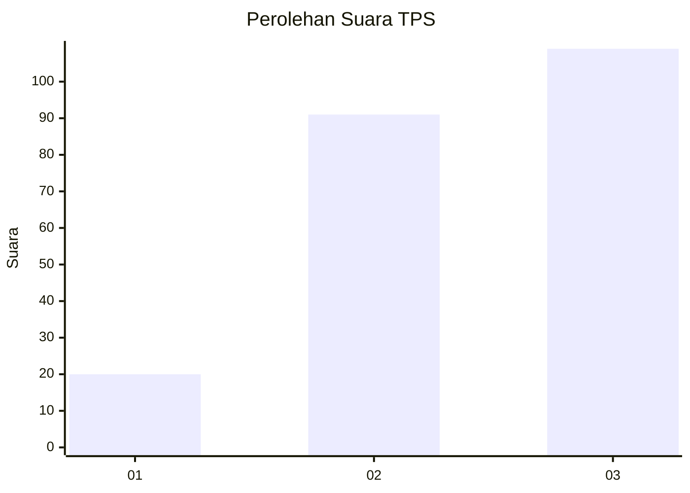
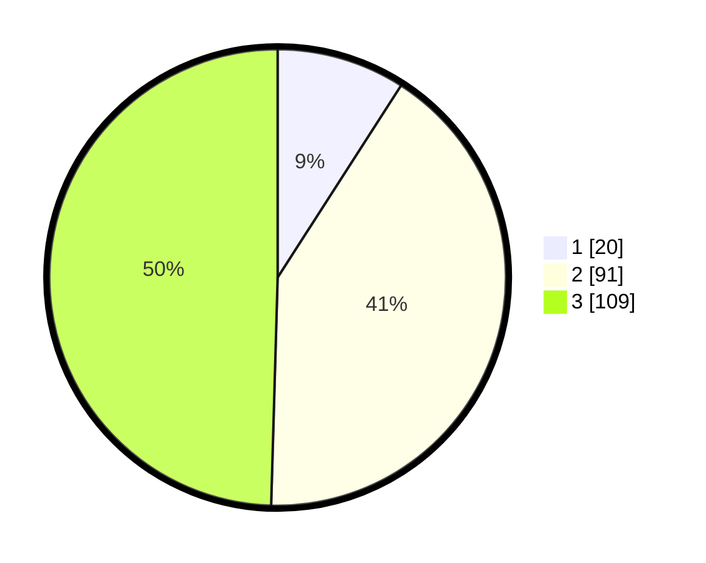

# Hasil

## Grafik

## Tabel

| No. | Nama Paslon    | Suara | Suara (raw) | Persentase |
|:--- |:-------------- | -----:| -----------:| ----------:|
| 1   | ANIES MUHAIMIN | 20    | [20][p-1]   | 9,09       |
| 2   | PRABOWO GIBRAN | 91    | [91][p-2]   | 41,36      |
| 3   | GANJAR MAHFUD  | 109   | [109][p-3]  | 49,55      |

[p-1]: https://github.com/gigit-pemilu/pemilu-2024-33-jawa-tengah/blob/main/pilpres/hitung-suara/sub/33-jawa-tengah/sub/02-banyumas/sub/14-ajibarang/sub/2003-sawangan/sub/016-tps/sub/paslon-1.txt
[p-2]: https://github.com/gigit-pemilu/pemilu-2024-33-jawa-tengah/blob/main/pilpres/hitung-suara/sub/33-jawa-tengah/sub/02-banyumas/sub/14-ajibarang/sub/2003-sawangan/sub/016-tps/sub/paslon-2.txt
[p-3]: https://github.com/gigit-pemilu/pemilu-2024-33-jawa-tengah/blob/main/pilpres/hitung-suara/sub/33-jawa-tengah/sub/02-banyumas/sub/14-ajibarang/sub/2003-sawangan/sub/016-tps/sub/paslon-3.txt

## Foto C Plano

https://sirekap-obj-formc.kpu.go.id/d5c9/pemilu/ppwp/33/02/14/20/03/3302142003016-20240214-224144--286a7c6f-4021-42b2-b1d8-0756f1e0a376.jpg

https://sirekap-obj-formc.kpu.go.id/d5c9/pemilu/ppwp/33/02/14/20/03/3302142003016-20240214-224533--0e38e850-93b6-49b2-bed1-c60ae84a67f1.jpg

https://sirekap-obj-formc.kpu.go.id/d5c9/pemilu/ppwp/33/02/14/20/03/3302142003016-20240214-224745--ff1ce2c7-c3b1-45bb-b952-fb76b9e3919d.jpg

## Metadata

| Key        | Value               |
| ---------- | ------------------- |
| Time Stamp | 2024-02-25 16:00:00 |

