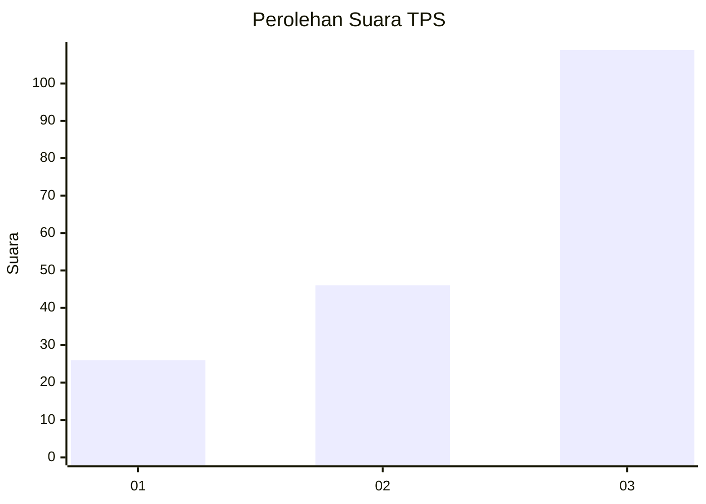
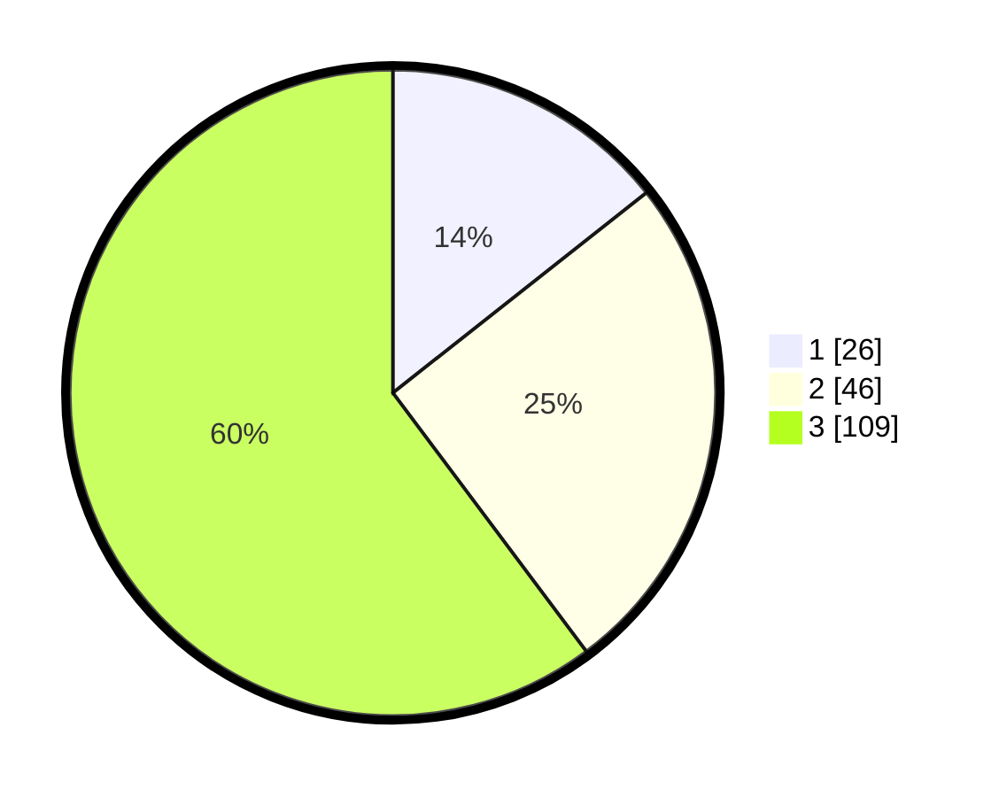

# Hasil

## Grafik

## Tabel

| No. | Nama Paslon    | Suara | Suara (raw) | Persentase |
|:--- |:-------------- | -----:| -----------:| ----------:|
| 1   | ANIES MUHAIMIN | 26    | [26][p-1]   | 14,36      |
| 2   | PRABOWO GIBRAN | 46    | [46][p-2]   | 25,41      |
| 3   | GANJAR MAHFUD  | 109   | [109][p-3]  | 60,22      |

[p-1]: https://github.com/gigit-pemilu/pemilu-2024-33-jawa-tengah/blob/main/pilpres/hitung-suara/sub/33-jawa-tengah/sub/02-banyumas/sub/14-ajibarang/sub/2004-jingkang/sub/006-tps/sub/paslon-1.txt
[p-2]: https://github.com/gigit-pemilu/pemilu-2024-33-jawa-tengah/blob/main/pilpres/hitung-suara/sub/33-jawa-tengah/sub/02-banyumas/sub/14-ajibarang/sub/2004-jingkang/sub/006-tps/sub/paslon-2.txt
[p-3]: https://github.com/gigit-pemilu/pemilu-2024-33-jawa-tengah/blob/main/pilpres/hitung-suara/sub/33-jawa-tengah/sub/02-banyumas/sub/14-ajibarang/sub/2004-jingkang/sub/006-tps/sub/paslon-3.txt

## Foto C Plano

https://sirekap-obj-formc.kpu.go.id/c55a/pemilu/ppwp/33/02/14/20/04/3302142004006-20240221-191442--cc98bcc6-9df1-4a60-9bef-dd948b915971.jpg

https://sirekap-obj-formc.kpu.go.id/c55a/pemilu/ppwp/33/02/14/20/04/3302142004006-20240220-234431--e8faf49e-11b5-44bc-bbac-893fa62cf47c.jpg

https://sirekap-obj-formc.kpu.go.id/c55a/pemilu/ppwp/33/02/14/20/04/3302142004006-20240220-234544--baf2d3c5-7a09-4c6e-bab3-bf49de525a9c.jpg

## Metadata

| Key        | Value               |
| ---------- | ------------------- |
| Time Stamp | 2024-02-24 22:31:28 |

