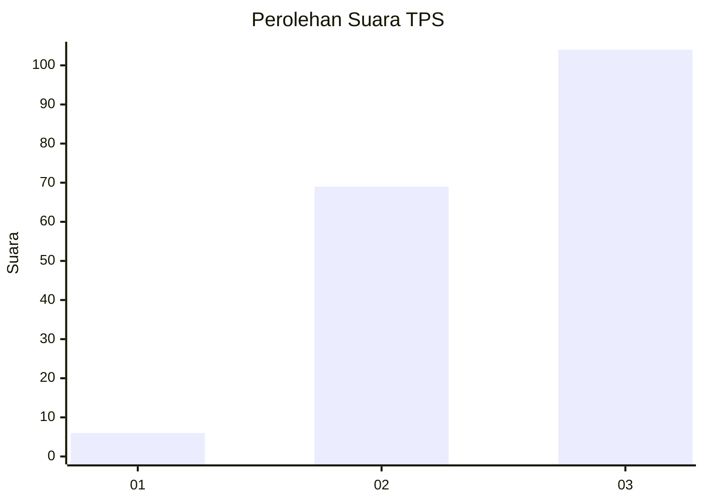
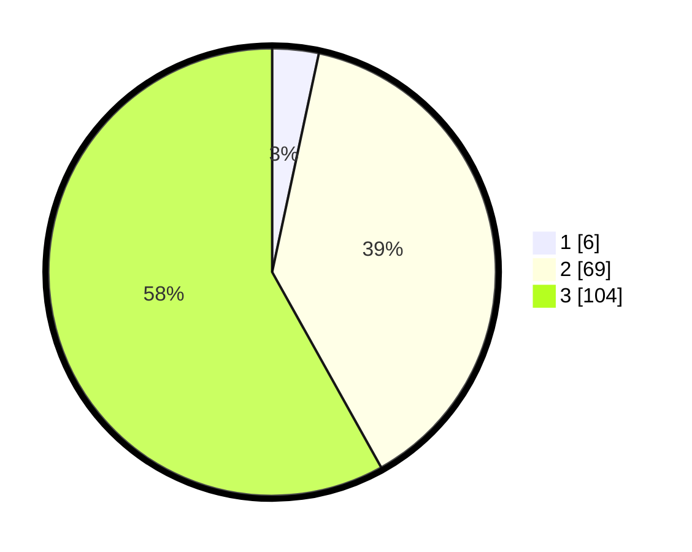

# Hasil

## Grafik

## Tabel

| No. | Nama Paslon    | Suara | Suara (raw) | Persentase |
|:--- |:-------------- | -----:| -----------:| ----------:|
| 1   | ANIES MUHAIMIN | 6     | [6][p-1]    | 3,35       |
| 2   | PRABOWO GIBRAN | 69    | [69][p-2]   | 38,55      |
| 3   | GANJAR MAHFUD  | 104   | [104][p-3]  | 58,10      |

[p-1]: https://github.com/gigit-pemilu/pemilu-2024/blob/main/pilpres/hitung-suara/sub/33-jawa-tengah/sub/02-banyumas/sub/14-ajibarang/sub/2004-jingkang/sub/017-tps/sub/paslon-1.txt
[p-2]: https://github.com/gigit-pemilu/pemilu-2024/blob/main/pilpres/hitung-suara/sub/33-jawa-tengah/sub/02-banyumas/sub/14-ajibarang/sub/2004-jingkang/sub/017-tps/sub/paslon-2.txt
[p-3]: https://github.com/gigit-pemilu/pemilu-2024/blob/main/pilpres/hitung-suara/sub/33-jawa-tengah/sub/02-banyumas/sub/14-ajibarang/sub/2004-jingkang/sub/017-tps/sub/paslon-3.txt

## Foto C Plano

https://sirekap-obj-formc.kpu.go.id/4525/pemilu/ppwp/33/02/14/20/04/3302142004017-20240215-000736--a046da11-666a-40bb-a8ea-045e56968eb7.jpg

https://sirekap-obj-formc.kpu.go.id/4525/pemilu/ppwp/33/02/14/20/04/3302142004017-20240215-000755--9a9b3c72-7e0a-4de5-9ad5-d65ed5c50110.jpg

https://sirekap-obj-formc.kpu.go.id/4525/pemilu/ppwp/33/02/14/20/04/3302142004017-20240215-000839--741b9cd2-c467-4c16-9f25-5f1629c6f5a7.jpg

## Metadata

| Key        | Value               |
| ---------- | ------------------- |
| Time Stamp | 2024-02-16 21:01:00 |

