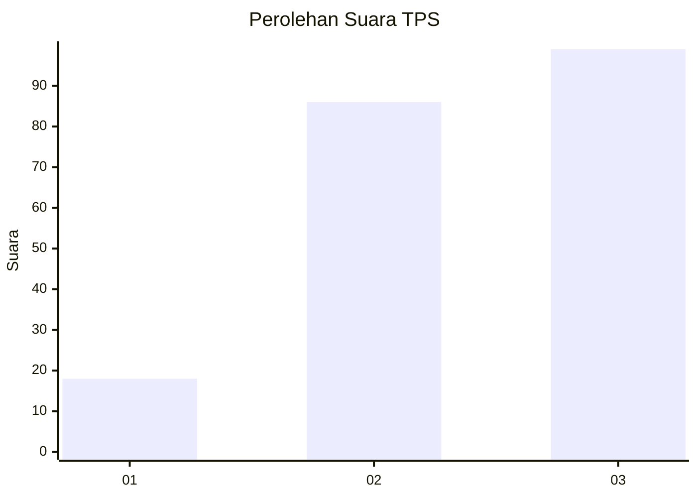
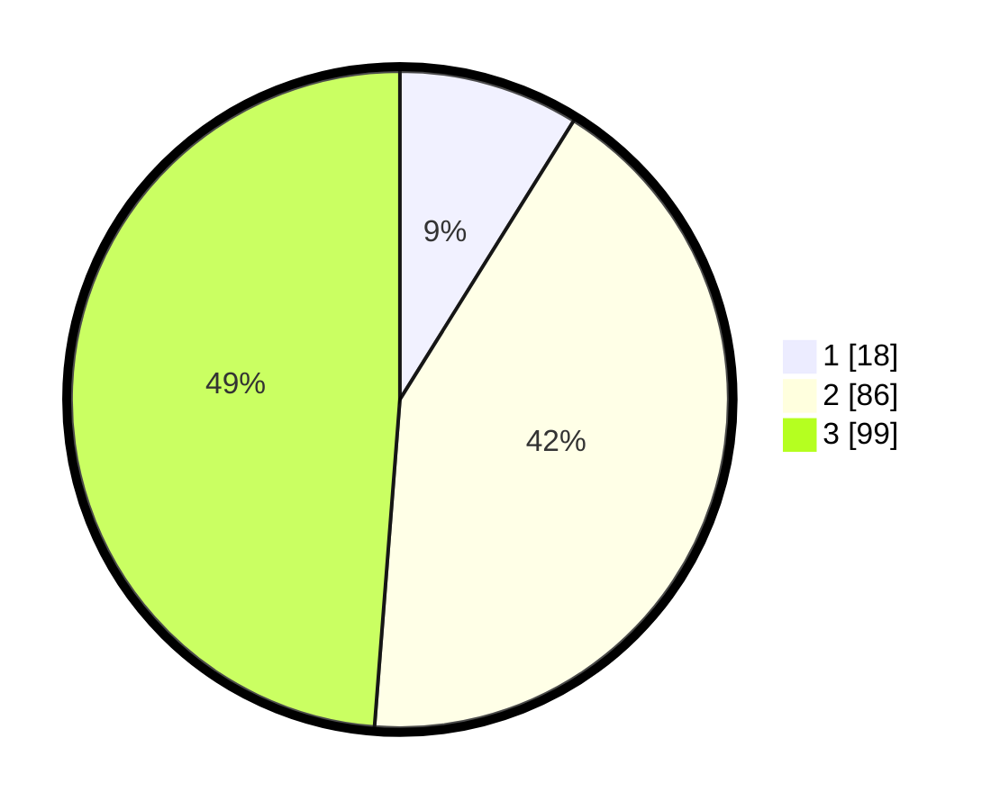

# Hasil

## Grafik

## Tabel

| No. | Nama Paslon    | Suara | Suara (raw) | Persentase |
|:--- |:-------------- | -----:| -----------:| ----------:|
| 1   | ANIES MUHAIMIN | 18    | [18][p-1]   | 8,87       |
| 2   | PRABOWO GIBRAN | 86    | [86][p-2]   | 42,36      |
| 3   | GANJAR MAHFUD  | 99    | [99][p-3]   | 48,77      |

[p-1]: https://github.com/gigit-pemilu/pemilu-2024/blob/main/pilpres/hitung-suara/sub/33-jawa-tengah/sub/02-banyumas/sub/14-ajibarang/sub/2005-banjarsari/sub/016-tps/sub/paslon-1.txt
[p-2]: https://github.com/gigit-pemilu/pemilu-2024/blob/main/pilpres/hitung-suara/sub/33-jawa-tengah/sub/02-banyumas/sub/14-ajibarang/sub/2005-banjarsari/sub/016-tps/sub/paslon-2.txt
[p-3]: https://github.com/gigit-pemilu/pemilu-2024/blob/main/pilpres/hitung-suara/sub/33-jawa-tengah/sub/02-banyumas/sub/14-ajibarang/sub/2005-banjarsari/sub/016-tps/sub/paslon-3.txt

## Foto C Plano

https://sirekap-obj-formc.kpu.go.id/acb6/pemilu/ppwp/33/02/14/20/05/3302142005016-20240215-064208--72330a44-6d83-4d8f-8a57-252fbd720476.jpg

https://sirekap-obj-formc.kpu.go.id/acb6/pemilu/ppwp/33/02/14/20/05/3302142005016-20240215-064351--15aba377-6da0-4a05-a2af-6bea80bdf438.jpg

https://sirekap-obj-formc.kpu.go.id/acb6/pemilu/ppwp/33/02/14/20/05/3302142005016-20240215-064551--f734d114-8d50-4b3d-b772-483ae5123b01.jpg

## Metadata

| Key        | Value               |
| ---------- | ------------------- |
| Time Stamp | 2024-02-25 16:00:00 |

